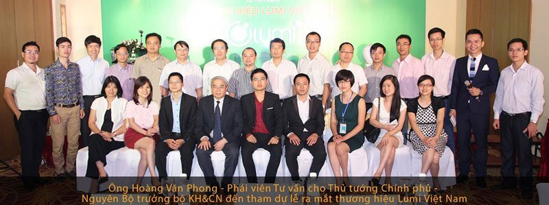
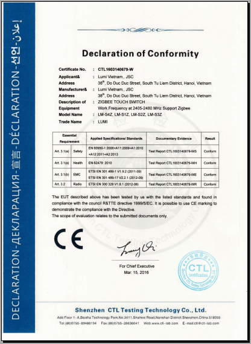

## GIỚI THIỆU VỀ LUMI VIỆT NAM

Cùng chung niềm đam mê từ những ngày còn “ăn ngủ” tại phòng thí nghiệm điện tử Trường Đại học Bách khoa Hà Nội, nơi cả 3 cựu thành viên Robocon năm 2008 BK-TNT thiết kế những sản phẩm đầu tiên, khao khát tạo ra sản phẩm made in Việt Nam.

Dự án đầu tiên về chế tạo bộ biến đổi nguồn từ 24Vdc (một chiều) sang 220Vac (xoay chiều) đã nhanh chóng bị thất bại khi nguồn vốn eo hẹp, kinh nghiệm thị trường còn hạn chế, chưa kể hàng Trung Quốc xuất hiện tràn lan. “Trong cái khó, ló cái khôn”, rút kinh nghiệm từ dự án đầu tiên, quyết tâm đến cùng, mong muốn tạo ra sản phẩm thương hiệu Việt phục vụ người Việt, Lumi Việt Nam đã ra đời trong bối cảnh đó (27/4/2012) với sản phẩm đầu tiên là giải pháp nhà thông minh.

**Nếu như yếu tố thẩm mỹ, sang trọng được ưu tiên hàng đầu thì chất lượng là vấn đề sống còn. Đến nay giải pháp nhà thông minh của Lumi đã trải qua hàng chục phiên bản, liên tục cải tiến và hoàn thiện, trong suốt quá trình đó đội ngũ kỹ sư của Lumi được sự hợp tác, hỗ trợ của các chuyên gia đến từ các hãng cung cấp linh kiện hàng đầu thế giới như Mỹ, Nhật, Hà Lan, Đài Loan, Singapore…**

* Texas Instruments (Mỹ) – Cung cấp vi điều khiển
* Fair Child(Mỹ) – Cung cấp diode, transitor
* Panasonic(Nhật) – Cung cấp tụ điện áp cao
* Vishay Semiconductor (Mỹ) – Cung cấp diode, transistor 
* NXP Semiconductor(Hà Lan) – Cung cấp Transistor
* Songchuan(Singapore) – Cung cấp Role
 
Ngay từ đầu, Lumi Việt Nam đã xác định được hướng đi riêng của mình. Tập trung vào phân khúc thị trường trung và cao cấp, giải pháp của Lumi mang lại sự tiện ích vượt trội cho khách hàng bởi sự đơn giản và dễ dàng sử dụng (chỉ với 1 đến 2 ngày thi công bất kể công trình cũ hay mới, không cần đục đẽo) với mức giá chỉ bằng 1/3 so với các giải pháp tương tự trên thị trường.

_Buổi lễ ra mắt thương hiệu Lumi Việt Nam diễn ra thành công tốt đẹp với sự tham dự của ông Hoàng Văn Phong – Phái viên tư vấn cho Thủ tướng Chính Phủ – Nguyên Bộ trưởng bộ KH&CN _

Gần 6 năm không ngừng nỗ lực và phát triển, cho đến ngày hôm nay Lumi Việt Nam đã có 85 đại lý trên cả nước và 1 nhà phân phối chính thức tại Australia. Lumi Việt Nam là đơn vị đầu tiên tại Việt Nam nhận được chứng chỉ CE – tiêu chuẩn xuất khẩu sang các nước Châu Âu và chứng chỉ UL – được xuất khẩu đến 104 quốc gia trên thế giới. Hiện nay, sản phẩm của Lumi đã xuất khẩu tới 6 nước trên thế giới: Thái Lan, Australia, Ấn Độ, Lào, Campuchia …

_Là đơn vị đầu tiên tại Việt Nam trong thị trường nhà thông minh đạt chứng chỉ CE – tiêu chuẩn xuất khẩu sang các nước Châu Âu_

Sự tín nhiệm của các đối tác và hàng nghìn khách hàng đang sử dụng sản phẩm công tắc cảm ứng, công tắc điện thông minh của Lumi chính là lời chứng thực thuyết phục nhất cho giải pháp nhà thông minh Lumi.  Lumi Việt Nam đã được chọn là đơn vị cung cấp giải pháp nhà thông minh cho rất nhiều dự án lớn trên cả nước: Khu đô thị An Khánh, Mandarin, Spendora, Time City, Royal City, Water Mark, ThangLong Number 01, Ecopark, River side Long Biên, Văn phòng quốc hội tại TP HCM, Nhà điều hành sân Golf – Flamingo Đại Lải…

Với gần 25.000 ngôi nhà đã hoàn thiện, hàng chục dự án đang triển khai và ký kết hợp đồng, Lumi tự hào trở thành thương hiệu Việt được khách hàng lựa chọn nhiều nhất trong thị trường nhà thông minh tại Việt Nam. Chỉ từ 25 – 70 triệu/căn hộ hoặc 40 – 150 triệu/biệt thự liền kề là bạn đã sở hữu ngay ngôi nhà tiện nghi, hiện đại, sang trọng, đẳng cấp Châu Âu, giá chỉ bằng 1/2 giải pháp nhập khẩu trên thị trường.

Hãy liên hệ ngay với chúng tôi để trở thành người tiếp theo sở hữu công nghệ thông minh và tận hưởng trọn vẹn cuộc sống tiện nghi, hiện đại của giải pháp nhà thông minh Lumi Việt Nam mang đến.

