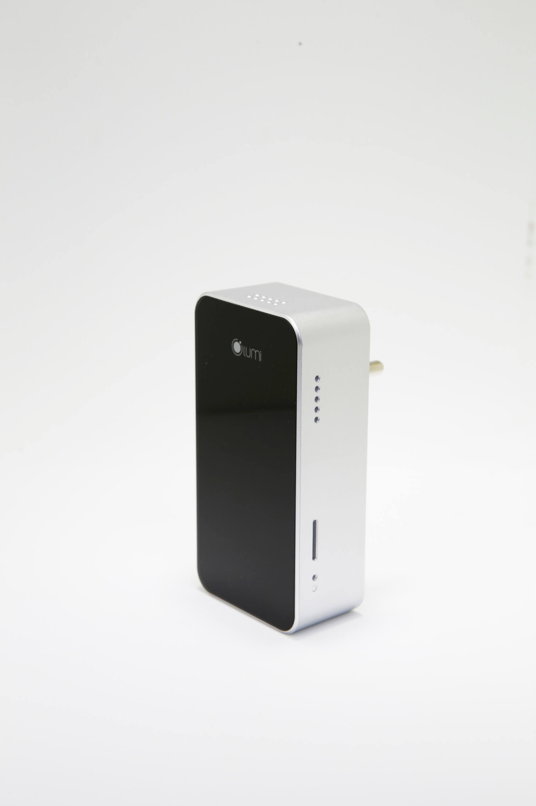
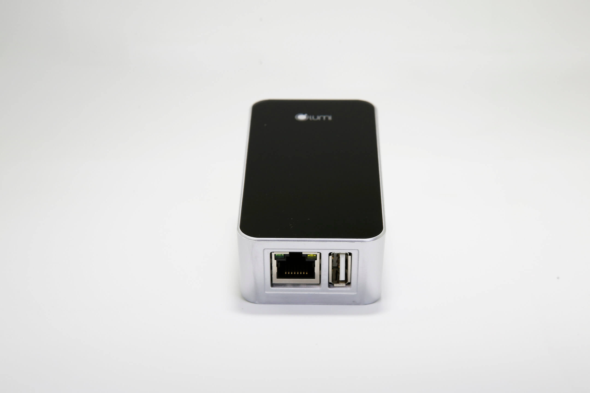

**Mô tả:** Là bộ não của ngôi nhà thông minh, tích hợp công nghệ truyền thông không dây Zigbee cho phép: Kết nối và quản lý các thiết bị điện, lưu trữ các thông tin cấu hình cài đặt của người dùng, cập nhật trạng thái các thiết bị cho người sử dụng

**Điện áp:** 5Vdc - 1A 

**Nhiệt độ hoạt động:** 75ºC max

Được xem là bộ não của ngôi nhà thông minh, bộ điều khiển trung tâm được ứng công nghệ truyền thông không dây Zigbee, tiêu chuẩn 802.15.4 – sử dụng tín hiệu radio có tần sóng ngắn, có 2 tầng và vận hành trong vùng bảo mật của hệ thống. Tuyệt đối an toàn cho ngôi nhà của bạn trước những tác nhân xấu.

Là đầu mối tiếp nhận và truyền thông tin “công việc” đến các công tắc để yêu cầu thiết bị thực hiện nhiệm vụ mà người sử dụng yêu cầu. Nơi lưu trữ các thông tin cấu hình, cài đặt của người dùng, cập nhật trạng thái các thiết bị và tự động ra lệnh cho các thiết bị hoạt động theo cấu hình mà người dùng cài đặt.

**Ứng dụng:**
Đóng vai trò là bộ não của giải pháp nhà thông minh. Hệ thống các công tắc kết nối thiết bị điện trong gia đình, nếu không có bộ điều khiển trung tâm thì sẽ trở thành công tắc cơ thông thường. Bạn không thể điều điều khiển, kiểm soát cũng như cài đặt chế độ tự hoạt động cho hệ thống thiết bị điện trong ngôi nhà của mình trên điện thoại, máy tính bảng …

**Phương thức hoạt động:** 

Bộ điều khiển trung tâm sẽ tiếp nhận tín hiệu từ cảm biến hoặc người dùng gửi đến sever. Sau khi tiếp nhận thông tin, bộ điều khiển trung tâm – HC truyền tín hiệu đến công tắc được gắn với thiết bị, để thực hiện yêu cầu của người dùng.

**Ví dụ:** Khi cảm biến phát hiện chuyển động gửi tín hiệu “có người di chuyển vào vùng cảm biến” đến HC. Tại đây, HC truyền tín hiệu nhận được đến công tắc kết nối với thiết bị như bóng đèn hành lang, đèn tuýp … sẽ tự động bật/tắt.

Nơi lưu trữ tất cả các dữ liệu của giải pháp nhà thông minh trong ngôi nhà của bạn

Ngoài ra, HC còn cho phép người dùng tạo hoạt cảnh. Ví dụ: Bạn có thể tạo cảnh bằng cách sử dụng 1 nút công tắc bật hoặc tắt toàn bộ thiết bị trong nhà, chỉ cần 1 nốt chạm trực tiếp như công tắc cơ hoặc trên điện thoại, bạn đã hoàn toàn điều khiển tất cả các thiết bị điện trong ngôi nhà. Tương tự với những hoạt cảnh: tiếp khách, ăn tối, đi làm về … cho các thiết bị trong gia đình.

**Ưu điểm của bộ điều khiển trung tâm: **

Sử dụng công nghệ chuẩn ZigBee – công nghệ nổi bật hiện nay với những đặc điểm bảo mật tốt, có thể hỗ trợ, kết nối các thiết bị trong nhà thành một mạng lưới thông minh. Công nghệ ZigBee tiêu hao rất ít năng lượng, tiết kiệm tối đa chi phí so với các công nghệ khác.

Đặc biệt, sever Lumi đã tích hợp thành công với Sever của Amazon – Mỹ để tạo ra giải pháp nhà thông minh điều khiển bằng giọng nói. Cho phép người dùng hoàn toàn kiểm soát, điều khiển các thiết bị trong ngôi nhà bằng chính “giọng nói quyền năng” của mình. Khi bạn nói câu lệnh“Turn on/off Lumi go home” tất cả các thiết bị trong ngôi nhà sẽ hoàn toàn bật/tắt, tùy theo câu lệnh.

Hãng ABI Research cho biết: năm 2012 đã có hơn 1,5 triệu hệ thống nhà thông minh đã được lắp đặt ở Mỹ và dự kiến, con số này sẽ tăng đến 8 triệu vào năm 2018. Điều đó cho thấy, nhà thông minh đã và đang trở thành tiêu chuẩn, xu hướng nhà ở hiện đại trong tương lai.

Tại Việt Nam, đã có gần 25.000 ngôi nhà đã hoàn thiện và hàng chục dự án đang triển khai và ký kết hợp đồng, Lumi tự hào trở thành thương hiệu Việt được khách hàng lựa chọn nhiều nhất trong thị trường nhà thông minh tại Việt Nam. Chỉ từ 25 – 70 triệu/căn hộ hoặc 40 – 150 triệu/biệt thự liền kề là bạn đã sở hữu ngay ngôi nhà tiện nghi, hiện đại, sang trọng, đẳng cấp Châu Âu, giá chỉ bằng 1/2 giải pháp nhập khẩu trên thị trường.

Hãy liên hệ ngay với chúng tôi theo số hotline 0968.333.268 - 0935.333.268  để trở thành người tiếp theo sở hữu công nghệ thông minh và tận hưởng trọn vẹn cuộc sống tiện nghi, hiện đại của giải pháp nhà thông minh Lumi Việt Nam mang đến