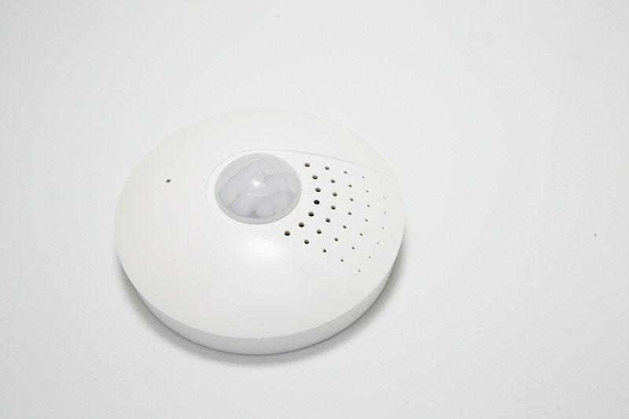
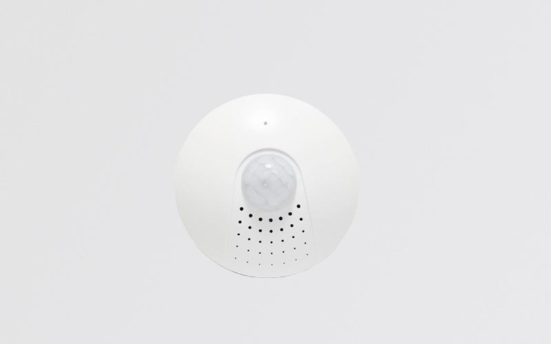
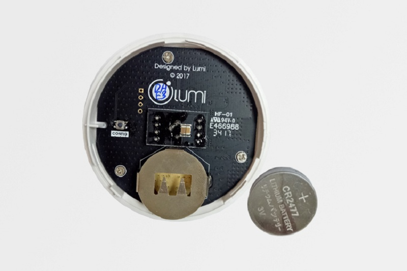

## CẢM BIẾN PHÁT HIỆN CHUYỂN ĐỘNG

**Mô tả**: Tự động bật/tắt đèn khi phát hiện chuyển động, cảm biến môi trường còn đóng vai trò là "người bác sỹ" đo nhiệt độ, ánh sáng, độ ẩm … trong ngôi nhà của bạn. Ngoài ra, cảm biến còn được tích hợp trong giải pháp an ninh như: kích hoạt còi hú, bật đèn… khi phát hiện sự xâm nhập trái phép.

**Điện áp**: Pin Lithium 3.6V 2.6Ah

**Nhiệt độ hoạt động**: 60ºC Max

**Thiết kế tinh tế, hiện đại**:

Cảm biến phát hiện chuyển động được làm bằng nhựa chống cháy PP, thiết kế tinh tế với đường bo tròn sang trọng, màu trắng mang đến nét hiện đại của sản phẩm.

Cảm biến phát hiện chuyển động Lumi, sử dụng công nghệ không dây Zigbee

**Ứng dụng**:

Cảm biến phát hiện chuyển động được ứng dụng tại khu vực hành lang, khu vệ sinh của các bệnh viện, khách sạn, nhà ở, trườg học … tránh tình trạng người dùng quên tắt đèn khi ra vào

Cảm biến chuyển động truyền tín hiệu đến HC và từ HC đến công tắc đèn thông minh bằng sóng không dây Zigbee

Cảm biến chuyển động còn đóng vai trò là “người bác sỹ” đo nhiệt độ, ánh sáng, độ ẩm … trong ngôi nhà. 1 trong các yếu tố trên thừa hay thiếu, cảm biến sẽ gửi thông tin đến HC, HC sẽ thực hiện nhiệm vụ “ra lệnh” cho điều hòa, đèn, rèm mở ra khi trong nhà thiếu ánh sáng.

Được tích hợp trong giải pháp an ninh như: kích hoạt còi hú, đèn sáng … khi phát hiện có sự cố tình xâm nhập vào vùng chuyển động.

**PHƯƠNG THỨC CHUYỂN ĐỘNG:**

Cảm biến phát hiện chuyển động sẽ truyền tín hiệu đến bộ điều khiển trung tâm (HC) khi phát hiện có sự di chuyển vào vùng cảm biến. Tại đây, bộ điều khiển trung tâm sẽ gửi thông tin đến công tắc kết nối với bóng đèn để bật/tắt theo tín hiệu từ cảm biến phát hiện chuyển động.

Thời gian bật/tắt sẽ được bạn cài đặt một cách linh hoạt. Ví dụ: thời gian sáng khi người đi qua hoặc đứng trong vùng cảm biến sẽ l – 3 phút. Và sẽ tắt sau khi người di chuyển qua từ 30s – 1 phút.

Cảm biến phát hiện chuyển động là 1 trong 7 giải pháp nhà thông minh Lumi

**An toàn và tiện dụng:**

Cảm biến thông thường trên thị trường sẽ dùng dây điện, để kết nối giữa cảm biến với bóng đèn. Khi cảm phát hiện sự di chuyển, ngay lập truyền tín hiệu tới công tắc bên trong cảm biến để thực hiện công việc bật/tắt đối với bóng đèn.

Điểm khác biệt của cảm biến phát hiện chuyển động Lumi và cảm biến thông thường là dùng Pin. Do sử dụng pin nên tuyệt đối an toàn khi lắp ở những nơi có độ ẩm cao và rất linh hoạt trong việc di chuyển, thay đổi địa điểm lắp đặt.

Mặt khác, công tắc đèn cảm biến của Lumi có thể cấu hình theo hoạt cảnh và linh động trong việc sử dụng. Ví dụ: Nếu bạn muốn thay đổi công tắc đèn cảm biến thành công tắc rèm, đèn tuyp, quạt … chỉ cần cấu hình lại trên app điện thoại mà không cần đục đẽo đường dây điện như cảm biến thông thường.

Cảm biến phát hiện chuyển động của Lumi được sử dụng pin, rất dễ cho việc lắp đặt cũng như an toàn cho người dử dụng

Pin sử dụng từ 12 – 18 tháng, thay pin hoàn toàn dễ mà không cần sự hỗ trợ của kỹ thuật. Với 20.000 ngôi nhà đã lắp đặt và sử dụng, hàng chục dự án đang triển khai và ký kết hợp đồng. Lumi tự hào trở thành thương hiệu Việt được khách hàng lựa chọn nhiều nhất trong thị trường nhà thông minh tại Việt Nam.

Hãy liên hệ ngay với chúng tôi theo số hotline 0968.333.268 - 0935.333.268  để trở thành người tiếp theo sở hữu công nghệ thông minh và tận hưởng trọn vẹn cuộc sống tiện nghi, hiện đại của giải pháp nhà thông minh Lumi Việt Nam mang đến.