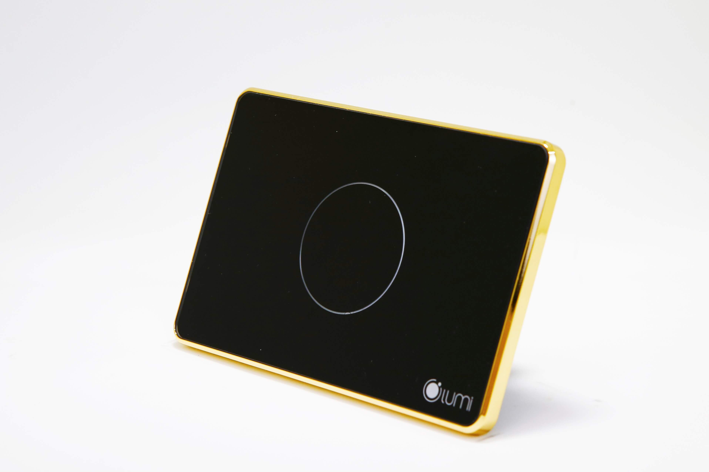
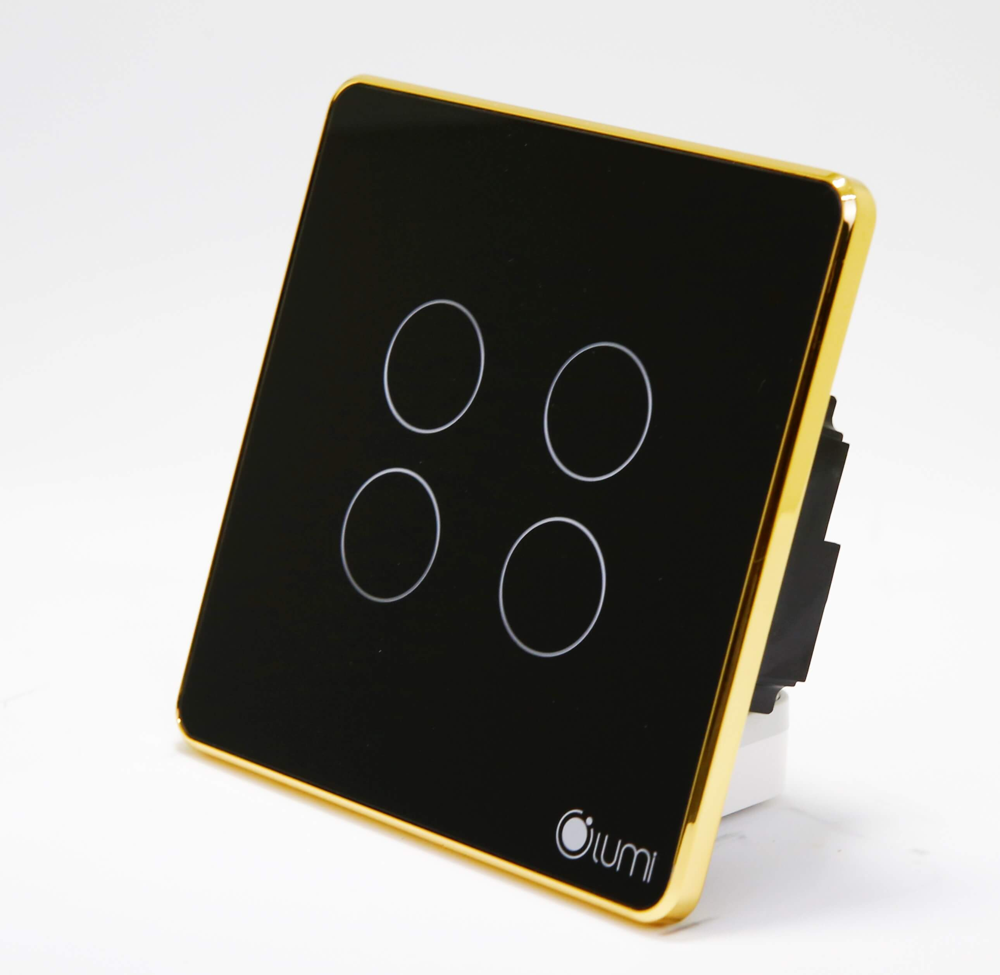
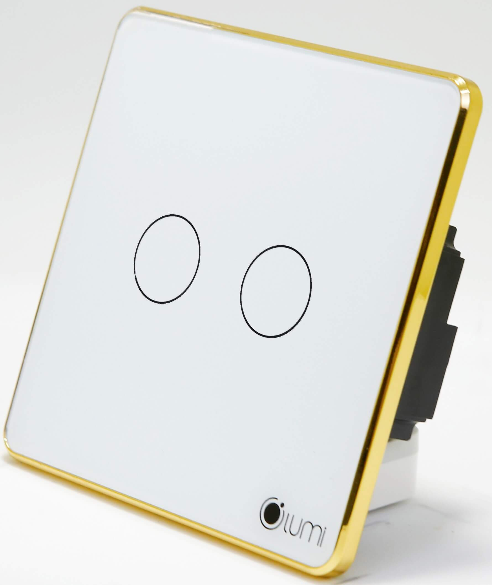
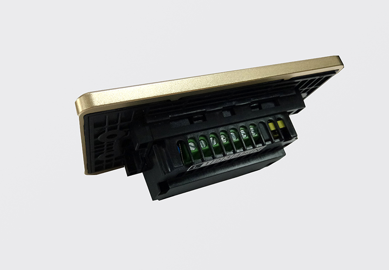
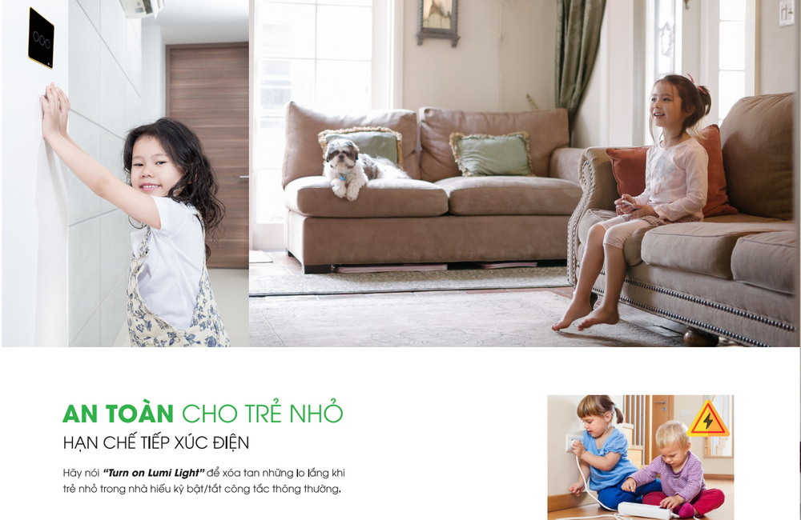
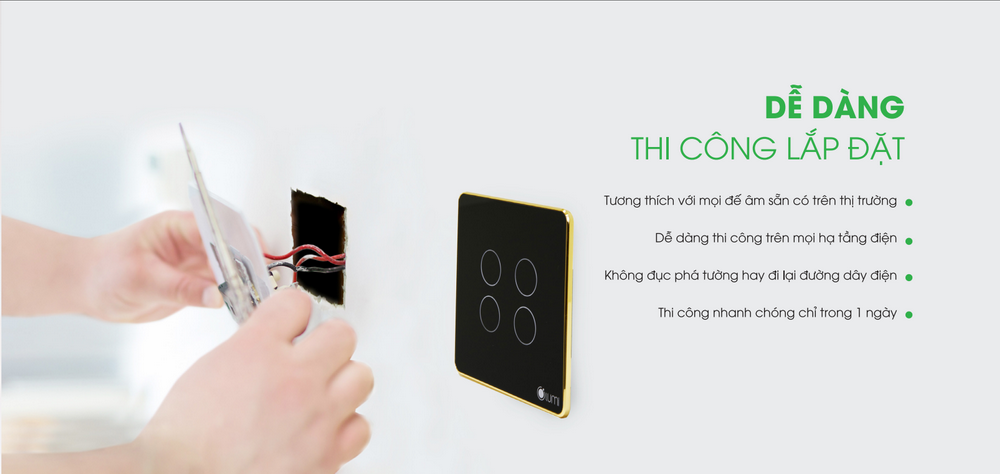

**Thiết kế tinh tế, hiện đại, đẳng cấp sang trọng:**

Là công tắc cảm ứng thông minh, sử dụng mặt mặt kính cường lực, chống xước, chống va đập tốt, kết hợp với vòng tròn tỏa sáng Led bao quanh, kèm theo logo Lumi ở góc phải tạo nên điểm nhấn và sự lôi cuốn cho sản phẩm. Đồng thời, đèn Led luôn được tỏa sáng dù bật hay tắt, nên bạn sẽ thấy ngay chiếc công tắc dù là trong đêm tối.  Đặc biệt, công tắc cảm ứng của Lumi được sử dụng công nghệ điện dung nên rất  an toàn kể cả khi tay ướt chạm vào công tắc điện.

**HỆ THỐNG CẦU NỐI  AN TOÀN TUYỆT ĐỐI:**

Bên trong là ReLay có chức năng đóng/cắt nguồn điện . Vỏ ngoài làm bằng chất liệu nhựa PP, có khả năng chống cháy. Sản phẩm được kiểm tra, và test kỹ càng trước khi xuất xưởng nên tuyệt đối không xảy ra trường hợp chập cháy.

Với số lần bật tắt lên đến 100 nghìn lần, công tắc cảm ứng của Lumi có độ bền lên tới từ 10 – 20 năm

**ỨNG DỤNG: **

Dùng để điều khiển trực tiếp các thiết bị điện trong nhà như: điều hòa, quạt, đèn chiếu sáng, rèm … Với công tắc cảm ứng thông minh của Lumi, bạn có thể cài đặt rất nhiều kiểu bật/tắt cho các thiết bị trong nhà như: Tạo hoạt cảnh bật/tắt, tạo nhóm đảo chiều không cần dây nối, tạo rule cho thiết bị. Ví dụ: Bạn có thể tạo cảnh bằng cách sử dụng 1 nút công tắc bật hoặc tắt toàn bộ thiết bị trong nhà, chỉ cần 1 nốt chạm trực tiếp như công tắc cơ hoặc trên điện thoại, bạn đã hoàn toàn bật/tắt tất cả các thiết bị điện trong ngôi nhà. Tương tự với những hoạt cảnh: tiếp khách, ăn tối, đi làm về … cho các thiết bị trong gia đình.

Đặc biệt, với giải pháp nhận dạng giọng nói của Lumi, còn cho phép bạn điều khiển hệ thống các thiết bị trong ngôi nhà bằng chính “giọng nói quyền năng” của mình. Ví dụ: khi bạn nói câu lệnh“Turn on/off Lumi go home” tất cả các thiết bị trong ngôi nhà sẽ hoàn toàn bật/tắt, tùy theo câu lệnh.

**ƯU ĐIỂM NỔI BẬT CỦA CÔNG TẮC ĐIỆN CẢM ỨNG LUMI:**

Đế âm tường công tắc cảm ứng của Lumi hoàn toàn thích hợp được với đế âm tường nhà bạn có sẵn. Vì vậy, thời gian thi công nhanh (chỉ từ 1 – 3 ngày bất kể công trình mới hay cũ, không phải đục đẽo tường ). Đặc biệt, sản phẩm của Lumi Việt Nam để nguồn cấp từ  110V – 240V rất phù hợp với hệ thống lưới điện tại Việt Nam, vì nguồn cấp cho hệ thống điện nhà bạn không phải khi nào cũng ở mức ổn định 220V. Điều đó sẽ giúp các thiết bị điện nhà bạn tránh được những hư hỏng khi nguồn cấp không ổn định.

Bằng điện thoại, bạn có thể điều khiển được hệ thống thiết bị điện trong ngôi nhà dù ở bất cứ đâu. Ngoài ra, bạn có thể cài đặt hoạt cảnh như “về nhà”, trước khi rời khỏi cơ quan, chỉ cần chạm nhẹ trên smartphone “về nhà” là một hệ thống bao gồm: đèn chiếu sáng  rèm cửa, bình nóng lạnh, điều hòa … đã sẵn sàng chào đón bạn. Đặc biệt, vòng tròn Led tỏa sáng giúp bạn sẽ thấy ngay công tắc đèn mà không cần lò dò trong bóng tối tìm công tắc đèn như những sản phẩm thông thường khác.