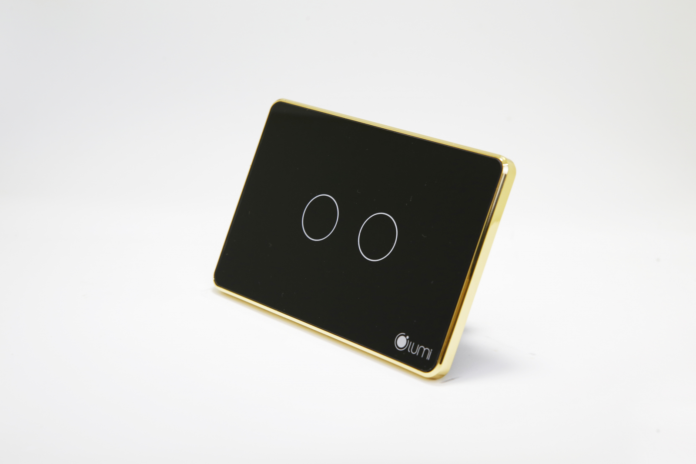

**Mô tả**: là loại công tắc cảm ứng thông minh sử dụng công nghệ cảm ứng điện dung, công nghệ không dây Zigbee, mặt kính cường lực, chống xước, chống va đập, kết hợp với vòng tròn tỏa sáng LED bao quanh tạo nên sự tinh tế, sang trọng, đẳng cấp

**Điện áp**: 150 - 250 VAC

**Nhiệt độ hoạt động**: 0 - 40ºC max

**Công suấ**t: 700w(Đèn sợi đốt)-150w(Đèn led)/1 nút

**Kích thước**: Hình vuông (95 x 95 mm) - Hình chữ nhật (121,5 x 80 mm)

## CÔNG TẮC CẢM ỨNG VIỀN NHÔM MẠ VÀNG

**THIẾT KẾ TINH TẾ, HIỆN ĐẠI, ĐẲNG CẤP SANG TRỌNG:**

Là loại công tắc cảm ứng thông minh sử dụng công nghệ cảm ứng điện dung, mặt kính cường lực, chống xước, chống va đập tốt, kết hợp với vòng tròn tỏa sáng LED bao quanh tạo nên sự lôi cuốn, tinh tế và sang trọng.

Với Relay bật tắt lên đến 100.000 nghìn lần, tuổi thọ của công tắc cảm ứng thông minh có thể lên đến 20 năm 

Đặc biệt, với giải pháp nhận dạng giọng nói của Lumi, còn cho phép bạn điều khiển hệ thống các thiết bị trong ngôi nhà bằng chính “giọng nói quyền năng” của mình. Ví dụ: khi bạn nói câu lệnh“OK LUMI, VỀ NHÀ” tất cả các thiết bị trong ngôi nhà sẽ hoàn toàn bật/tắt, tùy theo câu lệnh.

Giải pháp an toàn vì hạn chế tiếp xúc điện, thân thiện, dễ sử dụng đối với người cao tuổi, nhà thông minh điều khiển bằng giọng nói đang là sự lựa chọn lý tưởng cho mọi gia đình Việt

**Ưu điểm nổi bật của công tắc điện cảm ứng Lumi:**

Đế âm tường công tắc cảm ứng của Lumi hoàn toàn thích hợp được với đế âm tường nhà bạn có sẵn. Vì vậy, thời gian thi công nhanh (chỉ từ 1 – 3 ngày bất kể công trình mới hay cũ, không phải đục đẽo tường ). Đặc biệt, sản phẩm của Lumi Việt Nam để nguồn cấp từ  110V – 240V rất phù hợp với hệ thống lưới điện tại Việt Nam, vì nguồn cấp cho hệ thống điện nhà bạn không phải khi nào cũng ở mức ổn định 220V. Điều đó sẽ giúp các thiết bị điện nhà bạn tránh được những hư hỏng khi nguồn cấp không ổn định.

## Công tắc viền nhôm nguyên khối mạ vàng màu đen/trắng, phiên bản hình chữ nhật

Bằng điện thoại, bạn có thể điều khiển được hệ thống thiết bị điện trong ngôi nhà dù ở bất cứ đâu. Ngoài ra, bạn có thể cài đặt hoạt cảnh như “về nhà”, trước khi rời khỏi cơ quan, chỉ cần chạm nhẹ trên smartphone “về nhà” là một hệ thống bao gồm: đèn chiếu sáng  rèm cửa, bình nóng lạnh, điều hòa … đã sẵn sàng chào đón bạn. Đặc biệt, vòng tròn Led tỏa sáng giúp bạn sẽ thấy ngay công tắc đèn mà không cần lò dò trong bóng tối tìm công tắc đèn như những sản phẩm thông thường khác.

Công tắc 4 nốt, cho phép bạn kết nối tối thiểu là 4 thiết bị và tối đa là 10 thiết bị điện (nếu bạn thiết lập hoạt cảnh)

Với gần 25.000 ngôi nhà đã hoàn thiện, hàng chục dự án đang triển khai và ký kết hợp đồng, Lumi tự hào trở thành thương hiệu Việt được khách hàng lựa chọn nhiều nhất trong thị trường nhà thông minh tại Việt Nam. Chỉ từ 25 – 70 triệu/căn hộ hoặc 40 – 150 triệu/biệt thự liền kề là bạn đã sở hữu ngay ngôi nhà tiện nghi, hiện đại, sang trọng, đẳng cấp Châu Âu, giá chỉ bằng 1/2 giải pháp nhập khẩu trên thị trường.

Hãy liên hệ ngay với chúng tôi theo số hotline 0968.333.268 - 0935.333.268  để trở thành người tiếp theo sở hữu công nghệ thông minh và tận hưởng trọn vẹn cuộc sống tiện nghi, hiện đại của giải pháp nhà thông minh Lumi Việt Nam mang đến.