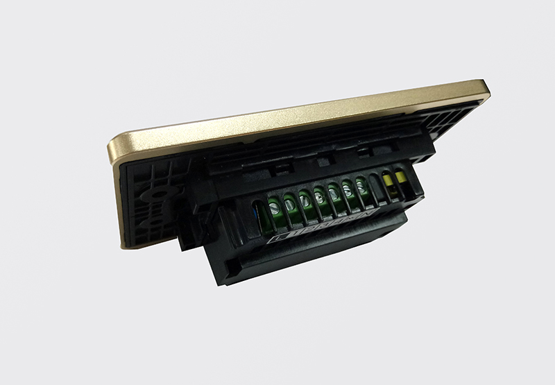

**Mô tả:** Là loại công tắc cảm ứng thông minh sử dụng công nghệ cảm ứng điện dung, công nghệ không dây Zigbee, mặt kính cường lực, :chống xước, chống va đập, kết hợp với vòng tròn tỏa sáng LED bao quanh tạo nên sự tinh tế, sang trọng, đẳng cấp.

**Điện áp:** 150 - 250 VAC

**Nhiệt độ hoạt động:** 0 - 40ºC max

**Công suất:** 700w(Đèn sợi đốt)-150w(Đèn led)/1 nút

**Kích thước:** Hình vuông (95 x 95 mm) - Hình chữ nhật (121,5 x 80 mm)

**Thiết kế tinh tế, hiện đại, đẳng cấp sang trọng:**

Là công tắc cảm ứng thông minh, sử dụng mặt mặt kính cường lực, chống xước, chống va đập tốt, kết hợp với vòng tròn tỏa sáng Led bao quanh, kèm theo logo Lumi ở góc phải tạo nên điểm nhấn và sự lôi cuốn cho sản phẩm. Đồng thời, đèn Led luôn được tỏa sáng dù bật hay tắt, nên bạn sẽ thấy ngay chiếc công tắc dù là trong đêm tối.  Đặc biệt, công tắc cảm ứng của Lumi được sử dụng công nghệ điện dung nên rất  an toàn kể cả khi tay ướt chạm vào công tắc điện.

**Hệ thống cầu nối  an toàn tuyệt đối:**

Bên trong là ReLay có chức năng đóng/cắt nguồn điện . Vỏ ngoài làm bằng chất liệu nhựa PP, có khả năng chống cháy. Sản phẩm được kiểm tra, và test kỹ càng trước khi xuất xưởng nên tuyệt đối không xảy ra trường hợp chập cháy.

**Ứng dụng: **

Dùng để điều khiển trực tiếp các thiết bị điện trong nhà như: điều hòa, quạt, đèn chiếu sáng, rèm … Với công tắc cảm ứng thông minh của Lumi, bạn có thể cài đặt rất nhiều kiểu bật/tắt cho các thiết bị trong nhà như: Tạo hoạt cảnh bật/tắt, tạo nhóm đảo chiều không cần dây nối, tạo rule cho thiết bị. Ví dụ: Bạn có thể tạo cảnh bằng cách sử dụng 1 nút công tắc bật hoặc tắt toàn bộ thiết bị trong nhà, chỉ cần 1 nốt chạm trực tiếp như công tắc cơ hoặc trên điện thoại, bạn đã hoàn toàn bật/tắt tất cả các thiết bị điện trong ngôi nhà. Tương tự với những hoạt cảnh: tiếp khách, ăn tối, đi làm về … cho các thiết bị trong gia đình.

Đặc biệt, với giải pháp nhận dạng giọng nói của Lumi, còn cho phép bạn điều khiển hệ thống các thiết bị trong ngôi nhà bằng chính “giọng nói quyền năng” của mình. Ví dụ: khi bạn nói câu lệnh“OK LUMI, VỀ NHÀ” tất cả các thiết bị trong ngôi nhà sẽ hoàn toàn bật/tắt, tùy theo câu lệnh.

Đế âm tường sản phẩm của Lumi thích hợp được với đế 2 loại đế âm tường vuông/chữ nhật trên thị trường

Đến nay, với gần 25.000 ngôi nhà đã hoàn thiện, hàng chục dự án đang triển khai và ký kết hợp đồng, Lumi tự hào trở thành thương hiệu Việt được khách hàng lựa chọn nhiều nhất trong thị trường nhà thông minh tại Việt Nam. Chỉ từ 25 – 70 triệu/căn hộ hoặc 40 – 150 triệu/biệt thự liền kề là bạn đã sở hữu ngay ngôi nhà tiện nghi, hiện đại, sang trọng, đẳng cấp Châu Âu, giá chỉ bằng 1/2 giải pháp nhập khẩu trên thị trường.

Hãy liên hệ ngay với chúng tôi theo số hotline 0968.333.268 - 0935.333.268  để trở thành người tiếp theo sở hữu công nghệ thông minh và tận hưởng trọn vẹn cuộc sống tiện nghi, hiện đại của giải pháp nhà thông minh Lumi Việt Nam mang đến.
