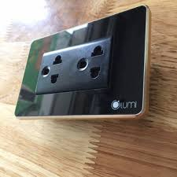

Ổ cắm điện mặt kính LM-SK là thiết bị điện do Công Ty CP  Lumi Việt Nam sản xuất. Với bề mặt kính  cường lực cách điện,cách nhiệt,đây là thiết bị tuyệt đối an toàn với trẻ, chống mở, có nối  đất.

## Ổ Cắm Thông Minh Lumi

Ổ cắm điện mặt kính LM-SK là thiết bị điện do Công Ty CP Lumi Việt Nam sản xuất. Với bề mặt kính cường lực cách điện,cách nhiệt,đây là thiết bị tuyệt đối an toàn với trẻ, chống mở, có nối đất.

Tính năng và đặc điểm nổi bật của Ổ cắm Lumi mặt kính LM-SK
Ổ cắm lumi là một thiết bị điện thông minh trong bộ giải pháp nhà thông minh Lumi, nó không chỉ có là thiết bị dùng để tiếp điện như những chiếc công tắc bình thường mà còn là món đồ trang trí cho ngôi nhà của bạn.

Với thiết kế đồng bộ với các công tắc cảm ứng, ổ cắm điện thông minh Lumi có vẻ ngoài SANG TRỌNG và ĐẸP MẮT. Bề mặt được trang bị mặt kính cường lực càng làm cho thiết bị này trở nên TINH TẾ hơn

Ổ cắm điện Lumi có hai màu cơ bản là màu đen và màu trắng phù hợp với mọi không gian sống và nội thất kiến trúc của mọi ngôi nhà từ hiện đại cho đến cổ điển.

Ngoài sử dụng cắm điện thì ổ điện Lumi còn sử dụng như một ổ cắm wifi, cắm dây cap truyền hình,…
