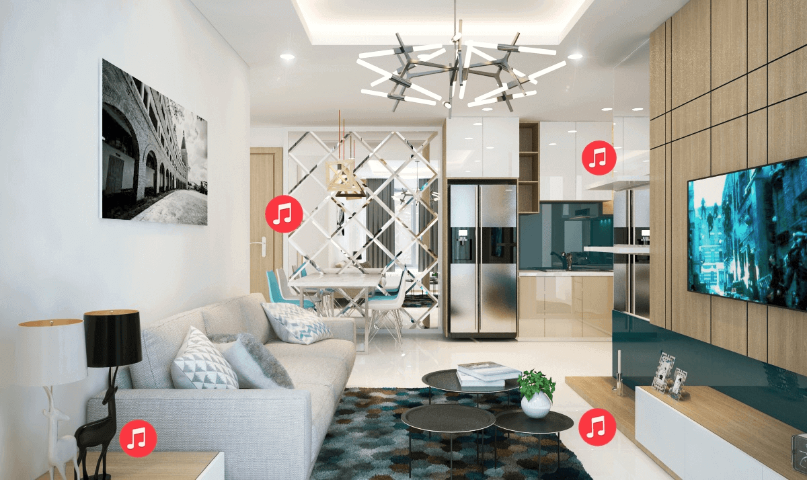
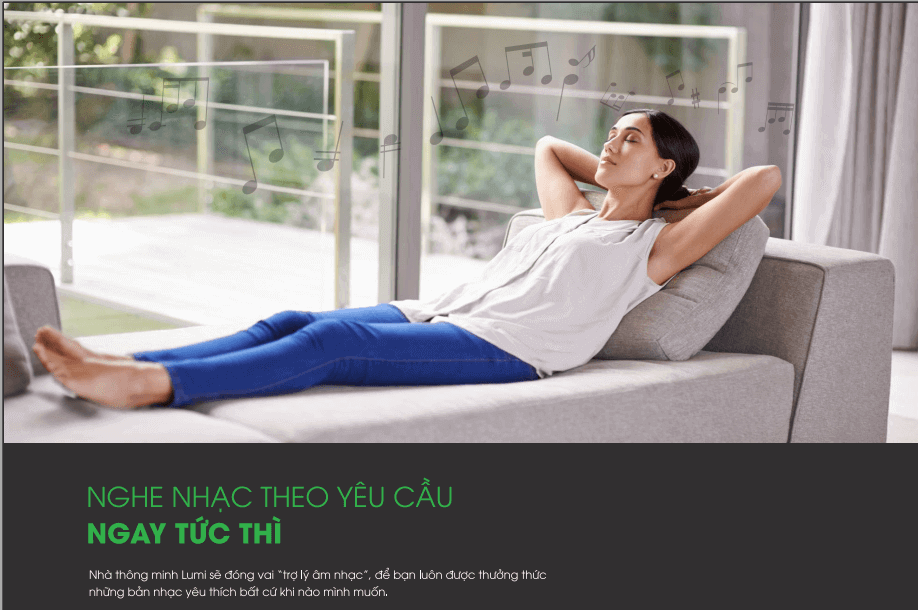
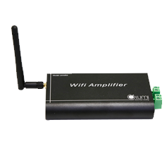

**Bạn muốn nghe nhạc mọi lúc? khi đang uống trà, đọc sách hay nấu ăn?**

**Bạn muốn nghe nhạc mọi nơi, từ phòng ngủ, phòng khách cho đến phòng bếp?**

**Hãy để Lumi Việt Nam giúp bạn thư giãn ở bất cứ nơi đâu với giải pháp âm thanh đa vùng.**

_Âm thanh đa vùng_

## Âm thanh đa vùng là gì?

Âm thanh đa vùng là hệ thống thiết bị âm thanh được gắn ở nhiều nơi trong nhà thông minh. Chỉ cần ngồi một chỗ, bạn cũng có thể dễ dàng bật tắt, điều chỉnh âm lượng hay chuyển bài hát theo ý thích.

Một hệ thống giải pháp âm thanh đa vùng được xem là hoàn hảo khi nó đáp ứng được 3 yếu tố: nghe nhạc ở bất cứ khu vực nào trong nhà, phát nhạc từ bất cứ nguồn nào mà không gặp khó khăn về khoảng cách, cuối cùng là chất lượng âm thanh sống động đẳng cấp.

Hiểu được điều đó, Lumi ứng dụng những công nghệ thiết bị âm thanh đỉnh cao nhất vào giải pháp nhà thông minh, đáp ứng nhu cầu giải trí bất cứ khu vực nào bạn muốn. Đặc biệt, quy trình vận hành rất đơn giản và dễ thực hiện.

## Ưu điểm của giải pháp âm thanh đa vùng Lumi

### Nghe nhạc ngay tức thì

Tiện ích nổi bật của giải pháp âm thanh đa vùng Lumi chính là khả năng nghe nhạc ngay tức thì. Tất cả hệ thống âm thanh trong ngôi nhà đều dễ dàng điều khiển nhờ tích hợp nhiều phương tiện khác nhau từ smartphone, máy tính bảng, loa Lumi hay công tắc cảm ứng.

Với chiếc smartphone, bạn dễ dàng bật/tắt, chuyển bài hay điều chỉnh âm lượng chi bằng một cú chạm. Bạn cũng có thể nghe bất kỳ bài hát online nào khi điện thoại có wife hay kết nối 3G/4G. Trong khi đó, loa Lumi lại cho phép bạn loa điều khiển âm thanh ngay cả khi vướng tay như lúc đang tắm hay nấu ăn bằng giọng nói quyền năng của mình.

_Nghe nhạc bất cứ đâu, bất cứ khi nào trong nhà_

Bạn hoàn toàn chủ động trong việc điều khiển âm thanh và nghe nhạc mọi lúc mọi nơi mà không phải di chuyển nhiều. Hệ thống thiết bị âm thanh được phân bổ đều theo các khu vực sẽ giúp bạn nghe nhạc liên tục. Dù phải di chuyển từ phòng này sang phòng khác hay từ trong nhà ra hành lang thì chất lượng âm thanh cũng không kém đi. Bất kể bạn ở đây hay đang làm gì, bạn vẫn thưởng thức được âm nhạc tuyệt vời từ giải pháp âm thanh đa vùng Lumi.

Ngoài ra, giải pháp âm thanh đa vùng Lumi còn cho phép bạn cài đặt lịch phát nhạc theo khung giờ có sẵn. Ví dụ, bạn cài đặt lịch phát nhạc vào 6h sáng và 18h tối hằng ngày, bạn sẽ được đánh thức bằng bản nhạc vui nhộn hay thưởng thức âm nhạc du dương khi đi làm về.

### Đẳng cấp âm nhạc sống động

Điều làm nên đẳng cấp tuyệt vời cho giải pháp âm thanh đa vùng Lumi chính là chất lượng âm thanh sống động. Giải pháp này mang đến cho bạn sự tiện nghi và gu thưởng thức đẳng cấp như tỷ phú Bill Gate.
Âm ly Lumi giúp khuếch đại tín hiệu xử lý và đem lại những trải nghiệm âm nhạc đỉnh cao ở bất cứ đâu trong ngôi nhà. Ngoài ra, hệ thống âm thanh đa vùng kết hợp với các thiết bị khác tạo nên hoạt cảnh đồng điều như khi âm nhạc cất lên, đèn bật sáng, rèm tự động mơ tạo nên không gian ban mai đầy hứng khởi cho gia chủ. Bạn chỉ cần cài đặt các hoạt cảnh theo sở thích của mình qua app Lumi trên smartphone.

_Nghe nhạc đỉnh cao với giải pháp âm thanh đa vùng Lumi_

Ngoài ram thiết kế tinh tế, nhỏ gọn với màu sắc trang nhã của thiết bị âm thanh cũng phù hợp với kiến trúc của mọi ngôi nhà. Bộ sản phẩm đi kèm giải pháp thường bao gồm: công tắc cảm ứng viền mạ vàng, công tắc cảm ứng viền nhôm, bộ điều khiển trung tâm, âm ly Lumi. Đặc biệt, tất cả các sản phẩm đều đạt chuẩn CE và UL.

Hãy tận hưởng những phút giây thư giãn cùng âm nhạc sống động ngay hôm nay cùng giải pháp âm thanh đa vùng Lumi. Liên hệ với chúng tôi để được tư vấn, giải đáp và hỗ trợ các tiện ích cho ngôi nhà bạn.

Giahangroup - đơn vị thi công và phân phối giải pháp âm thanh đa vùng Lumi uy tín chất lượng để bạn trao gửi niềm tin.