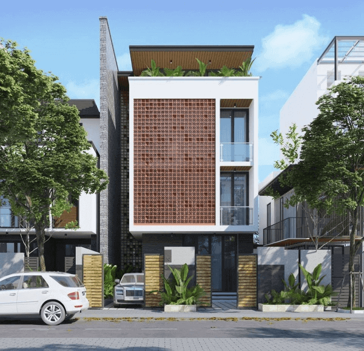
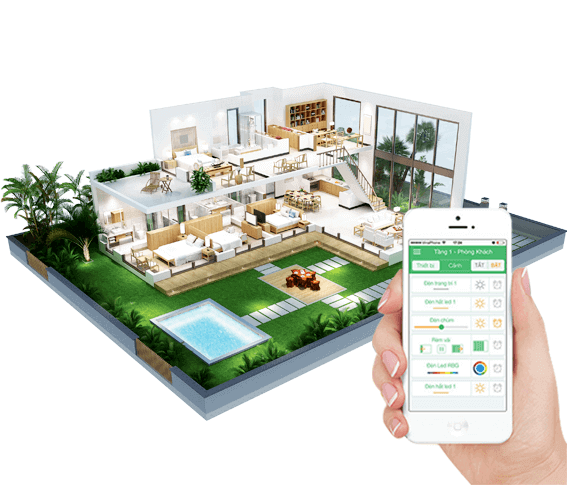
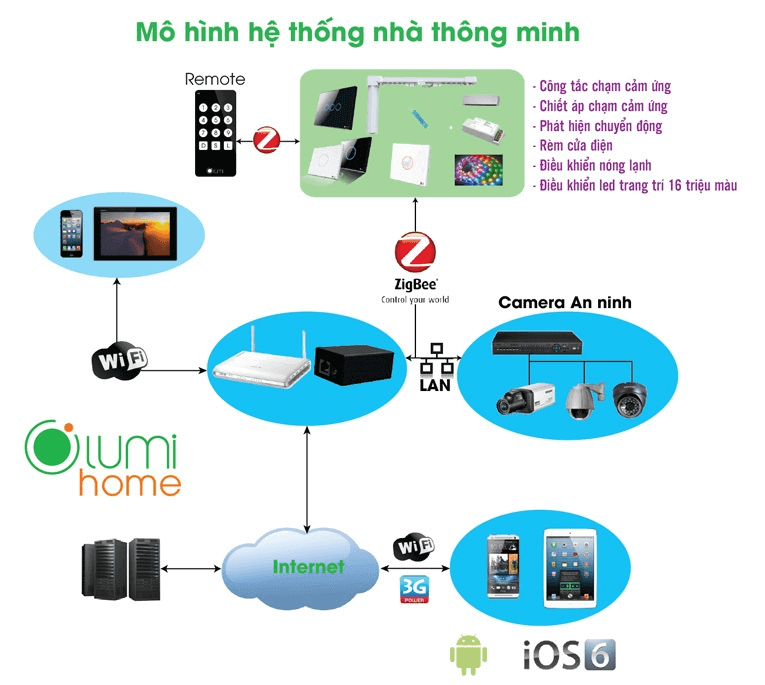

**Hiện nay, giải pháp nhà thông minh đã trở nên phổ biến hơn với gia đình Việt nhờ tiện ích vượt trội và giá cả phải chăng. Chỉ với 70-150 triệu đồng, bạn có thể sở hữu giải pháp nhà thông minh Lumi với nhiều tiện ích hơn cả mong đợi từ hệ thống chiếu sáng, âm thanh, điều hòa tivi, bình nóng lạnh, rèm cửa… Đặc biệt, bạn có thể kiểm soát điều khiển mọi trạng thái hoạt động thông qua smartphone, bộ điều khiển cảm ứng và loa giọng nói tiếng Việt.**

## Cuộc sống tiện nghi đẳng cấp

Không gì tuyệt vời hơn khi ngôi nhà của mình khiến thượng khách đến chơi phải trầm trồ thán phục vì sự đẳng cấp riêng biệt cũng như tiện ích vượt trội. Giải pháp nhà thông minh Lumi hội tụ đủ những yếu tố đó.

Nếu như với một ngôi nhà phố thông thường, bạn phải đến tận nơi để điều khiển các thiết bị. Nhưng với nhà thông minh Lumi, bạn có thể làm chủ và điều khiển mọi hoạt động, trạng thái ngôi nhà bằng các thiết bị điều khiển, smartphone hay thậm chí là bằng chính giọng nói của mình. Chỉ cần ngồi một chỗ trên giường, làm việc ở cơ quan hay đi công tác xa hàng trăm kilomet, bạn vẫn có thể bật/tắt các thiết bị điện trong ngôi nhà thông qua ứng dụng Lumi trên smartphone/máy tính/ipad được kết nối 3G/4G. Mọi thông tin về trạng thái hoạt động của tất cả thiết bị đều được hiển thị trên màn hình. Đặc biệt, khi ở nhà có thể dùng loa Milo để điều khiển bằng giọng nói tiếng Việt, tiện ích này thích hợp với mọi hoàn cảnh ngay cả khi bạn đang dở tay nấu ăn, đang yên vị trên giường, thậm chí là khi bạn đang tắm vẫn có thể mở cổng cho khách, tưới nước cho cây...

_Giải pháp nhà thông minh cho phép bạn kiểm soát mọi thứ thông qua smartphone_

## Ngoài ưu điểm tích hợp bộ điều khiển đa năng, giải pháp nhà thông minh Lumi mang đến cho bạn nhiều tiện ích vượt trội:**

Cài đặt và điều khiển hệ thống thiết bị trong nhà từ điều hòa, bình nóng lạnh, tivi theo ý muốn.
Cảm biến chuyển động sẽ giúp đèn tự động bật/tắt khi có chuyển động hay theo khung giờ định sẵn linh hoạt.
Bộ điều khiển Led 16 triệu màu mang đến không gian sống sinh động theo từng khung cảnh như sinh nhật, noel, liên hoan,đêm giao thừa…
Giải pháp âm thanh đa vùng, cho phép bạn nghe nhạc mọi lúc mọi nơi theo sở thích. Bạn cũng có thể lựa chọn phát nhạc tự động theo các khoảng thời gian trong ngày.

## Tiết kiệm điện năng

Không chỉ mang đến tiện ích và đẳng cấp vượt trội, giải pháp nhà thông minh Lumi còn giúp bạn tiết kiệm chi phí của các hoạt động sử dụng sinh hoạt của gia chủ. Điều hòa/tivi/bình nóng lạnh có thể cài đặt theo giờ hay tự động tùy chỉnh theo nhiệt độ, thời tiết. Nếu bạn lỡ quên tắt thiết bị nào khi ra ngoài, smartphone ngay lập tức sẽ trở thành một công tắc di động để bạn giải quyết vấn đề đó. Chỉ cần một chạm kích hoạt chế độ "đi vắng" trên ứng dụng Lumi, các thiết bị sẽ tắt và kích hoạt chế độ an ninh. Tính di động và tự động này sẽ rất hữu ích trong việc cắt giảm chi phí hóa đơn tiền điện hàng tháng.

## Môi trường sống lành mạnh, an toàn

Giải pháp nhà thông minh Lumi được trang bị hệ thống kiểm soát môi trường tiên tiến với cảm biến đo nhiệt độ, độ ẩm, ánh sáng nhằm đảm bảo một môi trường trong lành, an toàn sức khỏe mọi thành viên trong gia đình. Bộ điều khiển trung tâm (HC) tính toán các thông số và thông báo đến điện thoại. Ngay khi phát hiện nhiệt độ không thích hợp, HC sẽ “ra lệnh” bật/tắt tới các thiết bị trong nhà từ điều hòa, quạt thông gió, máy hút ẩm...

_Môi trường sống lành mạnh, an toàn_

Sự an toàn là điều cơ bản không thể thiếu khi xây dựng giải pháp nhà thông minh Lumi.  Ngôi nhà được bảo vệ 2 vòng với hệ thống camera giám sát 24/24. Khi có đột nhập lạ, cảm biến sẽ ngay lập tức phát hiện và gửi cảnh báo đến smartphone, gmail đồng thời “huy động” các thiết bị như: còi báo động, mở rèm, điện bật sáng … để bạn xử lý kịp thời. Với giải pháp nhà thông minh Lumi, bạn hoàn toàn yên tâm khi ở nhà hay thảnh thơi đi du lịch dài ngày mà không cần phải lo lắng gì về mái ấm của mình.

## Thi công nhanh – đơn giản

Hiện nay, Lumi là đơn vị duy nhất trong thị trường nhà thông minh đạt chứng chỉ CE và UL. Gia Hân group tự hào là đơn vị tiên phong trong việc phân phối và thi công các hạng mục nhà thông minh Lumi.

Với đội ngũ kỹ sư chuyên nghiệp và giàu kinh nghiệm, việc thiết kế, lắp đặt giải pháp nhà thông minh Lumi được diễn ra một cách đơn giản và nhanh chóng. Thời gian thi công nhanh chỉ từ 1 – 2 ngày (bất kể công trình mới hay cũ) mà không cần đục đẽo hay tác động đến hạ tầng ngôi nhà.

**Hãy là người tiếp theo sở hữu giải pháp nhà thông minh Lumi với giá từ 70 – 150 triệu. Liên hệ ngay Gia Hân group để được tư vấn miễn phí và nhận thêm nhiều thông tin.**