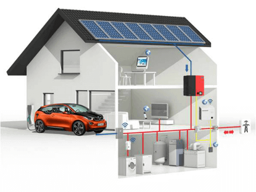
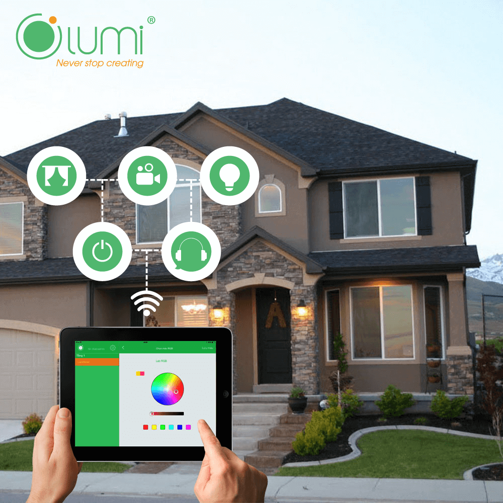

**Ngày nay cùng với sự phát triển của công nghệ, con người ngày càng có những giải pháp để mang đến cho mình một cuộc sống hiện đại và tiện ích hơn. Một trong những giải pháp mà chúng tôi muốn nói đến ở đây chính là nhà thông minh. Nó đã mang đến nhiều tiện ích cho những ngôi nhà,căn hộ hiện đại. Tuy nhiên, nhiều người vẫn chưa biết rõ về giải pháp này. Tất cả những thông tin về nhà thông minh cũng như những điều cần biết về nhà thông minh sẽ được chia sẻ qua bài viết dưới đây.**

## Nhà thông minh là gì?

Nhà thông minh ( smarthome) là việc ứng dụng những công nghệ hiện đại để điều khiển tự động những thiết bị trong nhà, giúp mang đến sự thoải mái và tiện dụng cho những thành viên trong gia đình. Giải pháp nhà thông minh giúp gia đình bạn tiết kiệm thời gian, tiết kiệm tiền bằng việc quản lý thời gian và năng lượng một cách hiệu quả nhất. Tất cả những gì liên quan đến năng lượng trong gia đình bạn sẽ được kiểm soát một cách hiệu quả thông qua smartphone. Như hệ thống đèn chiếu sáng, điều hòa, nóng lạnh. Thậm chí bạn có thể kiểm soát được nguồn ánh sáng và an ninh của ngôi nhà cũng chỉ với một chiếc smartphone nhỏ bé.

_Nhà thông minh (smarthome) Lumi_

## Nhà thông minh gồm những bộ phận nào

Nhà thông minh được thiết kế với 2 bộ phận chính là phần cứng và phần mềm. Phần cứng trong nhà thông minh là những thiết bị thông minh bao gồm: công tắc, loa thông minh, loa đa vùng, chuông báo, cảm biến tại cửa được kết nối với bộ điều khiển trung tâm để quản lý điều khiển hoạt động của toàn ngôi nhà. Để có thể lựa chọn những thiết bị phần cứng hoàn hảo nhất, bạn cần nắm rõ những điều cần biết về nhà thông minhsau đây:

Lựa chọn những thiết bị nằm trong một hệ sinh thái lớn và không bị độc quyền. Bạn nên chọn những thiết bị đồng bộ và không bị độc quyền vì thời gian sử dụng của ngôi nhà là rất lâu ( ít nhất 50 năm).

Việc sửa chữa thay thế những thiết bị này trong quá trình sử dụng là không thể tránh khỏi. Vì thế, bạn phải tính toán thật kỹ và sử dụng những thiết bị phổ biến để có thể sửa chữa thay thế dễ dàng. Bên cạnh đó, bạn cũng không thể tránh khỏi tình trạng sau một thời gian thì những sản phẩm độc quyền sẽ không được sản xuất nữa và như thế thì rất bất tiện.

Trong nhà thông minh thì bộ điều khiển trung tâm đóng vai trò cực kỳ quan trọng, giúp kiểm soát cũng như điều khiển tất cả các thiết bị khác có thể hoạt động trơn tru. Chính vì thế, khi chọn những thiết bị phần cứng trong nhà thông minh, bạn cũng nên chú ý để lựa chọn bộ điều khiển trung tâm có chất lượng cao. Một bộ điều khiển trung tâm tốt còn có thể hỗ trợ phát triển các chức năng khác trong tương lai.

_Cấu trúc nhà thông minh (smarthome)_

Phần mềm trong nhà thông minh là những chương trình được thiết lập để điều khiển các thiết bị thông minh trong nhà. Một ngôi nhà có thực sự thông minh và tiện ích hay không sẽ phụ thuộc rất nhiều vào những chương trình này. Những chương trình thông minh này có thể được chạy một cách độc lập hoặc kết nối với nhau thông qua điện toán đám mây.

Một trong những điều cần biết về nhà thông minh là mỗi giải pháp được cung cấp từ một đơn vị sẽ có một hệ thống phần mềm độc quyền khác nhau. Mỗi phần mềm này đều được bảo mật kỹ lưỡng và được cài đặt riêng cho mỗi hệ thống nhà thông minh. Hệ thống phần mềm này là độc quyền và quý khách hàng sẽ được hỗ trợ trọn đời. Mỗi khi phần mềm có xảy ra sự cố, trục trặc thì quý khách hàng sẽ luôn được hỗ trợ tốt nhất.

Sự kết hợp giữa phần cứng và phần mềm trong nhà thông minh sẽ giúp tạo nên một ngôi nhà hoàn chỉnh nhất, mang đến sự tiện ích cho quý khách hàng. Nhà thông minh chính là xu hướng trong tương lai. Vì thế, việc lắp đặt giải pháp nhà thông minh là rất thiết thực cho mỗi gia đình.

Trên đây là những điều cần biết về nhà thông minh (smarthome). Nếu bạn đang có nhu cầu cũng như muốn tìm hiểu thêm về giải pháp nhà thông minh, vui lòng [liên hệ](/lien-he) GiaHanGroup để được hỗ trợ.