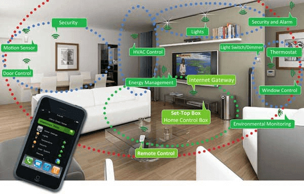
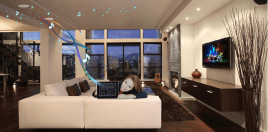

**Giải pháp nhà thông minh sử dụng công nghệ tiên tiến với những giải pháp thông minh, mang đến cho quý khách hàng không gian hiện đại và tiện ích nhất. Hãy cùng tìm hiểu những lợi ích của nhà thông minh qua bài viết sau đây.**

## Sử dụng công nghệ không dây tiên tiến

Công nghệ không dây tiên tiến mà Lumi áp dụng mang đến những tiện ích tuyệt vời cho ngôi nhà của bạn. Sóng không dây trong nhà thông minh giúp kết nối các thiết bị một cách đồng bộ. Các thiết bị thông minh trong nhà được thiết kế và kết nối với nhau bằng sóng không dây thông qua bộ điều khiển trung tâm, không phải đi dây điện lằng nhằng, gây mất thẩm mỹ trong ngôi nhà. Hơn thế nữa, sóng không dây cũng gây ảnh hưởng đến sức khỏe của người sử dụng, đảm bảo an toàn cho tất cả mọi thành viên trong gia đình. Đây là lợi ích của nhà thông minh mà không phải giải pháp nào cũng có được.

## Tiện nghi hiện đại hàng đầu

Hệ thống nhà thông minh với những thiết bị tiện ích được kết nối với nhau thông qua hệ thống sóng không dây và bộ điều khiển từ xa, mang đến sự tiện nghi bậc nhất cho người sử dụng. Trong nhà thông minh, các thiết bị trong hệ thống như rèm cửa, hệ thống chiếu sáng, điều hòa nhiệt độ được kết nối đồng bộ với nhau, tạo nên một hệ thống mạng thống nhất, giúp chủ nhân có thể điều khiển bằng smartphone hoặc máy tính bảng có kết nối internet. Phụ thuộc vào nhu cầu sử dụng cũng như thói quen sinh hoạt hàng ngày mà gia chủ có thể thiết lập ngữ cảnh phù hợp nhất. Sự tiện nghi mà nhà thông minh mang lại sẽ giúp gia chủ có những sự tiện ích bậc nhất.

## Tận hưởng của sống tiện nghi hiện đại

Kiểm soát và điều khiển các thiết bị thông qua smartphone hoặc máy tính bảng

Một trong những lợi ích của nhà thông minh là những thiết bị điện sẽ được kiểm soát và điều khiển thông qua smartphone hoặc máy tính bảng có kết nối internet. Bạn có thể điều khiển những thiết bị đó dù đang ở bất kỳ đâu. Sóng không dây trong hệ thống nhà thông minh sẽ kết nối tất cả thiết bị thông qua bộ điều khiển trung tâm. Khi giao diện nhà thông minh đã được cài sẵn trên điện thoại, bạn sẽ dễ dàng điều khiển và kiểm soát những thiết bị trong ngôi nhà

## Lợi ích của nhà thông minh trong việc tiết kiệm năng lượng

Trong nhà thông minh, nguồn năng lượng trong gia đình sẽ luôn được kiểm soát một cách tốt nhất. Bạn sẽ không còn nỗi lo quên tắt đèn, tắt điều hòa hay những thiết bị sử dụng điện năng khác trong gia đình.

_Lợi ích của nhà thông minh trong việc tiết kiệm năng lượng_

Bên cạnh đó, bạn cũng có thể kiểm soát được việc những thành viên trong gia đình sử dụng năng lượng như thế nào, có lãng phí hay không? Với hệ thống thông minh được tích hợp với smartphone, bạn có thể tắt các thiết bị đó dù bạn ở bất kỳ đâu. Hơn thế nữa, bạn còn có thể thiết lập, hẹn giờ tắt cho tất cả các thiết bị, giúp các thiết bị điện năng được sử dụng một cách tối ưu nhất, tiết kiệm điện năng tối đa cho ngôi nhà của bạn

## Kiểm soát an ninh từ xa

Hệ thống nhà thông minh trang bị camera an ninh và hệ thống cảm biến hiện đại, giúp bạn có thể kiểm soát được an ninh trong ngôi nhà của mình.

Đặc biệt, khi có động tĩnh lạ xảy ra trong ngôi nhà thì sẽ có một thông báo được gửi đến điện thoại của bạn. Vì thế, bạn sẽ dễ dàng kiểm soát được an ninh trong không gian đó rất nhanh chóng.

Như vậy, chúng tôi đã chia sẻ đến các bạn thông tin về những lợi ích của nhà thông minh, giúp bạn có thêm một giải pháp sử dụng hết những tiện ích trong ngôi nhà của mình. Với những gì mà chúng tôi chia sẻ hi vọng quý khách hàng đã có thêm hiểu biết cũng như những nhận định chính xác hơn về nhà thông minh. Nếu bạn đang muốn tìm hiểu thêm cũng như lắp đặt hệ thống nhà thông minh, vui lòng liên hệ Lumi để được hỗ trợ tốt nhất.

Chúng tôi cam kết mang đến cho quý khách hàng những lợi ích của nhà thông minh tiện lợi nhất với mức giá tốt nhất.
