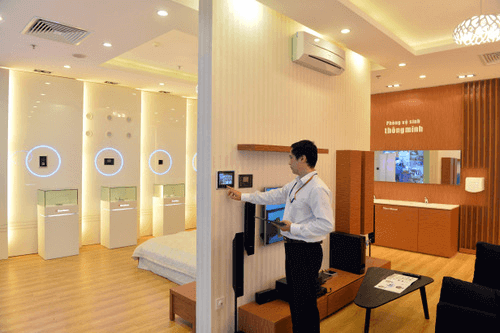
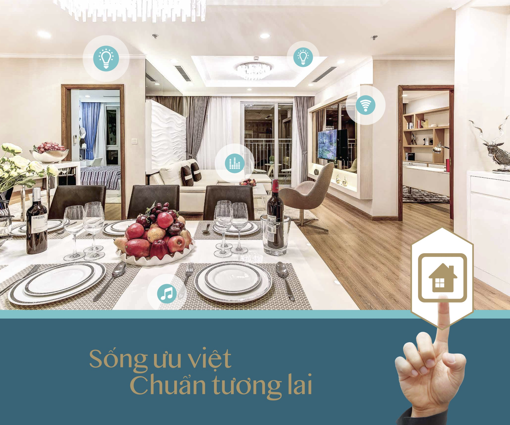
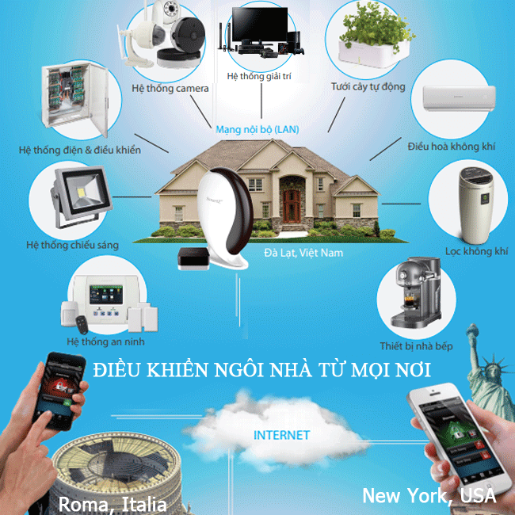

**Để việc thi công lắp đặt ngôi nhà thông minh được thuận lợi, nhất định bạn phải đặt ra các câu hỏi sau đây cho nhà phân phối, điều này sẽ giúp bạn có được ngôi nhà tốt nhất.**

##Các câu hỏi quan trọng cụ thể như:

### Ngôi nhà sử dụng giao thức kết nối gì?**

Hiểu được các vấn đề này sẽ giúp bạn biết được khả năng tích hợp các thiết bị cho ngôi nhà của bạn trong thời điểm hiện tại và tương lai. Giao thức kết nối hiện nay có thể là Bluetooth, RF, S Wave hay Zigbee….Công nghệ Zigbee hiện tại đang là giao thức tân tiến nhất, trong tương lai có thể sẽ là xu hướng mới.

### Ngoài các kết nối trên ngôi nhà có được tích hợp các thiết bị khác không?

Do nhu cầu sử dụng ngày càng cao, nên rất có thể sau này bạn cần phải sử dụng thêm nhiều thiết bị khác nữa, vì thế bạn phải hỏi kỹ xem sau này có thể nâng cấp hệ thống ngôi nhà thông minh của mình giúp hoàn thiện hơn.

_Các thiết bị cơ bản khi lắp đặt ngôi nhà thông minh_

### Ngôi nhà có tích hợp Amazon Echo, Google Home không?

Có thể đến một ngày chiếc điện thoại thông minh cũng không còn cần thiết để mang theo bên mình nữa, thay vì đó là điều khiển bằng giọng nói sẽ là xu hướng thời đại mới. Vì thế bạn cũng cần hỏi nhà phân phối về vấn đề này.

### Độ bảo mật của ngôi nhà có an toàn không?

Nhà thông minh được hoạt động với hệ thống tự động hóa, dựa trên nền tảng internet. Bởi thế khả năng bị tấn công bảo mật qua hệ thống internet cũng khá cao, nên vấn đề này nhất định bạn phải quan tâm hàng đầu. Bạn cần biết chút ít về dịch vụ lưu trữ đám mây mà công ty lắp đặt hiện đang tư vấn cho bạn, giúp bạn biết khả năng an toàn cho ngôi nhà của mình.

### Phải làm gì khi ngôi nhà gặp sự cố - Khắc phục có dễ dàng không?

Những ngôi nhà thông minh mới chỉ xuất hiện tại Việt Nam trong thời gian gần đây nên còn rất mới mẻ. Tuy nhiên với các nước phát triển trên thế giới, ngôi nhà đã có từ rất lâu.

Do sự mới mẻ nên khi lắp đặt ngôi nhà thông minh không thể tránh khỏi việc bạn thao tác sai do chưa thành thạo. Đơn giản nhất như khi sử dụng chiếc laptop hay bất cứ loại công nghệ nào, tuy đã có từ lâu, nhưng vẫn còn rất nhiều chức năng ta chưa khai thác hết.

Riêng nhà thông minh phần lớn chỉ nhà cung cấp và lắp đặt thì mới chắc chắn thành thạo. Vì thế vấn đề bảo hành, hỗ trợ sau khi lắp đặt là vô cùng quan trọng.

### Vậy ý nghĩa thật sự của việc lắp đặt ngôi nhà thông minh là gì?

Ngôi nhà thông minh có tích hợp một trung tâm đầu não để thu thập tín hiệu và thông tin các cảm biến báo về. Từ đó trung tâm sẽ chỉ huy các thiết bị điện, điện tử khác trong nhà, phục vụ các nhu cầu của chủ nhân.

_Điều khiển dễ dàng mọi thiết bị ở bất cứ đâu_

Việc lắp đặt ngôi nhà thông minh nhằm giải phóng bớt những công việc không cần thiết trong ngôi nhà, chẳng hạn như việc phải leo lên cầu thang để tắt đèn, đi xa nhà phải về tưới cây…Với ngôi nhà thông minh bạn chỉ cần các nút kích hoạt các ngữ cảnh được lập trình theo ý muốn của bạn, được lưu vào 1-2 nút nhất định, vì thế bạn cũng không cần phải lo lắng.

### Nhà thông minh mang lại lợi ích gì?

Một trong những lợi ích thiết thực nhất của ngôi nhà thông minh đó là có thể quan sát, điều khiển, kiểm soát ngôi nhà mọi lúc, mọi nơi. Ngôi nhà thông minh đem lại cuộc sống tiện nghi và an toàn, đem đến sự an tâm hơn cho người sử dụng.

Trong tương lai, trên thế giới cũng như tại Việt nam, với hệ thống thiết bị hiện đại, nhiều đơn vị có thể lắp đặt ngôi nhà thông minh mang lại lợi ích nhiều hơn nữa, cụ thể:

Giúp bạn khỏe mạnh hơn.
Chăm sóc người già giùm cho bạn.
Giúp bạn tương tác với các mạng xã hội rộng rãi hơn.
Hi vọng qua bài viết sẽ giúp bạn hiểu hơn về các vấn đề liên quan đến việc lắp đặt ngôi nhà thông minh cụ thể nhất.