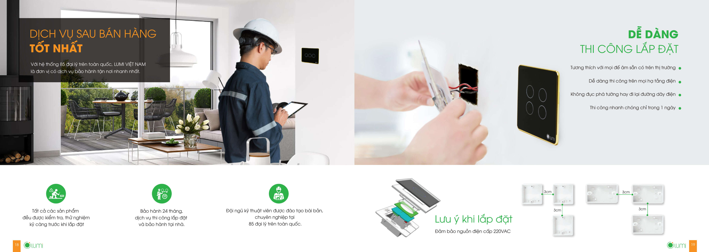

**TRONG VÀI NĂM TRỞ LẠI ĐÂY, CỤM TỪ NHÀ THÔNG MINH ĐƯỢC NHẮC ĐẾN CŨNG NHƯ TÌM KIẾM RẤT NHIỀU. CŨNG CHÍNH VÌ THẾ, NHU CẦU XÂY NHÀ THÔNG MINH CŨNG TĂNG CAO. KHÔNG THỂ PHỦ NHẬN ĐƯỢC NHỮNG TÍNH NĂNG MÀ NHÀ THÔNG MINH MANG LẠI. TUY NHIÊN KHÔNG PHẢI AI CŨNG BIẾT CÁCH XÂY MỘT NGÔI NHÀ THÔNG MINH ĐÚNG CÁCH VÀ TIẾT KIỆM. VẬY ĐIỀU BẠN CẦN LÀM KHI LẮP ĐẶT NHÀ THÔNG MINH LÀ GÌ. HÃY CÙNG THEO DÕI BÀI VIẾT DƯỚI ĐÂY NHÉ.**

## Chú ý thiết kế kiến trúc khi xây nhà thông minh

Nhà thông minh cũng giống như bao ngôi nhà bình thường khác. Chính vì thế trước khi lắp đặt nhà thông minh cần có bản vẽ thiết kế cũng như những kiến trúc sẽ hỗ trợ bạn về vấn đề này. Tuy nhiên trong khi thiết kế xây dựng nhà thông minh thì bạn cần chú ý vì một số công năng của nó sẽ rất khác so với những ngôi nhà thông thường. Bạn phải thiết kế sao cho phù hợp với những nhu cầu của mình. Bên cạnh đó, vị trí lắp đặt các thiết bị thông minh cũng cần được bố trí trên bản vẽ thiết kế này.

## Sắp xếp nội thất cho ngôi nhà thông minh

Việc lắp đặt nhà thông minh cần kết hợp với một số thiết bị thông minh khác. Vì như vậy sẽ giúp bạn có thể biến hóa thành nhiều vật dụng khác nhau trong cùng một khu vực. Điều này sẽ giúp bạn tiết kiệm được diện tích cũng như phát huy được tất cả công năng của những món đồ nội thất đó. Việc sắp xếp nội thất trong ngôi nhà thông minh cũng giúp bạn dễ dàng biến hóa, linh động nhiều kịch bản hơn.

_Các thiết bị cơ bản của nhà thông minh_

## Diện tích của ngôi nhà

Trong nhà thông minh thì diện tích đóng vai trò cực kỳ quan trọng trong việc lắp đặt các thiết bị. Bạn có thể xem xét diện tích của ngôi nhà là lớn hay nhỏ, khoảng cách giữa các phòng có lớn hay không. Từ đó sẽ có những phương án lắp đặt các thiết bị thông minh phù hợp nhất. Nếu diện tích nhà bạn hạn hẹp thì có thể lắp đặt những thiết bị thông minh không dây được kết nối với nhau bằng sóng wifi. Còn nếu nhà bạn có diện tích rộng thì hãy sử dụng những thiết bị thông minh có dây. Chúng được kết nối và hoạt động thông qua bộ điều khiển trung tâm.

## Vị trí lắp đặt các thiết bị thông minh trong ngôi nhà

Trong bản vẽ thiết kế sẽ có sơ đồ bố trí các thiết bị điện. Bạn nên xem xét thật kỹ và có những lựa chọn đúng đắn để đặt các thiết bị điện sao cho phù hợp nhất. Nếu bạn không rành khi xem bản vẽ kỹ thuật thì có thể nhờ đến sự hỗ trợ của các kỹ sư nhé.

_Khi lắp đặt nhà thông minh, cần xây dựng bản vẽ thiết kế bố trí các thiết bị_

## Lựa chọn nhà cung cấp giải pháp nhà thông minh uy tín

Bên cạnh việc lắp đặt, sắp xếp những thiết bị  trên thì một điều nữa mà bạn cũng cần lưu ý chính là chọn nhà cung cấp lắp đặt uy tín. Khi xây nhà thông minh thì không phải gia chủ nào cũng có thể quan sát tất cả quá trình xem việc lắp đặt những thiết bị có chính xác, phù hợp hay không. Những sản phẩm họ sử dụng có phải là hàng chính hãng hay không?

Hơn thế nữa, bạn cũng sẽ quan tâm đến chế độ bảo hành khi lắp đặt nhà thông minh đúng không. Bạn nên tìm những chuyên gia về nhà thông minh để được tư vấn cũng như hỗ trợ tốt nhất.Tất cả những điều đó sẽ được giải quyết khi bạn làm việc với một nhà cung cấp giải pháp nhà thông minh uy tín.

Một trong những đơn vị cung cấp giải pháp nhà thông minh uy tín mà chúng tôi muốn chia sẻ đến các bạn chính là Lumi. Với nhiều năm kinh nghiệm trong lĩnh vực cung cấp giải pháp lắp đặt nhà thông minh cùng đội ngũ nhân viên kỹ thuật dày dặn kinh nghiệm, Lumi sẽ là lựa chọn tối ưu nhất cho quý khách hàng.

Với thái độ phục vụ chuyên nghiệp cùng đội ngũ kỹ thuật giàu kinh nghiệm tại Gia Hân group, bạn sẽ được giải đáp bất kỳ thắc mắc nào với thái độ thân thiện nhất. Tất cả sản phẩm của Lumi đều được bảo hành chu đáo. Trong quá trình sử dụng nếu có bất cứ vấn đề, nhân viên kỹ thuật sẽ có mặt ngay lập tức để hỗ trợ bạn.

Mọi thông tin chi tiết, quý khách hàng hãy liên hệ Lumi để được hỗ trợ lắp đặt nhà thông minh tốt nhất nhé.

**Hãy liên hệ với Gia Hân qua địa chỉ và số điện thoại:**

 Số 304 Nguyễn Đình Tựu, Q.Thanh Khê , TP. Đà Nẵng
 
 Hotline :  0968.333.268 - 0935.333.268
 
 web:        Giahangroup.vn