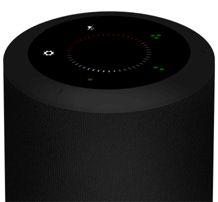
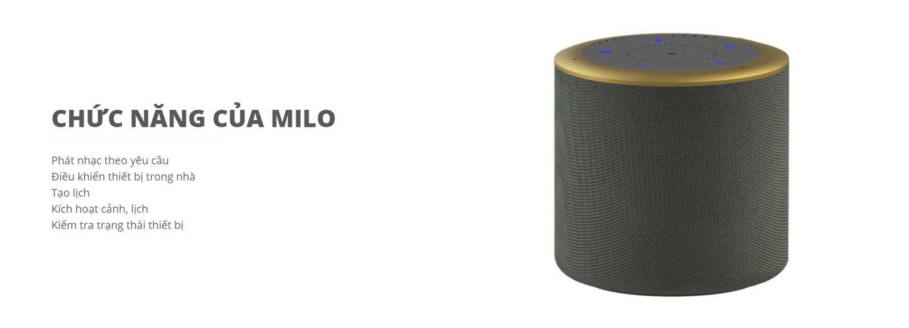
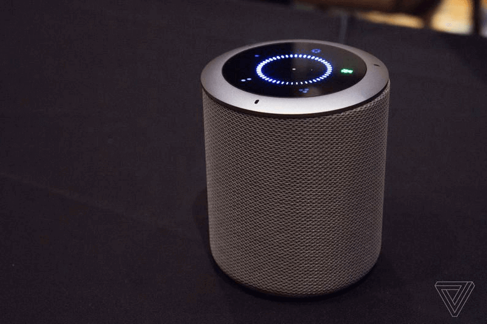

**Trong cuộc sống hiện đại thì những giải pháp công nghệ hiện đại luôn giúp quý khách có một cuộc sống hiện đại và tiện ích nhất. Một trong những tiện ích đó chính là giải pháp loa thông minh Milo - Điều khiển bằng giọng nói tiếng việt, giúp bạn có thể điều khiển tất cả các thiết bị trong gia đình bằng giọng nói của mình.**

Khi được trang bị giải pháp Milo – Giọng nói tiếng Việt, bạn có thể dễ dàng điều khiển, kiểm soát tất cả thiết bị trong gia đình mình chỉ với một câu lệnh](7.png)

## Tiện ích của giải pháp loa thông minh Milo- giọng nói tiếng việt

Khi được trang bị giải pháp Milo – Giọng nói tiếng Việt, bạn có thể dễ dàng điều khiển, kiểm soát tất cả thiết bị trong gia đình mình chỉ với một câu lệnh

_Tiện ích của giải pháp Milo- giọng nói tiếng việt_

Bạn có thể điều khiển hệ thống ánh sáng, hệ thống quạt, điều hòa, nóng lạnh trong ngôi nhà của mình. Giải pháp loa thông minh Milo mang đến rất nhiều tiện ích cho cuộc sống của bạn đó là:

## Điều khiển tất cả những thiết bị trong ngôi nhà bằng tiếng việt

Bạn hoàn toàn có thể điều khiển hệ thống chiếu sáng, hệ thống quạt điện, nóng lạnh, rèm cửa chỉ với những câu thoại bằng tiếng việt cực kỳ đơn giản.

Dù là giọng ở vùng miền nào thì loa Milo vẫn hiểu rất dễ dàng và thực hiện theo đúng yêu cầu của bạn.

## Điều khiển qua smartphone mọi lúc mọi nơi

Bạn ra khỏi nhà và không nhớ rằng mình đã tắt đèn hay chưa, bạn cũng không thể biết rằng những đứa trẻ nhà mình đã tắt điều hòa, nóng lạnh sau mỗi lần sử dụng. Điều này sẽ không còn là nỗi lo lắng vì bạn có thể kiểm soát những thiết bị đó và điều khiển chúng dễ dàng thông qua smartphone. Điều đặc biệt là bạn chỉ cần sử dụng những câu lệnh bằng tiếng việt. Dù ở bất kỳ đâu thì bạn vẫn có thể điều khiển được hệ thống điện, hệ thống đèn, rèm...của gia đình mình.

## Thiết kế tinh tế

Với 2 màu sắc nâu và đen cùng thiết kế viền nhôm sang trọng và thân được bọc vải cẩn thận, loa Lumi rất thân thiện và trang nhã, mang đến cho  không gian vẻ đẹp hoàn hảo nhất.

Đặc biệt, nó cũng có thể là một vật trang trí, giúp căn  phòng trở nên đẹp, lịch sử và trang nhã hơn

_Thiết kế tinh tế của loa thông minh Milo_

## An toàn với người dùng

Nếu bạn đang lo lắng rằng không biết sản phẩm này có nguy hại và gây nguy hiểm trong quá trình sử dụng hay không chúng tôi xin khẳng định rằng: “Sản phẩm này cũng rất an toàn với người sử dụng, đạt chuẩn Châu Âu và được phép xuất khẩu ra 104 quốc gia trên thế giới”

## Một số câu lệnh đơn giản trong giải pháp loa thông minh Milo- giọng nói tiếng Việt

**Ok Lumi, bật đèn**

Đây là câu lệnh được sử dụng khi bạn có nhu cầu bật đèn trong căn phòng. Ngay lập tức, toàn bộ hệ thống đèn điện trong căn phòng sẽ tự động bật sáng.

Giải pháp Milo sẽ cho bạn cơ hội thể hiện giọng nói cũng như sức mạnh trong giọng nói của mình.

**Ok Lumi, mở rèm**

Đây sẽ là câu lệnh mà bạn có thể sử dụng khi muốn mở toàn bộ hệ thống rèm cửa ngôi nhà. Rèm cũng sẽ đóng lại khi bạn nói “ok, Lumi đóng rèm”.

**Ok Lumi, mở nhạc**

Nếu bạn đang buồn chán và muốn thưởng thức một bản nhạc thì có thể sử dụng câu lệnh “ ok Lumi, mở nhạc” cực kỳ đơn giản và nhanh chóng. Ngay lập tức, những bản nhạc yêu thích của bạn sẽ được phát trong không gian đó. Vì được kết hợp cùng google assistant, Lumi cho phép bạn có thể thưởng thức bất kỳ bản nhạc nào mình muốn.

## Những thiết bị kết hợp trong bộ giải pháp

Không chỉ có loa Milo mà giải pháp này còn được kết hợp với nhiều thiết bj khác nhau, mang đến một sự hoàn chỉnh cho không gian. Đó là bộ điều khiển trung tâm, công tắc viền nhôm, công tắc mạ vàng

Là một hệ thống hoàn chỉnh, những thiết bị này sẽ giúp giải pháp loa Milo được vận hành một cách trơn tru nhất. Hơn thế nữa với thiết kế hiện đại, sang trọng, những thiết bị trong bộ giải pháp cũng sẽ là những vật trang trí, mang đến không gian đẹp tinh tế nhất.

Như vậy, chúng tôi vừa chia sẻ đến các bạn thông tin về một giải pháp hiện đại, tân tiến, mang đến nhiều tiện ích cho cuộc sống hiện đại.

Nếu quý khách hàng đang có nhu cầu tìm hiểu về giải pháp loa thông minh Milo, vui lòng liên hệ Lumi để được hỗ trợ tốt nhất.
