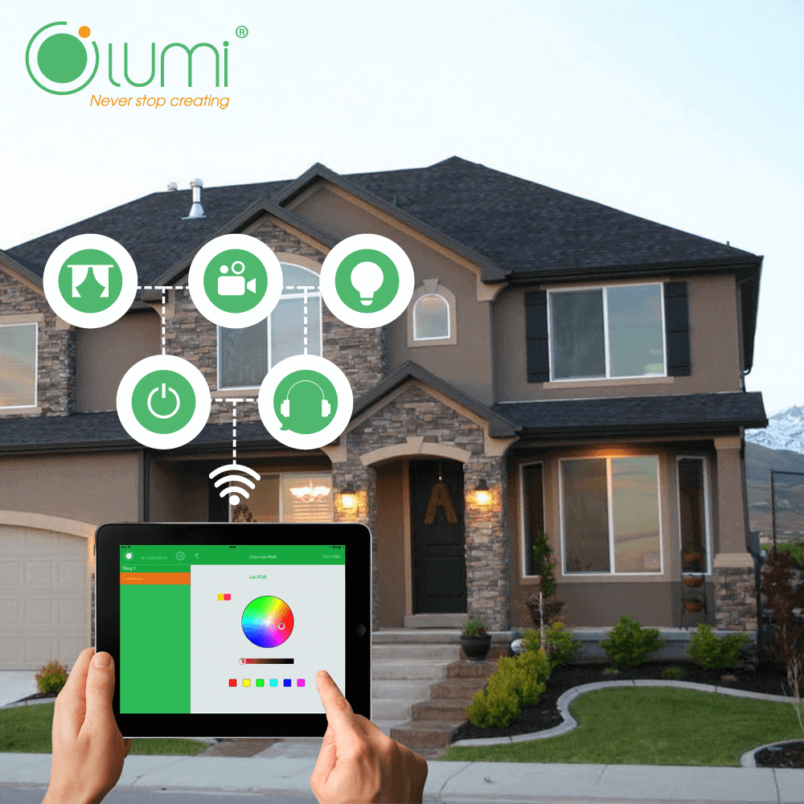
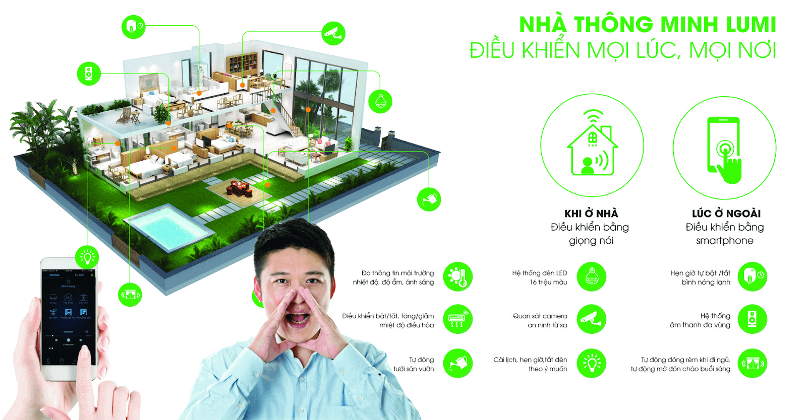

## NHỮNG LỢI ÍCH ƯU VIỆT ĐẾN TỪ GIẢI PHÁP NHÀ THÔNG MINH LUMI MANG LẠI.

**Cuộc sống con người ngày càng phát triển, những ứng dụng công nghệ hiện đại ngày càng được áp dụng nhiều vào đời sống hàng ngày, mang đến sự tiện ích cho mọi người. Trong số đó thì không thể không kể đến giải pháp nhà thông minh có thể điều khiển và kiểm soát ngôi nhà bằng smartphone hoặc thông qua máy tính có kết nối internet. Giải pháp nhà thông minh Lumi mang đến rất nhiều tiện ích cho người sử dụng.**

**Đảm bảo sự an toàn thông qua việc điều khiển ánh sáng và thiết bị điện**

Giải pháp nhà thông minh Lumi giúp tăng thêm sự an toàn cho ngôi nhà cũng như những thành viên trong gia đình bạn.

Bạn có thể kiểm soát tất cả hệ chiếu sáng , hệ thống điều hòa, nóng lạnh các vật dụng khác như dụng điện như quạt điện, tivi, tủ lạnh, máy sấy tóc,lò nướng…chỉ bằng một cái chạm nhẹ trên smartphone.

_Kiểm soát hệ thống ánh sáng thiết bị điện dễ dàng và nhanh chóng_

Bạn sẽ luôn kiểm soát được tất cả những thiết bị điện trong nhà như con bạn đã tắt máy sấy hay chưa hay điều hòa, nóng lạnh đã được đóng lại sau khi sử dụng. Vì thế, bạn sẽ tiết kiệm được một khoản chi phí tiền điện hàng tháng đáng kể.

Thêm vào đó, giải pháp nhà thông minh Lumi còn cho phép bạn có thể điều khiển khoảng thời gian chiếu sáng trong nhà, đánh lạc hướng kẻ trộm, đảm bảo an ninh trong ngôi nhà bạn.

### Đảm bảo an ninh

Hệ thống camera an ninh và cảm ứng nhập khẩu sẽ giúp bạn kiểm soát được an ninh trong ngôi nhà của mình một cách tốt nhất.

Khi có sự đột nhập bất thường thì hệ thống an ninh sẽ đồng loạt hoạt động như sáng đèn mở rèm, còi hú. Đồng thời cũng sẽ có một thông báo gửi đến điện thoại của bạn. Điều này sẽ đảm bảo an ninh của ngôi nhà luôn được kiểm soát ở mức tốt nhất.

### Bảo vệ sức khỏe của gia đình bạn nhờ giải pháp môi trường

Nhiệt độ, ánh sáng và độ ẩm trong căn phòng sẽ được điều chỉnh phù hợp theo sự cài đặt của bạn. Khi nhiệt độ trong phòng quá nóng, quá lạnh, phòng tối hay độ ẩm trong phòng quá cao thì hệ thống cảm biến sẽ tự động điều chỉnh về mức phù hợp nhất.

Hơn thế nữa, nếu lượng ánh sáng chiếu đến nhà bạn quá lớn thì hệ thống cảm biến sẽ tự động kéo rèm lại. Môi trường trong nhà bạn luôn được kiểm soát ở mức tối ưu nhất, giúp bạn chăm sóc được các thành viên trong gia đình mình một cách tốt nhất.

### Tiết kiệm thời gian

Cuộc sống hiện đại khiến bạn luôn phải bận rộn và phải cân bằng giữa công việc và việc chăm sóc gia đình. Nếu sống trong những căn nhà thì bình thường thì bạn sẽ luôn phải bận rộn chạy từ nơi này sang nơi kia, để hoàn thành tất cả những công việc từ chăm sóc gia đình công việc ở công ty hay việc kinh doanh cá nhân. Nhưng với những ngôi nhà thông minh thì lượng công việc của bạn sẽ giảm đi rất nhiều bạn sẽ không còn phải chạy ngược chạy xuôi để mở cửa cho bọn trẻ hay phải về nhà để điều chỉnh các thiết bị trong nhà.Bạn sẽ tiết kiệm được rất nhiều thời gian và công việc sẽ đạt được hiệu quả tốt nhất.

### Điều khiển và kiểm soát ngay khi bạn đi xa

Những thiết bị trong nhà thông minh được kết nối với smartphone. Vì thế, bạn có thể dễ dàng kiểm soát và điều khiển ngôi nhà cho dù bạn ở bất kỳ nơi đâu.

_Điều khiển các thiết bị mọi lúc mọi nơi_

Chính vì thế, cho dù bạn ở ngoài thì bạn vẫn có thể kiểm soát được bọn trẻ ở nhà, chúng có sử dụng tivi hay không, chúng có đang ở nhà vào buổi tối hay không,.. Điều này mang đến nhiều tiện ích cho các ông bố bà mẹ, đặc biệt là với những người bận rộn

Như vậy, chúng tôi vừa chia sẻ đến các bạn giải pháp thông minh Lumi giúp bạn kiểm soát được ngôi nhà một cách tốt nhất về sức khỏe và cả sự an toàn của các thành viên trong gia đình nữa. Nếu quý khách hàng đang có nhu cầu tìm hiểu về giải pháp nhà thông minh Lumi, vui lòng liên hệ Lumi để được hỗ trợ tốt nhất.
