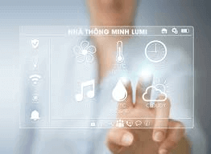
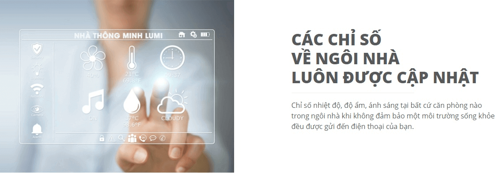
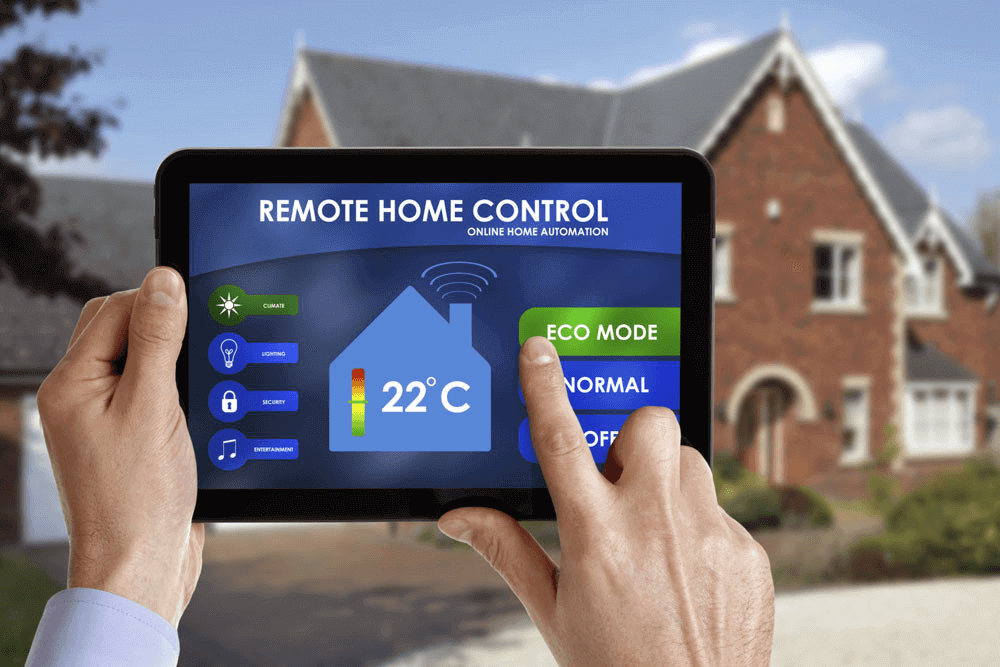

**Môi trường trong ngôi nhà bị nhiễm bụi bẩn, ô nhiễm không khí hay những vấn đề về bụi bẩn đang là điều khiến nhiều gia đình đau đầu hiện nay. Vấn đề về môi trường như độ ẩm nhiệt độ bụi bẩn gây ảnh hưởng rất nhiều đến sức khỏe của nhiều thành viên trong gia đình, đặc biệt là người già và trẻ nhỏ. Hiểu được điều đó, Lumi đã cho ra đời giải pháp kiểm soát môi trường Lumi, giúp bạn có thể bảo vệ sức khỏe toàn diện cho các thành viên trong gia đình.**

_GIẢI PHÁP KIỂM SOÁT MÔI TRƯỜNG LUMI_

## Tính năng của giải pháp bảo vệ môi trường

Thiết bị cảm biến chuyển động và cảm biến cửa của Lumi luôn tích hợp cảm biến môi trường, cung cấp những thông tin về nhiệt độ, độ ẩm, ánh sáng trong từng căn phòng. Khi nhiệt độ trong nhà có sự thay đổi quá nóng hay quá lạnh thiết bị cảm biến sẽ truyền thông tin đến bộ điều khiển trung tâm. Bộ điều khiển trung tâm sẽ gửi thông tin đến smartphone của bạn. Đồng thời, hệ thống cũng sẽ tự động kích hoạt điều hòa, bật quạt gió, kéo rèm cửa, mang đến một môi trường trong lành nhất, đảm bảo sức khỏe tốt nhất cho các thành viên trong gia đình bạn.

Giải pháp kiểm soát môi trường Lumi có thể điều khiển bằng giọng nói tiếng việt, dù là giọng bắc trung hay nam thì thiết bị vẫn có thể nhận diện được. Bên cạnh đó, bạn sẽ luôn kiểm soát được các chỉ số về nhiệt độ, độ ẩm trong ngôi nhà tại bất kỳ nơi đâu vào bất kỳ thời gian nào chỉ thông qua chiếc smartphone. Điều này cực kỳ tiện lợi cho những gia đình có trẻ nhỏ và người lớn tuổi.

_Theo dõi mọi chỉ số với giải pháp kiểm soát môi trường Lumi_

Các chỉ số nhiệt độ, độ ẩm ánh sáng luôn được cập nhật liên tục, giúp bạn kiểm soát được thông tin về môi trường trong ngôi nhà của mình nhanh chóng và tiện lợi.

Bên cạnh đó, thiết bị này còn có thể kết hợp với những thiết bị khác để tạo nên sự kỳ diệu trong không gian như hệ thống rèm cửa tạo nên không gian đẹp mắt và sự đồng bộ cho toàn không gian đó. Hơn thế nữa, rèm cửa sẽ tự động mở hoặc đóng khi không gian căn phòng quá tối hoặc quá sáng. Hệ thống đèn trong ngôi nhà cũng sẽ tự động bật hoặc tắt nếu không gian đó quá tối hoặc quá sáng.

Những thiết bị được sử dụng trong giải pháp này đều đạt chứng nhận CE và UL theo chuẩn Châu Âu và được phép xuất khẩu sang 104 quốc gia trên thế giới.

## Những thiết bị đồng bộ của giải pháp

Giải pháp kiểm soát môi trường sử dụng những thiết bị đồng bộ khác, mang đến sự tiện ích cũng như vẻ đẹp cho toàn ngôi nhà.

_Những thiết bị đồng bộ của giải pháp_

### Công tắc cảm ứng

Công tắc cảm ứng được thiết kế mạ vàng tạo nên sự sang trọng, đẳng cấp.

Thiết bị ứng dụng công nghệ không dây Zigbee cho phép có thể điều khiển từ xa hệ thống điện, đèn chiếu sáng, điều hòa, nóng lạnh thông qua smartphone hoặc máy tính có kết nối internet. Đặc biệt công tắc cảm ứng còn có chức năng điều khiển bằng giọng nói.

### Bộ điều khiển trung tâm

Được xem là bộ não của ngôi nhà thông minh, thiết bị có chức năng kiểm soát cũng như điều khiển các thiết bị khác trong toàn ngôi nhà.

Sản phẩm ứng dụng công nghệ truyền thông không dây Zigbee cực kỳ thông minh, có thể kết với smartphone thông qua mạng internet.

Bộ điều khiển trung tâm là nơi lưu trữ những thông tin về cấu hình, các cài đặt, cập nhật và ra lệnh những thiết bị khác theo yêu cầu của người dùng.

### Cảm biến cửa, cảm biến chuyển động

Thiết bị giải pháp kiểm soát môi trường Lumi sẽ được tích hợp trong cảm biến cửa để kiểm soát và thông báo đến người dùng những thông số về môi trường trong căn phòng cũng như trong toàn ngôi nhà đó.

Như  vậy chúng tôi vừa chia sẻ đến các bạn một giải pháp cho ngôi nhà thông minh giúp kiểm soát và điều chỉnh những thông số về độ ẩm, nhiệt độ ánh sáng trong căn phòng phù hợp nhất, để bảo vệ sức khỏe toàn diện của bạn vàn những thành viên khác trong gia đình. Nếu bạn đang có nhu cầu tìm hiểu cũng như lắp đặt giải pháp kiểm soát môi trường Lumi, vui lòng liên hệ Lumi để được hỗ trợ tốt nhất nhé.