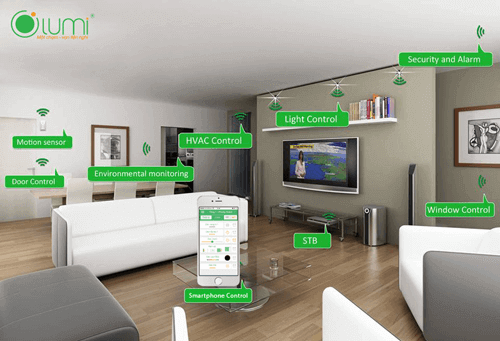
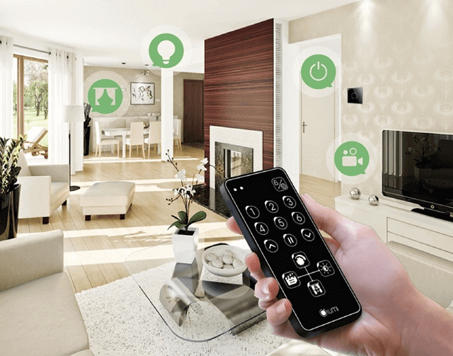
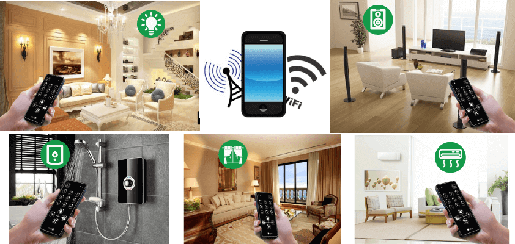

**Ngày nay những căn hộ chung cư ngày càng trở nên phổ biến là là lựa chọn hàng đầu của nhiều gia đình hiện nay, đặc biệt là gia đình của những vợ chồng trẻ. Để có thể mang đến một cuộc sống tiện ích hơn cho những gia đình Việt Nam. Lumi đã mang đến giải pháp thiết kế giải pháp nhà thông minh Lumi cho nhà chung cư, giúp mọi người trong căn hộ có một cuộc sống tiện nghi hơn.**

**Giải pháp nhà thông minh là gì**

Giải pháp này đáp ứng được những tiêu chuẩn của một căn hộ thông minh hiện đại như hệ thống chiếu sáng, hệ thống điều hòa, rèm cửa, bình nóng lạnh, quạt… Tất cả những hệ thống này có thể điều khiển dễ dàng bằng smartphone hoặc máy tính có kết nối internet. Đặc biệt giải pháp nhà thông minh Lumi tích hợp với loa milo có thể điều khiển bằng giọng nói tiếng việt. Chỉ một câu lệnh, toàn bộ hệ thống trong nhà sẽ lập tức thực hiện theo ý muốn của bạn như đồng loạt tắt, hay bật các thiết bị.

_Giải pháp nhà thông minh Lumi tích hợp nhiều tiện ích_

## Giải pháp nhà thông minh Lumi gồm những gì

### Hệ thống chiếu sáng thông minh

Với hệ thống chiếu sáng thông minh trong căn hộ, bạn chỉ cần một nút chạm nhẹ trên smartphone là có thể bật tắt ngay lập tức thay vì những công tắc lằng nhằng như trước đây. Hơn nữa, bạn còn có thể điều khiển bằng giọng nói với loa thông minh Milo. Dù là giọng vùng miền nào thì loa milo vẫn có thể hiểu được.

Đặc biệt, bạn còn có thể thiết kế hoạt cảnh lặp đi lặp lại hàng ngày như đi ra ngoài về nhà, chế độ xem phim. Vào khung giờ đó thì tất cả các thiết bị sẽ được lập trình sẵn chờ bạn về nhà nữa thôi

### Hệ thống điều khiển rèm thông minh

Giải pháp nhà thông minh cho căn hộ chung cư còn cho phép bạn có thể điều khiển hệ thống rèm cửa từ xa. Dù bạn ở bất kỳ đâu, vào khoảng thời gian nào thì vẫn có thể thiết lập chế độ mở đóng của rèm cửa ở nhà.

_Dễ dàng điều khiển mọi thiết bị ngay trong tầm tay_

### Điều khiển hệ thống điều hòa và nóng lạnh

Đây sẽ là một tiện ích giúp quý khách có thể tiết kiệm một khoản không nhỏ chi phí tiền điện hàng tháng. Chỉ một nút chạm nhẹ là bạn có thể thiết lập được hệ thống điều hòa và nóng lạnh, đảm bảo sức khỏe tốt nhất cho những thành viên trong gia đình. Việc quên tắt điều hòa hay nóng lạnh cũng sẽ không bao giờ xảy ra nữa khi bạn lắp đặt giải pháp ngôi nhà thông minh cho căn hộ của mình.

### Hệ thống an ninh đảm bảo an toàn cho gia đình bạn

Với hệ thống camera giám sát an ninh 24/7, bảo vệ an ninh của gia đình bạn một cách tốt nhất. Hệ thống cảm biến nhập khẩu giúp phát hiện nhanh chóng khi có sự đột nhập và những hành động lạ diễn ra trong căn hộ của bạn, đồng thời những thiết bị chống trộm khác cũng đồng loạt hoạt động như rèm cửa, hệ thống còi hú, đèn chiếu sáng.Trong lúc đó cũng sẽ có một thông báo được gửi đến điện thoại của bạn. Vì thế, nếu bạn có vắng nhà thì vẫn có thể kiểm soát được an ninh của toàn căn hộ.

### Hệ thống giải trí âm thanh theo vùng

Giải pháp nhà thông minh Lumi cho căn hộ thiết lập hệ thống âm thanh đa vùng. Cho phép phát nhạc theo từng khu vực trong ngôi nhà với những bản nhạc khác nhau. Mỗi thành viên trong gia đình sẽ được thưởng những bản nhạc khác nhau theo sở thích của mình. Đặc biệt, bạn có thể thiết lập giờ phát nhạc và những bản nhạc theo từng khung giờ. Như những bản nhạc du dương nhẹ nhàng vào buổi sáng để bắt đầu ngày mới đầy nhiệt huyết hay những bản nhạc sôi động để đánh thức bé yêu vào mỗi buổi sáng.

Để có thể đáp ứng được mọi nhu cầu của tất cả khách hàng, Lumi đã ứng dụng công nghệ truyền thông không dây Zigbee tiên tiến nhất hiện nay để lắp đặt giải pháp nhà thông minh cho căn hộ chung cư.

Công nghệ này cho phép lắp đặt giải pháp nhà thông minh Lumi cho những căn nhà mới xây hay những căn nhà đang sử dụng. chỉ cần thay thế công tắc điện mới vào công tắc điện đang sử dụng mà không cần đi lại đường dây điện.

Như vậy, chúng tôi đã chia sẻ đến các bạn một giải pháp tổng hợp tất cả những thiết bị thông minh, mang đến cho quý khách hàng một cuộc sống tiện ích nhất. Nếu quý khách đang có nhu cầu tìm hiểu về giải pháp nhà thông minh Lumi, vui lòng liên hệ Gia Hân để được hỗ trợ tốt nhất.