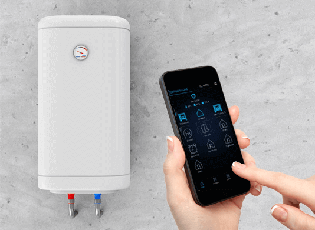
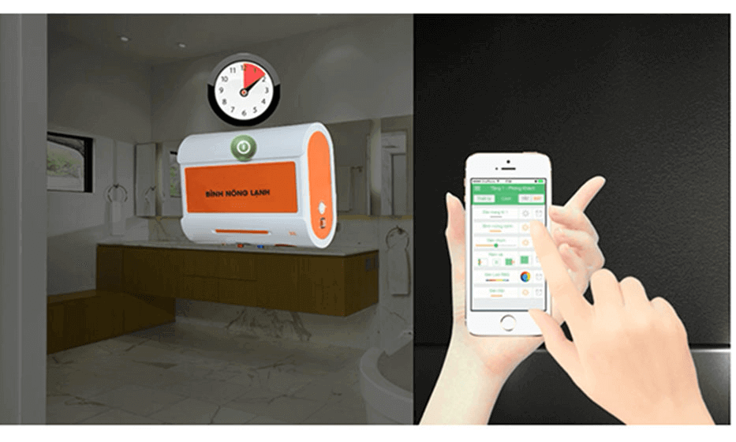
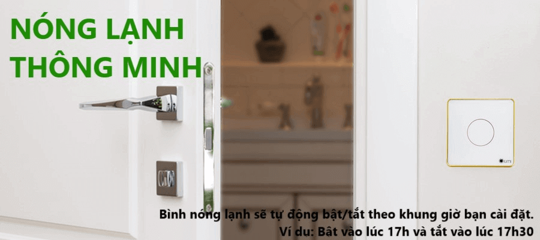

**Cuộc sống ngày càng trở nên bận rộn và việc sử dụng thời gian đòi hỏi sự khoa học hơn trước. Đặc biệt với những người bận rộn, ngay khi trở về nhà họ chỉ mong muốn là được ngâm mình trong làn nước ấm mà không phải chờ đợi việc bật nóng lạnh thêm một phút giây nào. Để đáp ứng nhu cầu đó, Lumi đã ứng dụng giải pháp bật tắt bình nóng lạnh Lumi với nhiều tiện ích thông minh.**

## Điều khiển mọi lúc mọi nơi

Giải pháp bật tắt bình nóng lạnh Lumi tích hợp điều khiển bằng nhiều phương tiện khác nhau từ smartphone, công tắc cảm ứng cho đến loa giọng nói tiếng Việt.

**Với chiếc smartphone nhỏ gọn, bạn có thể bật/tắt bình nóng lạnh dễ dàng dù ở bất cứ nơi đâu. Tất cả các thông tin về trạng thái hoạt động của bình nóng lạnh đều được hiển thị ngay trên màn hình để bạn thuận tiện theo dõi**

_ Bật tắt bình nóng lạnh Lumi ngay trên smartphone_

Bạn cũng có thể điều khiển bình nóng lạnh với bộ công tắc cảm ứng thông minh Lumi được thiết kế các nút công tắc chịu được công suất cao.

Ngoài ra, bạn hoàn toàn có thể sử dụng giọng nói của mình để bật tắt bình nóng lạnh Lumi bằng những câu lệnh đơn giản như: “OK Lumi...bật bình nóng lạnh”.

Dù bạn đang ở nhà, đang đi ra ngoài hay chuẩn bị trở về, chỉ cần một cú chạm, bình nóng lạnh sẽ bật/tắt ngay lập tức. Bạn sẽ có ngay nước nóng để sử dụng khi về nhà mà không mất thời gian chờ đợi.

## Chức năng hẹn giờ

Nếu bạn thường xuyên sử dụng bình nóng lạnh vào một thời điểm cố định trong ngày, bạn có thể cài đặt giờ bật/tắt bình nóng lạnh. Ví dụ, bạn hẹn giờ bật lúc 18h và tắt lúc 18h30, bình nóng lạnh sẽ tự động bật/tắt theo khung giờ đó.

_Bình nóng lạnh tự động bật tắt theo khung giờ bạn cài đặt_

Đây là tiện ích không chỉ giúp cuộc sống sinh hoạt trở nên tiện nghi hơn mà còn tiết kiệm kha khá điện năng sử dụng trong nhà. Ai cũng bình nóng lạnh là một trong những thiết bị tiêu tốn nhiều điện năng nhất. Đôi lúc bạn sẽ quên tắt bình và để chế độ nước nóng sang đến ngày hôm sau hay tệ hơn là kéo dài cả tuần nếu bạn đi công tác. Nhờ chức năng hẹn giờ, bạn sẽ tiết kiệm được một khoản đáng kể trong chi tiêu sinh hoạt hằng ngày.

## Đẳng cấp chất lượng

Không chỉ sở hữu công năng tuyệt vời, giải pháp bật tắt bình nóng lạnh Lumi còn ghi điểm bời thiết kế đẳng cấp, mang lại vẻ đẹp mỹ quan cho không gian gia đình. Bộ công tắc cảm ứng thông minh có mặt kính cường lực sang trọng, chống xước và vòng tròn đèn LED tinh tế. Đặc biệt, bộ công tắc này được thiết kế tương thích với mọi loại đế âm tường có sẵn, thuận tiện cho việc lắp đặt, thay thế mà không gây ảnh hưởng đến hệ thống điện trong nhà. Loa Lumi nhỏ gọn, màu sắc tinh tế có thể sử dụng như một vật trang trí cho không gian ngôi nhà.

Bộ giải pháp bật tắt bình nóng lạnh Lumi bao gồm: bộ điều khiển trung tâm, công tắc cảm ứng viền mạ vàng, công tắc cảm ứng viền mạ nhôm, cảm biến chuyển động. Tất cả các sản phẩm đều đạt chuẩn Châu Âu với thiết kế tinh tế mang đến vẻ đẹp sang trọng cho ngôi nhà.

Hãy đến với Lumi để trải nghiệm tiện ích bật tắt bình nóng lạnh cùng rất nhiều những giải pháp cho ngôi nhà thông minh như: hệ thống đèn chiếu sáng, điều khiển rèm tự động, an ninh chống trộm, kiểm soát môi trường, âm thanh đa vùng, loa Milo giọng nói tiếng Việt, hệ thống điều hòa Tivi, đèn Led 16 triệu màu...
Với mức giá chỉ bằng 1/3 so với các giải pháp tương tự trên thị trường cùng thời gian thi công nhanh chóng, Lumi là địa chỉ uy tín để bạn ứng dụng những tiện ích thông minh vào cuộc sống gia đình.

Hãy liên hệ ngay với chúng tôi để trở thành người tiếp theo sở hữu giải pháp bật tắt bình nóng lạnh Lumi và tận hưởng trọn vẹn cuộc sống tiện nghi dành riêng cho bạn.
