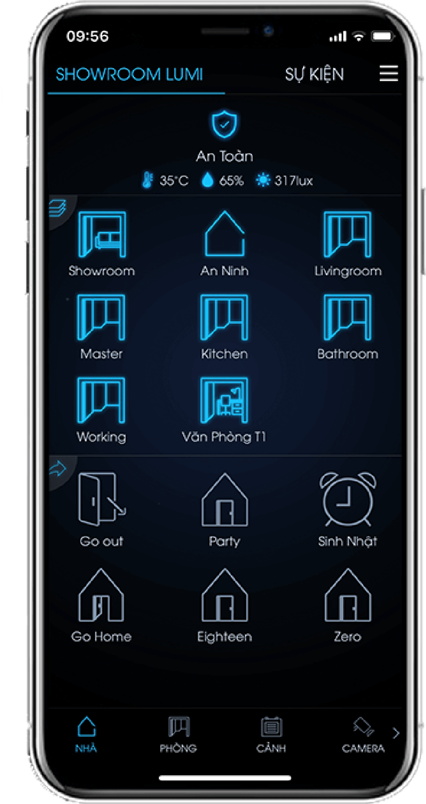

**Chúng tôi đã mang tới cho bạn đọc những cảm nhận hay nhất về hệ thống nhà thông minh smarthome của LUMI. Lần này chúng tôi xin tiếp tục các đánh giá chi tiết hơn về giải pháp nhà thông minh SmartHome: về thiết kế, tính năng, cách sử dụng, thiết lập cơ bản... và đặc biệt là khả năng tự học thông minh thói quen người sử dụng và nhận lệnh bằng giọng nói qua các thiết bị như alexa của amazon hay milo của lumi nghiên cứu tự phát triển đã ra mắt hôm 27/6/2018**

## Thiết kế phần cứng

Nhà thông minh smarthome không phải chỉ là ngôi nhà như nhiều người hình dung mà là một hệ thống gồm phần cứng là các bộ điều khiển, bộ phát sóng, công tắc, cảm biến và phần mềm điều khiển, với SmartHome của LUMI cũng không phải ngoại lệ.

Xét về chất liệu gia công các sản phẩm của lumi được bảo vệ bên ngoài bằng kính cường lực Gorilla Glass. Nghe hơi giống những ngôn từ mang tính chất tiếp thị nhưng khi tiếp xúc thực tế với các sản phẩm Lumi SmartHome thì hẳn là bạn sẽ hiểu là nhà sản xuất không cường điệu khi nói vậy.

Cảm giác "phẳng" chính là điều dễ nhận thấy đầu tiên khi tôi tiếp xúc với các mặt cảm biến của công tắc cảm ứng trong hệ thống LUMI SmartHome. Toàn bộ bề mặt trước của công tắc  là hệ thống nút bấm cảm ứng. Đưa ngón tay chạy ngang dọc theo tấm bảng điều khiển gắn trên tường, tôi cảm nhận sự trơn nhẵn, láng mịn như khi chạm tay vào một tấm gương nhỏ, đây là điều không thể tìm thấy ở những thiết bị nhà tự động khác, vốn sử dụng các nút bấm vật lý, cơ học. Các góc vát được phay nhẵn,bao bọc bởi một viền nhôm hoặc viền vàng  chắc chắn phần bờ mép của bảng điều khiển cũng được cắt ghép rất khéo, không có khe hở hay lỗi nhỏ nào. Điều này chứng tỏ quá trình gia công sản phẩm được thực hiện tỉ mỉ và cẩn thận.mang đến sự oan toàn tin tưởng tuyệt đối cho người sử dụng.

Lật mặt sau của bảng điều khiển, tôi cảm nhận được thiết kế "nguyên khối" một cách rõ rệt hơn khi không tìm thấy dấu hiệu nào kết nối giữa màn hình với khung nhôm xung quanh. Bảng  công tăc của LUMI SmartHome sở hữu một thân hình đột phá và liền mạch, phá vỡ quan niệm xưa nay của mọi người về thiết bị điều khiển thông thường, nghĩa là có thể tháo rời từ mặt trước, nút bấm cho đến mọi thành phần khác chỉ bằng cách tháo các ốc vít, điều quan trọng hơn hết là công tắc LUMI có thể tích hợp vs mọi sản phẩm cơ thông thường mang đến sự tiện lợi cho người thi công lẫn sử dụng sản phẩm.

Với các biểu tượng được thiết kế đơn giản, được làm "phẳng" mang đến sự tinh tế sang trọng sự khác biệt cho ngôi nhà của bạn… tạo nên cảm giác thân thiện, dễ sử dụng.. Vòng tròn màu xanh khi thiết bị chưa kích hoạt hay vòng trong màu đó khi đang hoạt động mang đến cho chúng ta sự khác biệt so với  các sản phẩm khác.

Tính thẩm mĩ cao của sản phẩm còn nằm ở thiết kế mặt trước. Hệ thống nút bấm cảm ứng( tối đa là 4 nút tương đương với bốn thiết bị chiếu sáng).

Nhưng tại sao nhà sản xuất phải vất vả để tạo ra những sản phẩm cao cấp như vậy trong khi những nỗ lực tinh tế đó ít khi được ghi nhận một cách đầy đủ? Với nhiều người, đó có lẽ chỉ đơn giản là một cái ổ cắm nhưng với LUMI thì hoàn toàn khác: LUMI và đội ngũ thiết kế phòng (R&D) đã dành rất nhiều thời gian và công sức để nghiên cứu ra một tiến trình mà theo họ là phức tạp và tham vọng nhất từ trước tới nay.

Theo đại diện LUMI, việc đẽo gọt, lắp ghép và hoàn thiện, xử lý vật liệu và tiến trình gia công gần như đã chiếm toàn bộ cuộc sống của nhân viên SmartHome. Nhà sản xuất tin rằng những nỗ lực phi thường đó là cách duy nhất để tạo ra những sản phẩm có chất lượng cao cấp, sang trọng khi đến tay người sử dụng, giúp họ tạo ra "đẳng cấp" cho ngôi nhà đang sống.

## Trình điều khiển nhà thông minh

Lumi smarthome là giải pháp nhà thông minh đi đầu ở đất nước ta phát triển mảng công nghệ nhà thông minh. Và quả thực, trong lần đầu tiên sử dụng tôi vô cùng thích thú khi thấy tất cả đồ gia dụng trong nhà như tivi, điều hòa, đèn trần, đèn ngủ…đều được điều khiển qua điện thoại ,hẹn giời hay bằng chính giọng nói của chúng ta. Sự tinh tế trong giao diện SmartHome còn đến từ các hình ảnh  rất "mượt" được sử dụng khi chuyển đổi giữa các chế độ hiển thị.

## Điều khiển SmartHome bằng giọng nói

Kể từ khi "trợ lý ảo" Siri xuất hiện lần đầu tiên trên iPhone 4s, chức năng điều khiển bằng giọng nói đã được quan tâm hơn và nhiều công cụ thực hiện chức năng này cũng liên tiếp ra đời: Google Now cho Android, Cortana cho Windows Phone… Dù vậy, theo tìm hiểu của VnReview thì đến nay vẫn chưa có giải pháp nhà thông minh nào trên thế giới áp dụng thành công tính năng điều khiển bằng giọng nói, chưa tính đến việc hỗ trợ tiếng Việt.

Trước thực tế đó, Lumi đã đi tiên phong trong việc tiến hành các nghiên cứu một cách có hệ thống trong lĩnh vực xử lý giọng nói tiếng Việt đó chính là thiết bị MILo và cho ra đời "trợ lý ảo" cho nhà thông minh SmartHome.

Lần đầu tiên tiếp xúc, trợ lý ảo SmartHome khiến tôi bất ngờ với những tương tác bằng tiếng Việt rất tự nhiên, giúp giao tiếp với hệ thống trở nên thân thiện, không cứng nhắc như một hệ thống điều khiển thông thường. Sẽ là một trải nghiệm tuyệt vời khi bạn ra lệnh bằng giọng nói và hệ thống đáp ứng bạn.

Với "cô nàng" trợ lý ảo này thì tôi có thể trực tiếp ra lệnh cho SmartHome mà không cần chạm vào phần mềm hay bảng điều khiển thiết bị. Thay vào đó, tôi chỉ cần ra lệnh cho trợ lý ảo và "cô nàng" sẽ có phản hồi. Việc "ra lệnh" cho SmartHome cũng rất đơn giản và dễ dàng: tôi chỉ cần đọc mệnh lệnh theo cú pháp "**Ok Lumi**" là SmartHome sẽ thực hiện đúng theo yêu cầu. Ví dụ:  nếu muốn SmartHome chuyển sang kịch bản Xem phim tôi chỉ cần nói "**Home - Xem phim**", trợ lý ảo sẽ trả lời "**SmartHome đã chuyển sang chế độ Xem phim**"; muốn SmartHome mở cửa đón khách vào nhà, tôi nói "**OK LUMI**" và lập tức SmartHome sẽ đáp lại mệnh lệnh này…

## Tự "hiểu", học theo thói quen người dùng

Đến đây, khi nhắc đến cụm từ "nhà thông minh SmartHome" thì có lẽ bạn đã mường tượng đến một ngôi nhà với những trang thiết bị được tự động hóa theo một lịch trình được cài đặt sẵn và có thể được điều khiển từ xa. Tuy nhiên một giá trị lớn hơn mà SmartHome mang lại chính là việc các thiết bị gia dụng có thể kết nối với nhau, có thể "hiểu" và tương tác tốt với thói quen của người sử dụng. Để kiểm chứng việc LUMI SmartHome "thông minh" cỡ nào, tôi đã thực hiện nhiều điều chỉnh phức tạp nhưng lại thường xảy ra trong cuộc sống hàng ngày.

Chẳng hạn, một ngữ cảnh Buổi sáng thông thường của LUMI SmartHome sẽ gồm các kịch bản như bật đèn, kéo rèm tự động kéo, tivi tự động bật chương trình "Chào buổi sáng"... Nhưng là một người ham mê thể thao nên tôi sẽ đưa thêm kịch bản Tập thể dục vào ngữ cảnh Buổi sáng. Sau 3 ngày thực hiện thao tác này, hệ thống sẽ tự động lựa chọn và hiển thị kịch bản Tập thể dục vào ngữ cảnh buổi sáng để tôi tiện kích hoạt.

Tương tự, tôi có thói quen xem phim vào buổi tối để thư giãn trước khi đi ngủ. Sau vài lần kích hoạt kịch bản Xem phim thì hệ thống sẽ đưa biểu tượng của kịch bản này vào vị trí đầu tiên của ngữ cảnh Buổi tối để tôi lựa chọn. Thật tuyệt vời! Giờ thì tôi sẽ không cần phải mò mẫm tìm kiếm lệnh điều khiển mong muốn để đưa vào các ngữ cảnh tương ứng nữa, những thao tác này đã được SmartHome "học" và tự động áp dụng theo thói quen của tôi.

**Kết luận**

Theo tiêu chí xếp hạng nhà thông minh của hãng nghiên cứu thị trường Gartner mới công bố, các hệ thống nhà thông minh trên thế giới hiện nay đa phần thuộc nhóm nhà tự động Home Automation. Cấp độ cao nhất của nhà thông minh là Connected Home. Đây là thế hệ nhà thông minh mà Gartner dự đoán tới những năm 2017 mới trở nên phổ biến.

Trong vài năm gần đây, các đại gia công nghệ như Microsoft, Apple, Google, Samsung... đang gấp rút tìm cách chiếm được "miếng bánh" lớn nhất trên thị trường nhà thông minh được hãng ABI Research dự báo có quy mô đến hơn 40 tỉ USD vào năm 2020. Như Google mua lại Nest (hãng sản xuất bộ điều khiển nhiệt độ thông minh và thiết bị báo khói), Samsung ra mắt hệ thống nhà thông minh khép kín trong các thiết bị của hãng hay gần đây nhất là Apple giới thiệu nền tảng phát triển ứng dụng nhà thông minh HomeKit.  

Song qua trải nghiệm và quá trình nghiên cứu về nhà thông minh, tôi đã không khỏi ngạc nhiên khi người tự thiết kế tự làm ra  nhận thấy sản phẩm SmartHome đã là hệ thống nhà thông minh hoàn chỉnh - Connected Home, kết nối tất cả các loại thiết bị trong ngôi nhà, không chỉ điều khiển theo kịch bản mà còn có thể thiết kế các kịch bản ngữ cảnh thông minh dựa vào thói quen, thời điểm và mệnh lệnh trước đó của chủ nhà. Điều đó có nghĩa là LUMI SmartHome đã có trước cả dự đoán của Gartner và tiến một bước trước các "đại gia" công nghệ trên thế giới về nhà thông minh. Nói cách khác, với sản phẩm SmartHome, chúng ta không phải là người theo đuôi, tiêu thụ công nghệ của thế giới như hiện thực lâu nay mà hoàn toàn có thể trở thành người đi đầu về xu hướng công nghệ.

Có thể, bạn vẫn chưa tin vào điều này. Ngay cả tôi cũng băn khoăn, trải nghiệm như vậy nhưng thực sự sản phẩm SmartHome có xứng với đẳng cấp thế giới hay không? Câu trả lời này sẽ có trong bài mới về nhà thông minh LUMI trong thời gian tới.

