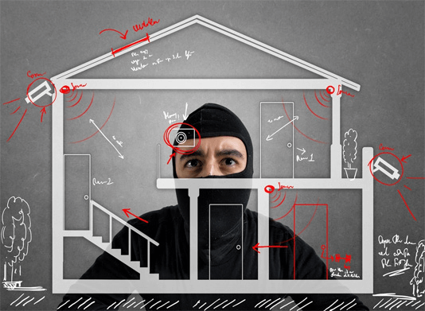
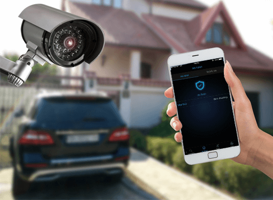

**Trong cuộc sống hiện đại ngày nay thì những giải pháp bảo vệ an ninh của ngôi nhà ngày càng được đầu tư đổi mới về trang thiết bị cũng như công nghệ hiện đại.**

**Để đáp ứng được nhu cầu ngày càng cao của rất nhiều khách hàng, Lumi mang đến giải pháp an ninh báo động, bảo vệ sự an toàn cho bạn và những thành viên trong gia đình bằng thiết bị cảm biến cửa và camera ninh.**

## Tìm hiểu về giải pháp an ninh báo động

Giải pháp an ninh báo động cho ngôi nhà được thiết kế với 2 thiết bị là cảm biến cửa và camera an ninh. Với 2 vòng bảo vệ như vậy thì an ninh và sự an toàn trong ngôi nhà của bạn sẽ được bảo vệ 24/24.

Hệ thống camera giúp bạn kiểm soát mọi hoạt động trong ngôi nhà 24/7 cực kỳ nhanh chóng và tiện lợi

Hệ thống cảm biến phát hiện đột nhập giúp bạn có thể phát hiện khi có người lạ đột nhập.

Cùng lúc đó, thì hệ thống cảm biến phát hiện đột nhập cũng sẽ phát ra tín hiệu như đèn hiệu còi hú tại nhà và gửi thông báo đến điện thoại, gmail của bạn ngay tức khắc.

## Tính năng của giải pháp an ninh báo động

Vì là giải thông minh, nên giải pháp an ninh này có rất nhiều tính năng đặc biệt, mang đến nhiều tiện ích cho người sử dụng. Đó được xem là những giải pháp vượt trội áp dụng công nghệ hiện đại vào cuộc sống của nhiều gia đình hiện đại ngày nay. Bao gồm:

## Giám sát qua điện thoại

Đây được xem là tính năng hữu ích nhất của giải pháp này dành cho mỗi gia đình người Việt. Vì cho dù bạn ở bất kỳ nơi đâu thì bạn cũng có thể giám sát được tất cả những hoạt động trong ngôi nhà của mình.

Bạn chỉ cần sử dụng điện thoại thông minh và đăng nhập là có thể xem xét và kiểm soát được mọi ngóc ngách trong ngôi nhà của mình.

_Giám sát qua điện thoại_

## Cảm biến cửa chống trội

Không phải công ty nào cũng cung cấp cả camera an ninh cả cảm biến chống chống trộm trong một giải pháp đâu nhé. Vì thế, đây chính là giải pháp an ninh báo động cải tiến được Lumi ứng dụng trong chính những sản phẩm của mình.

Tính năng chính của sản phẩm này là sẽ phát ra tín hiệu bao gồm đèn nháy, còi hú, kéo rèm hoàn toàn tự động khi phát hiện có hành động lạ trong thời gian cấm.

## Phát hiện đột nhập

Hệ thống camera 24/24 sẽ giúp bạn quan sát và phát hiện nhanh chóng những tình huống xấu trong nhà cũng như khu vực quanh ngôi nhà bạn sống. Điều này sẽ giúp bạn có thể phát hiện nhanh chóng những hành động lạ, đối tượng lạ trong ngôi nhà của mình. Chỉ một hành động lạ rất nhỏ thôi thì cũng sẽ bị phát hiện.

## Kết hợp linh hoạt nhiều giải pháp chống trộm khác

Vì là một hệ thống được kết nối với nhau nên khi cảm biến phát hiện có trộm đột nhập, những giải pháp chống trộm khác cũng sẽ hoạt động như còi hú, đèn xoáy, mở rèm, đèn bật sáng và cũng sẽ có một thông báo khác gửi đến điện thoại của bạn.

## Bộ sản phẩm đi kèm theo của giải pháp an ninh báo động

Bên cạnh 2 sản phẩm camera an ninh thì trong giải pháp này còn có những thiết bị đi kèm khác như sau: công tắc cảm ứng, bộ điều khiển trung tâm, cảm biến chống trộm, cảm biến cửa.

Những thiết bị này được thiết kế sang trọng đẹp mắt, không chỉ mang đến những tiện ích khi sử dụng mà còn mang đến vẻ đẹp sang trọng hiện đại nhất cho không gian

Bên cạnh đó những sản phẩm này còn được sản xuất từ lớp nhựa PP, cực kỳ an toàn và không gây hại cho người sử dụng.

Một ưu điểm vượt trội là những sản phẩm này cách điện hoàn toàn. Vì thế, bạn sẽ không còn phải lo lắng đến sự an toàn của những thành viên trong gia đình, đặc biệt là trẻ nhỏ.

Như vậy, chúng tôi đã chia sẻ đến các bạn những thông tin về một giải pháp hữu ích dành cho những ngôi nhà hiện đại. Nếu quý khách hàng đang có nhu cầu tìm hiểu về giải pháp an ninh báo động cũng như muốn lắp đặt nó cho ngôi nhà của mình thì hãy liên hệ Gia Hân để được hỗ trợ tốt nhất nhé.