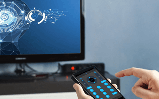
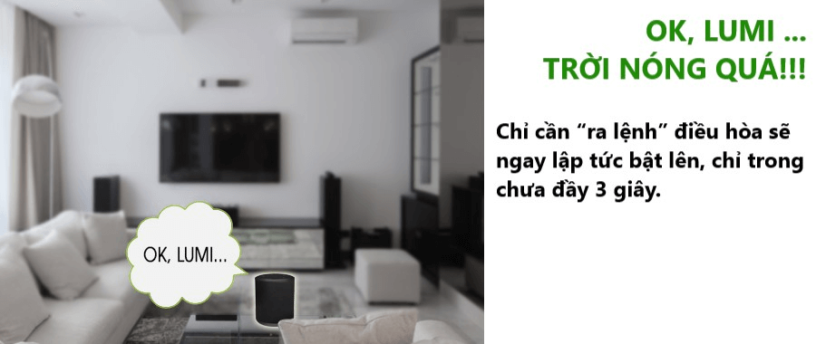

Bạn muốn tận hưởng không gia tươi mát ngay khi đặt chân về nhà? 

Bạn muốn điều khiển điều hòa tivi mọi lúc mọi nơi?

Hay bạn muốn thể hiện giọng nói quyền năng điều khiển mọi thứ trong ngôi nhà mình?

Bạn hoàn toàn có thể làm được điều đó với hệ thống điều hòa tivi Lumi - giải pháp giúp bạn tận hưởng trọn vẹn không gian sống tiện nghi hiện đại.

## Cuộc sống tiện nghi, tiết kiệm chi phí

Thay vì phải mất thời gian tìm kiếm remote để bật/tắt điều hòa, tivi thì giờ đây, giải pháp này cho phép bạn kiểm soát hoạt động của thiết bị chỉ bằng một cú chạm hay thậm chí là bằng giọng nói của chính mình. 
Bạn chỉ cần mở ứng dụng Lumi trên điện thoại, chạm vào biểu tượng điều hòa, tivi và lựa chọn lệnh cần thực hiện. Bạn cũng có thể ra lệnh cho các thiết bị bằng giọng nói. Ví dụ, khi bạn nói “OK, Lumi...trời nóng quá”, điều hòa sẽ ngay lập tức được bật lên trong vòng 3 giây. 
Trên đường từ cơ quan trở về trong tiết trời nắng nóng, bạn chỉ cần thao tác bật/tắt điều hòa qua smartphone. Căn phòng mát lạnh sẽ đón bạn ngay khi mở cánh cửa vào nhà. Thật tiện lợi phải không nào?

_Bật/tắt điều hòa nhanh chóng chỉ bằng giọng nói_

Ngoài ra, hệ thống điều hòa tivi Lumi còn giúp bạn tiết kiệm một khoản chi phí sử dụng điện kha khá mỗi tháng. Chúng ta đều biết điều hòa là một trong những thiết bị tiêu tốn nhiều điện năng nhất nên chẳng may nếu bạn quên tắt nó trước khi ra ngoài hay đi công tác xa. Số điện năng lãng phí sẽ khiến hóa đơn tiền điện gia tăng đáng kể khiến chính chủ phải xót xa. Nhưng với giải pháp nhà thông minh Lumi, bạn có thể điều khiển và kiểm soát hoạt động của điều hòa hay các thiết bị khác như tivi, bình nóng lạnh, đèn chiếu sáng... Vì tất cả thông tin trạng thái hoạt động đều được hiển thị trên điện thoại để bạn dễ dàng thao tác mọi lúc mọi nơi.

## Phương tiện điều khiển hệ thống điều hòa tivi Lumi

Giải pháp nhà thông minh Lumi cung cấp nhiều phương tiện để bạn điều khiển điều hòa, tivi trong mọi hoàn cảnh. 
Cách đơn giản và thông dụng nhất là smartphone. Thay vì 10 cái remote, bạn chỉ cần một chiếc điện thoại để điều khiển tất cả các thiết bị trong nhà. Trên ứng dụng Lumi, mọi thông tin về trạng thái và hoạt động của thiết bị đều được hiển thị rõ ràng chính xác. Bạn chỉ cần chạm nhẹ để thực hiện các lệnh cần thiết. Với một chiếc smartphone được kết nối internet, bạn có thể kiểm soát mọi thứ và xua tan nỗi lo quên tắt các thiết bị điện khi ra ngoài.

Cùng với smartphone, loa thông minh Milo cho phép bạn điều khiển tivi, điều hòa bằng chính giọng nói của mình. Thiết bị này có thể nhận diện các câu lệnh bằng mọi giọng nói Bắc, Trung, Nam và thực hiện chính xác theo ý muốn.

Ngoài ra, công tắc cảm ứng và cảm ứng hồng ngoại hỗ trợ đắc lực trong việc kiểm soát hoạt động tivi, điều hòa. Bộ điều khiển hồng ngoại có thể học và lưu 1.000 lệnh của điều khiển remote.

## Dễ dàng lắp đặt - sử dụng nhanh chóng

Quy trình lắp đặt và sử dụng hệ thống điều hòa tivi Lumi và giải pháp nhà thông minh diễn ra chuyên nghiệp, khoa học và nhanh chóng. Chỉ cần 20 phút lắp đặt và cài câu lệnh, bạn đã có ngay ngôi nhà hiện đại tiện nghi.

Bộ sản phẩm đi kèm giải pháp bao gồm: loa Milo, công tắc cảm ứng, bộ điều khiển trung tâm, cảm biến hồng ngoại. Sản phẩm đạt chuẩn CE và UL và hiện đã có mặt tại nhiều quốc gia như Ấn Độ, Úc, Thái Lan, Lào, Campuchia...

Là đơn vị tiên phong trong lĩnh vực smartphone, giải pháp nhà thông minh Lumi mang đến cho bạn những tiện ích ưu việt cho cuộc sống hiện đại. Trong đó, hệ thống điều hòa tivi Lumi đã và đang rất được ưa chuộng khi ứng dụng vào không gian nhà Việt. Sự tín nhiệm của khách hàng chính là minh chứng rõ ràng nhất cho chất lượng sản phẩm và dịch vụ của chúng tôi. 
Nếu bạn đang có nhu cầu tìm hiểu hay ứng dụng giải pháp nhà thông minh Lumi, hãy đến với Gia Hân để được tư vấn và hỗ trợ nhanh chóng. Chúng tôi chuyên cung cấp, tư vấn và thi công lắp đặt nhà thông minh cho rất nhiều dự án lớn với chất lượng tốt nhất và giá cả cạnh tranh nhất.

Hãy là người tiếp theo sở hữu hệ thống điều hòa tivi Lumi và giải pháp nhà thông minh hiện đại, tiện nghi nhất hiện nay cùng Gia Hân.

Địa chỉ: Số 304 Nguyễn Đình Tựu, Q.Thanh Khê, TP. Đà Nẵng

Hotline: 0968.333.268 - 0935.333.268

Email: [GiahanGroup2018@gmail.com](mailto:GiahanGroup2018@gmail.com)