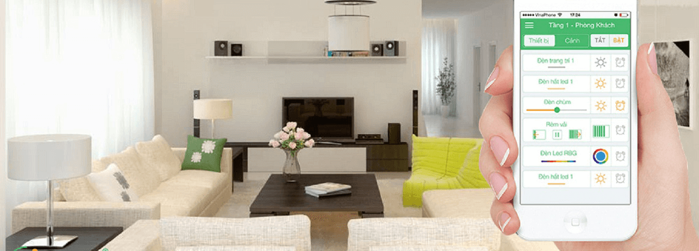
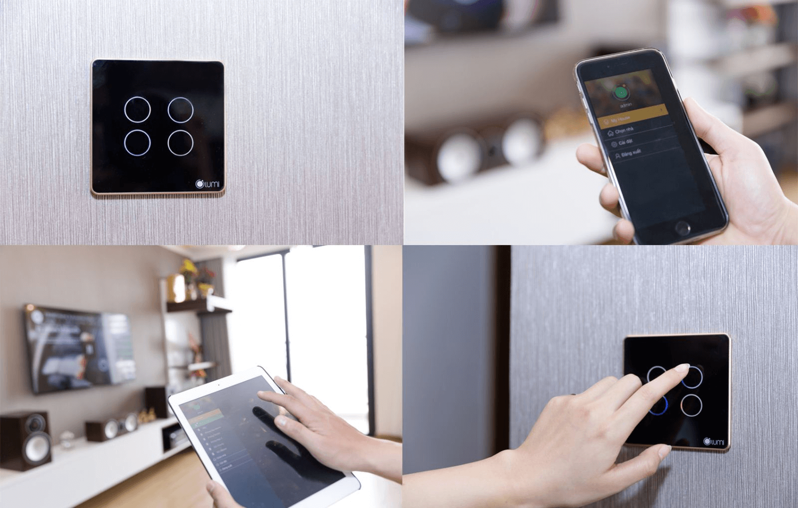

**Tiên phong trong lĩnh vực smarthome, Lumi xây dựng hệ thống tiện ích đồng bộ giúp cuộc sống trở nên tiện nghi và thoải mái hơn. Đặc biệt với giải pháp chiếu sáng thông minh, bạn sẽ dễ dàng điều khiển và kiểm soát hệ thống đèn chiếu sáng trong nhà chỉ bằng một cú chạm. Cuộc sống sẽ trở nên thú vị hơn khi bạn có thể làm chủ mọi thứ trong ngôi nhà theo ý muốn.**

_Giải pháp chiếu sáng thông minh Lumi_

## Điều khiển đa năng bằng smartphone và công tắc chạm cảm ứng

Giải pháp chiếu sáng thông minh mang lại cho chủ nhà nhiều sự tiện lợi khi điều khiển linh động trên smartphone và bằng giọng nói.

Chỉ cần có một chiếc smartphone kết nối internet, bạn hoàn toàn có thể điều khiển và kiểm sát hệ thống đèn chiếu sáng trong nhà bất cứ lúc nào. Bạn sẽ không phải lăn tăn khi đi ra ngoài mà không nhớ đèn đã tắt hay chưa. Bởi toàn bộ thông tin, trạng thái, độ sáng của từng thiết bị đều được hiển thị trên điện thoại. Bạn chỉ cần mở điện thoại để kiểm tra thay vì ngồi lo lắng hay xót xa tiền điện như trước đây.
Ngoài điều khiển bằng smartphone, Lumi còn tích hợp điều khiển giọng nói bằng công nghệ truyền thông Zigbee và cảm ứng điện dung. Vòng tròn tỏa sáng led giúp bạn nhận biết nhanh trạng thái đang bật/tắt của công tắc và rất an toàn kể cả khi tay ướt chạm vào.

## Cảm biến chuyển động

Cảm biến chuyển động là một trong những tiện ích nổi bật của giải pháp chiếu sáng thông minh Lumi. Với thiết bị cảm biến hồng ngoại, hệ thống đèn trong nhà sẽ tự động bật khi có chuyển động. Vùng cảm biến này hoạt động theo cơ chế, khi phát hiện có người di chuyển, đèn sẽ tự động bật và sau một khoảng thời gian cài đặt kể từ khi không phát hiện chuyển động nào, đèn lại auto tắt. 
Ngoài ra, Lumi còn có chức năng cảm biến mở cửa. Đèn sẽ tự động sáng khi cửa được mở ra và tắt khi cửa đóng. Cơ chế này giúp ánh sáng được điều chỉnh một cách linh hoạt mà bạn không cần phải động tay.

## Chức năng hẹn giờ chiếu sáng

Cũng như các tiện ích khách trong hệ thống giải pháp nhà thông minh Lumi, đèn chiếu sáng cũng tự hoạt động theo thời gian bạn cài đặt. Bạn có thể thiết lập các khung giờ bật/tắt một hoặc nhiều thiết bị chiếu sáng và để nó tự vận hành chính xác. 
Đây là một chức năng thực sự giá trị, bạn có thể tiết kiệm được một khoản chi phí chiếu sáng kha khá vì không lo quên tắt bóng đèn khi đi ra ngoài hay ngủ sớm. Đặc biệt, chức năng này càng phát huy tác dụng tại các khu vực cần được chiếu sáng thường xuyên trong một khung giờ cố định trong ngày. Ví dụ: đèn cổng nhà tự động bật lên lúc 6h tối và auto tắt vào 11h đêm.

## Gia Hân - đơn vị cung cấp giải pháp chiếu sáng thông minh Lumi hàng đầu Việt Nam

Cuộc sống của bạn sẽ tiện lợi hơn nhiều khi hệ thống đèn chiếu sáng trong nhà được điều khiển, kiểm soát dù ở bất cứ nơi đâu. Với giải pháp chiếu sáng thông minh Lumi, bạn có thể bật/tắt hệ thống chiếu sáng trên smartphone hay máy tính khi được kết nối Internet, 3G/4G, điều khiển bằng giọng nói tiếng Việt hay công tắc chạm cảm ứng. Ngoài ra, đèn hành lang, cầu thang, cửa... sẽ tự động bật khi có người di chuyển và tắt khi không có người.

_Điều khiển chiếu sáng thông minh Lumi_

Giải pháp chiếu sáng Lumi đi kèm bộ sản phẩm kèm theo bao gồm: công tắc cảm ứng viền mạ vàng, công tắc cảm ứng viền nhôm, cảm biến cửa, cảm biến phát hiện chuyển động.

Ngoài ra, Lumi còn phát triển đồng bộ các giải pháp thông minh khác cho ngôi nhà như: Milo - giọng nói Tiếng Việt, chiếu sáng thông minh, điều hòa TV thông minh, âm thanh đa vùng, Led 16 triệu màu, bật/tắt bình nóng lạnh, rèm cửa tự động, an ninh chống trộm, kiểm soát môi trường. 
Tại Gia Hân, tất cả các sản phẩm đều đạt chuẩn CE tiêu chuẩn xuất khẩu châu Âu và UL – bo mạch phần cứng đạt chuẩn quốc tế được xuất khẩu rộng rãi trên 104 quốc gia trên thế giới.   Đặc biệt, Gia Hân có đội ngũ kỹ thuật nhiều năm kinh nghiệm luôn sẵn sàng triển khai các hệ thống nhà thông minh, hệ thống thiết bị an ninh rộng khắp. Thiết kế sang trọng, tinh tế 80% khách hàng lựa chọn Lumi vì thiết kế của các sản phẩm. 
Nếu bạn đang tìm kiếm một tiện ích tuyệt vời cho cuộc sống hiện đại, hãy cập nhật giải pháp chiếu sáng thông minh Lumi cho gia đình mình ngay hôm nay.

