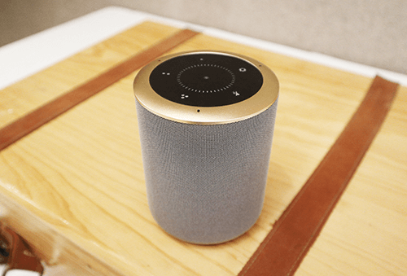
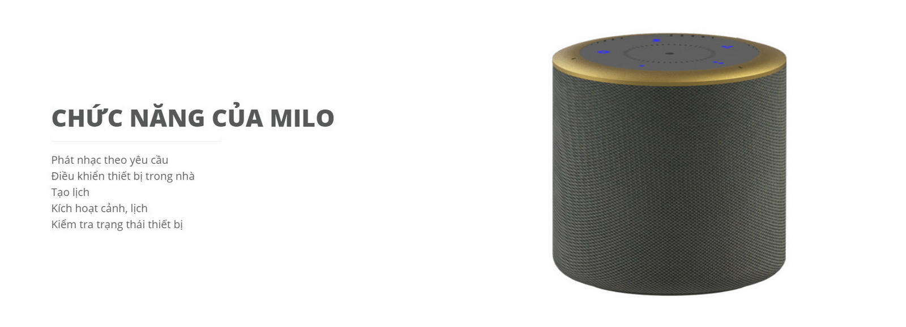
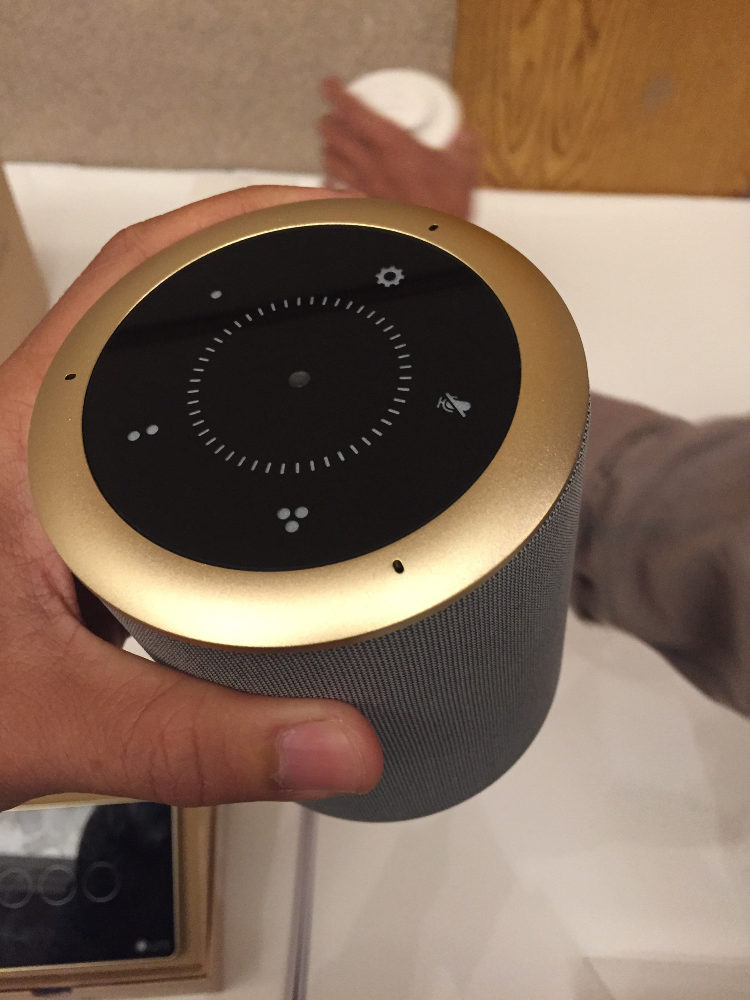

**Thấu hiểu và tương tác với mọi mong muốn của gia chủ là cách mà nhà thông minh Lumi chinh phục mọi khách hàng. Trong đó, một trong những tiện ích hàng đầu làm nên không gian sống hiện đại ưu việt của Lumi phải kể đến loa Milo - thiết bị điều khiển thông minh bằng giọng nói tiếng Việt linh hoạt và tiện lợi.**

_loa MILO-điều khiển thông minh bằng giọng nói tiếng Việt_

## Điều khiển thông minh bằng giọng nói tiếng Việt

Milo là một chiếc loa có thể điều khiển và kiểm soát hoạt động các thiết bị điện trong nhà bằng giọng nói. Từ hệ thống đèn chiếu sáng, tivi, điều hòa, bình nóng lạnh, rèm cửa...., bạn có thể dễ dàng ra lệnh chi bằng những câu thoại đơn giản. 
Điểm đặc biệt của loa Milo là dù bạn sử dụng giọng nói miền Bắc, Trung hay Nam thì nó vẫn có thể hiểu và thực hiện đúng theo mọi yêu cầu nhờ ứng dụng AI. Ứng dụng này đang tiếp tục được phát triển và trong tương lai, AI có thể ghi nhớ và tự động thực hiện những câu nói tự nhiên nhất của người dùng. Bắt đầu từ những câu thoại đơn giản “OK LUMI”, phẩm mềm bên trong loa Milo sẽ lắng nghe, thấu hiểu và hoạt động đúng theo mệnh lệnh của bạn.

## Tiện lợi, tiện nghi, tiện dụng

Trước đây, nếu như để điều khiển một thiết bị bất kỳ trong nhà bạn phải bật tắt công tắc hay hiện đại hơn và các nút chạm cảm ứng hay smartphone. Tuy nhiên, với loa Milo điều khiển thông minh bằng giọng nói tiếng Việt, bạn chẳng cần động tay cũng có thể bật/tắt ngay các thiết bị. Thông qua giọng nói bằng ngôn ngữ tiếng Việt, bạn có thể dễ dàng điều khiển mọi thiết bị điện trong nhà như đèn chiếu sáng, tivi, điều hòa, rèm cửa...một cách linh hoạt và tiện lợi.

Hãy thử hình dung về một không gian sống - nơi mà giọng nói của bạn trở nên quyền năng. Chỉ cần ra lệnh "OK LUMI, BẬT ĐÈN", hệ thống đèn chiếu sáng sẽ ngay lập tức được bật lên. "OK LUMI, BẬT NHẠC", bạn sẽ thưởng thức âm nhạc theo mong muốn nhờ kết nối trực tiếp với google assistant. Hay khi bạn nói “OK Lumi, Chào buổi sáng”, rèm sẽ tự động mở để đón chào ánh sáng bình minh. 
Bên cạnh khả năng điều khiển thông minh bằng giọng nói tiếng Việt cho các thiết bị trong nhà, Lumi còn tích hợp nhiều chức năng khác như phát nhạc theo yêu cầu, tạo lịch, kích hoạt cảnh lịch hay kiểm tra trạng thái thiết bị trong nhà. 

_Loa Milo đa chức năng_

Loa thông minh MILO thực sự là “người trợ lý” đắc lực giúp bạn làm chủ ngôi nhà của mình, đặc biệt là trong những lúc không rảnh tay như đang nấu nướng, nghỉ ngơi hay bận bịu công việc khác. Chỉ bằng vài câu lệnh đơn giản, mọi thiết bị sẽ “vâng lời” theo ý muốn của bạn. Milo giúp bạn thể hiện giọng nói “quyền năng” trong chính ngôi nhà của mình.

## Thiết kế hiện đại tinh tế

Không chỉ đa dạng về chức năng, loa thông minh Milo còn ghi điểm bởi thiết kế hiện đại và tinh tế. Thiết kế hình trụ nhỏ tương tự Apple HomePod được bọc vải xung quanh khung nhôm. Bên trên là các phím cảm ứng trên mặt kính cường lực cho phép thực hiện các chức năng điều khiển thay đổi hoạt cảnh các thiết bị trong nhà, tạo lịch hoạt động, bật tắt nhạc, tăng giảm âm lượng,…

Với hai màu đen nâu sang trọng, thân bọc vải và viền nhôm, Milo mang một vẻ đẹp đơn giản hiện đại mà không kém phần trang nhã. Bạn có thể đặt nó bất cứ đâu như một món trang trí nhỏ xinh cho không gian ngôi nhà.

_Thiết kế đơn giản tinh tế từ loa thông minh Milo_

Nếu bạn đang có nhu cầu sở hữu một chiếc loa Milo thông minh hay tư vấn thiết kế lắp đặt nhà thông minh Lumi, hãy đến với Gia Hân để trải nghiệm sản phẩm và chất lượng dịch vụ hàng đầu. 
Các thiết bị thông minh đều nhận được chứng chỉ CE (tiêu chuẩn xuất khẩu sang các nước Châu Âu) và chứng chỉ UL. Hiện nay, sản phẩm đã và đang được phân phối rộng rãi tại nhiều nước trên thế giới như Ấn Độ, Australia, Thái Lan, Lào, Campuchia …

Giải pháp nhà thông minh Lumi, từ loa Milo - điều khiển thông minh bằng giọng nói tiếng Việt cho đến hệ thống chiếu sáng tự động, an ninh chống trộm, kiểm soát môi trường...đã mang lại sự tiện ích vượt trội cho khách hàng với mức giá chỉ bằng 1/3 so với các giải pháp tương tự trên thị trường. Sự tín nhiệm của các đối tác và khách hàng đang sử dụng sản phẩm cộp mác Lumi là bằng chứng thuyết phục nhất về khả năng, chất lượng và tính ứng dụng của giải pháp nhà thông minh Lumi.  

Hãy liên hệ ngay với Gia Hân để sở hữu loa Milo - điều khiển thông minh bằng giọng nói tiếng Việt cùng các giải pháp smarthome hiện đại, tiện lợi nhất hiện nay.

