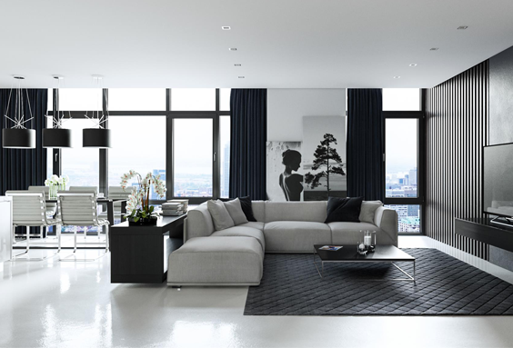
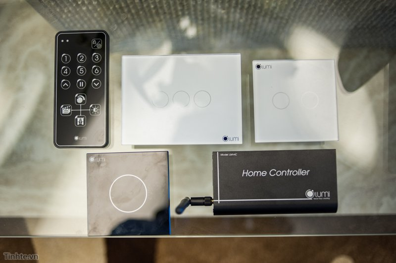

Không chỉ riêng nhưng căn biệt thự cao cấp mới sử dụng hệ thống nhà thông minh Lumi mà ở chung cư căn hộ cũng sử dụng các thiết bị tinh tế này, vùa qua mình có được mời trải nghiệm giải pháp nhà thông minh vủa Lumi trong một căn hộ cao cấ tại Hà Nội, Đây là giải pháp giúp chủ nhân ngôi nhà đơn giản hóa việc điều khiển, quản lý các thiết bị điện trong ngôi nhà thông qua các bảng điều khiển gắn trên tường nhà hoặc thông qua thiết bị như smartphone hay tablet. Trong bài viết này mình se giới thiệu sơ qua về hệ thống để các bạn hiểu roc hơn về ngôi nhà thông minh cua Lumi cũng như tiện ích mà nó mang lại.

Trọn bộ giải pháp Lumi bao gồm bọ điều khiển từ xa, các công tắc cảm ứng, công tắc dạng chiết áp và bộ điều khiển trug tâm.

Cả hai giải pháp của Lumi nhìn chung đều nhằm mang tới tiện ích cho việc điều khiển các thiết bị điện trong từng phòng và cả căn nhà như đèn điện, rèm cửa, quạt, điều hòa hay bình nóng lạnh... Giải pháp nhà thông minh Lumi bao gồm các công tắc gắn tường điều khiển qua cảm ứng, bộ điều khiển trung tâm để kết nối không dây tới smartphone/tablet cho điều khiển thiết bị. Ngoài ra, người dùng có thể bật/tắt hay hẹn giờ các thiêt bị điện khi đang ở ngoài căn nhà thông qua smartphone/tablet.

Ban đầu khi được giới thiệu về các bảng điều khiển cảm ứng gắn tường mình rất ấn tượng với cách hoàn thiện và thiết kế của sản phẩm. Những bảng điều khiển này được làm vuông hoặc hình chữ nhật tùy từng công tắc điều khiển rèm hay đèn, bề mặt được phủ một lớp kính cường lực dày 4mm tạo vẻ sang trọng cho sản phẩm đồng thời tăng khả năng chịu lực. Người dùng sẽ thao tác với bảng điều khiển này qua cảm ứng điện dung rất nhạy, ngay cả khi bề mặt có nước, một vòng tròn có ánh sáng sẽ báo cho chúng ta biết vùng nhận tín hiệu từ ngón tay, phân biệt với những vùng còn lại trên bề mặt kính. Vòng tròn này sẽ có ánh sáng đỏ khi đèn/rèm/quạt được bật và chuyển thành xanh dương khi các thiết bị tắt đi. Ánh sáng xanh này được giải thích sẽ cho cảm giác dịu mắt khi nhìn vào ban đêm (vì ban đêm các thiết bị đều tắt).

Để biết thêm thông tin về giải pháp nhà thông minh Lumi xin vui lòng liên hệ qua địa chỉ của Công ty chúng tôi đường dây nóng số.

Số 304 Nguyễn Đình Tựu, Q.Thanh Khê TP. Đà Nẵng
 
0968.333.268 - 0935.333.268

[GiahanGroup2018@gmail.com](mailto:GiahanGroup2018@gmail.com)

