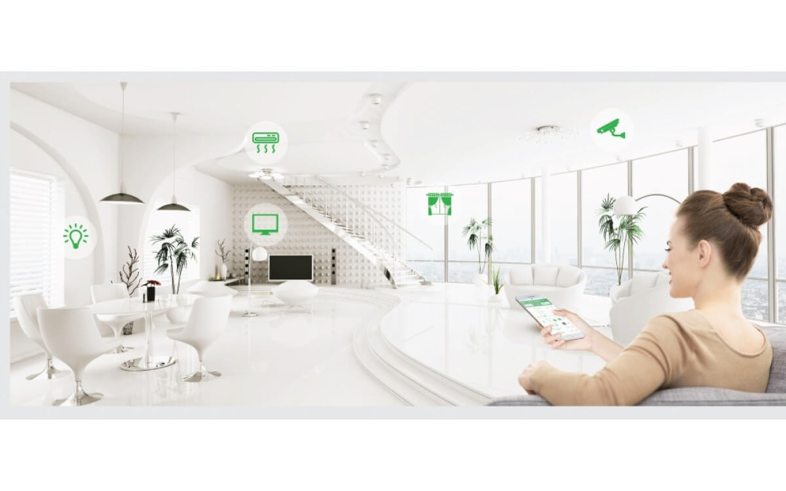
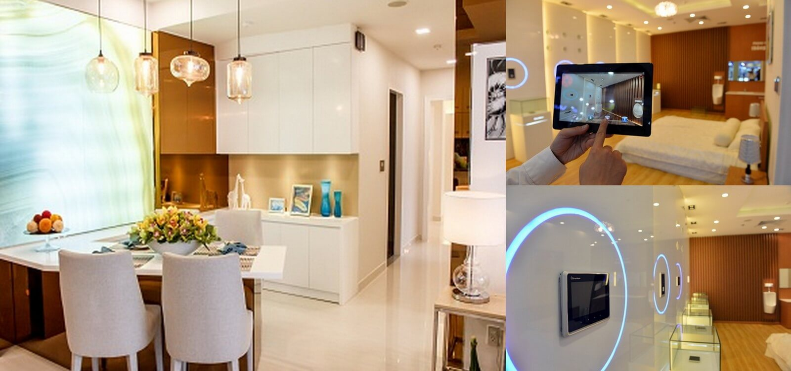

**Hãy tưởng tượng ngôi nhà của bạn được hỗ trợ bởi công nghệ 4.0 như vậy bạn có thể thức dậy với nước ấm để tắm, cafe sáng cùng một bản nhạc du dương đã được cài đặt sẵn, giúp bạn có một tinh thần sảng khoái để chào đón một ngày mới đầy hứng khởi.**

## Một ngôi nhà thông minh ở Việt Nam cần những yếu tố gì?

### 1.Kinh tế

Trải qua một thời gian dài do chiến tranh và bị cấm vận, nền kinh tế của Việt Nam không có điều kiện để tiếp xúc với các công nghệ kỹ thuật hiện đại. Chỉ sau khi kết thúc cấm vận, và Việt Nam tham gia giao lưu hội nhập với các nền kinh tế lớn trên thế giới, chúng ta đã nhanh chóng hội nhập mạnh mẽ vào các hiệp hội, tổ chức có quy mô quốc tế, toàn cầu, có cơ hội tiếp cận, giao lưu thương mại. Hội nhập nền kinh tế thế giới đồng nghĩa với việc các hàng hóa của Việt Nam có thể phát triển mạnh xuất khẩu ra nước ngoài và ngược lại có thể nhập khẩu hàng hóa từ nước ngoài vào Việt Nam, trong đó có mặt hàng công nghệ, điện tử thiết bị hiện đại, phục vụ sản xuất và nhu cầu của người dân.

### 2. Mạng viễn thông, và công nghệ tự động hóa.

Ngày nay, xã hội càng hiện đại, khoa học kỹ thuật càng phát triển thì cuộc sống của con người càng đầy đủ tiện nghi và việc ứng dụng tự động hóa càng được rộng rãi. Trong căn nhà thông minh, đồ dùng trong nhà từ phòng ngủ, phòng khách đến toilet đều gắn các bộ điều khiển điện tử có thể kết nối với Internet và điện thoại di động, cho phép chủ nhân điều khiển vật dụng từ xa hoặc lập trình cho thiết bị ở nhà hoạt động theo lịch. Thêm vào đó, các đồ gia dụng có khả năng tương tác với nhau.

Các thành phần của hệ thống nhà thông minh bao gồm các cảm biến (như cảm biến nhiệt độ, cảm biến ánh sáng hoặc do cử chỉ), các bộ điều khiển hoặc máy chủ và các thiết bị chấp hành khác. Nhờ hệ thống cảm biến, các bộ điều khiển và máy chủ có thể theo dõi trạng thái bên trong ngôi nhà để đưa ra các quyết định điều khiển các thiết bị một cách phù hợp, nhằm đảm bảo môi trường sống tốt nhất cho con người. Sự tự động hóa của ngôi nhà đặc biệt có ích cho người lớn tuổi và người tàn tật, những người muốn sống tự lập.

## Các lợi ích đem lại từ ngôi nhà thông minh

### 1. Sự tiện nghi, tiết kiệm thời gian

Bạn thử tưởng tượng lại các công việc hằng ngày phải làm với các thiết bị trong ngôi nhà mình, nào là đóng rèm mở rèm, bật tắt bình nước nóng, bật tắt đèn, điều chỉnh nhiệt độ điều hòa … và vô số những công việc khác. Tất cả khiến bạn luôn cảm thấy mệt mỏi và đôi khi không kiểm soát đượcchúng.

Ngôi nhà thông minh sẽ giúp bạn xử lý tất cả những việc này một cách nhanh chóng thông qua các thiết bị điện tử, mạng internet và điện thoại, tiết kiệm thời gian và năng lượng.

### 2. Tiết kiệm tiền bạc và năng lượng

Hiện nay, điện là nguồn năng lượng không thể thiếu cho mọi gia đình. Các thiết bị sử dụng như tivi, tủ lạnh, điều hòa, máy giặt, hệ thống chiếu sáng,… đều nhờ vào nguồn điện năng. Chính vì vậy mà thiết bị tiết kiệm điện luôn song hành với nhà thông minh và có những ưu điểm vượt trội. Hệ thống thiết bị tiết kiệm điện thông minh sẽ được lắp đặt với một hệ thống mạng không dây, giúp bạn có thể kiểm soát, điều khiển những vật dụng sử dụng điện năng trong gia đình. Ngoài ra, các thiết bị điện còn có thể tự động bật/tắt nhờ hệ thống cảm ứng hồng ngoại, cảm ứng chuyển động, lịch hẹn giờ,… Các thiết bị điện thông minh còn được kết nối với các thiết bị điện tử khác trong gia đình như laptop, điện thoại, tivi,…

**Nhà thông minh Lumi ngôi nhà dành cho người Việt**

Hội tụ đủ yếu tốt về kinh tế, kỹ thuật, công nghệ cùng nhiều tiện nghi khác mà giải pháp nhà thông minh lumi mang lại. Lumi Việt Nam đã khẳng định vị trí của mình trong thị trường nhà thông minh trên thế giới nói chung và Việt Nam nói riêng. Nhờ vậy càng ngày càng có nhiều ngôi nhà thông minh được lắp đặt trên khắp đất nước với hơn 25.000 công trình đã lắp đặt và sử dụng. Vậy còn chờ gì nữa mà không liên hệ với chúng tôi để có được ngôi nhà thông minh cho riêng mình.

Để biết thêm thông tin chi tiết về sản phẩm xin vui lòng liên hệ 0968.333.268 - 0935.333.268 để đươc tư vấn hỗ trợ hoặc liên hệ:

 Địa chỉ: Số 304 Nguyễn Đình Tựu, Q.Thanh Khê, TP. Đà Nẵng
 
 Hotline: 0968.333.268 - 0935.333.268
 
 Email: [GiahanGroup2018@gmail.com](mailto:GiahanGroup2018@gmail.com)

