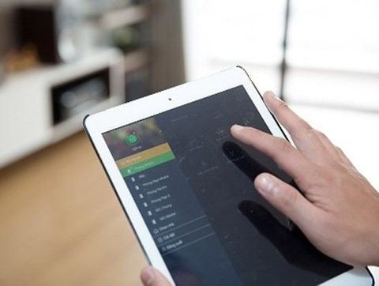

Thực tế hiện nay, trên thị trường đang bày bán tràn lan các thiết bị điện cơ truyền thống,và dần các thiết bị cơ đã có thay đổi mẫu mã cũng như tính năng sử dụng ,làm thế nào để thay đổi được thói quen cũng như cách nhìn nhận của mọi người về Nhà Thông Minh Lumi.

Như chúng ta đã biết trên thị trường nhà thông minh, bên cạnh những giải pháp nhà thông minh của các hãng lớn trên thế giới đến từ Đức, Pháp, Mỹ, Singapore   sneijder acis… được phân phối tại Việt Nam thông qua các đại lý ủy quyền trong nước, giải pháp nhà thông minh của Bkav và Lumi Việt Nam là 2 thương hiệu Việt đã phần nào tạo dựng được chỗ đứng trên thị trường.

Sau 8 năm phát triển, giải pháp Bkav SmartHome do Bkav phát triển là một hệ thống kết nối tất cả các thiết bị trong ngôi nhà thành một hệ thống mạng, để có thể điều khiển chúng theo các kịch bản thông minh, bao gồm: hệ thống đèn chiếu sáng, rèm cửa, điều hoà nhiệt độ, ti vi, dàn âm thanh, cảm biến môi trường, chuông cửa có hình, camera an ninh, hàng rào điện tử, cảnh báo rò rỉ khí gas... Bkav hiện cung cấp giải pháp nhà thông minh cho các khách hàng theo 2 hướng, trong đó Bkav SmartHome Luxury là giải pháp hoàn chỉnh, có giá thành “tương đối”, phù hợp với các dự án siêu biệt thự hay căn hộ sang trọng; Bkav SmartHome 2 là hệ thống nhà thông minh được sản xuất công nghiệp, dễ lắp đặt và đặc biệt là có mức giá thành thấp hơn nhiều, chỉ khoảng 30 triệu đồng nhằm giúp nhiều khách hàng có thể dễ dàng tiếp cận.

Còn với Lumia Việt Nam, doanh nghiệp cung cấp giải pháp nhà thông minh “Made in Vietnam” do 3 kỹ sư từ lò đào tạo Bách khoa Hà Nội sáng lập đến nay cũng đã phát triển qua hàng chục phiên bản khác nhau để đáp ứng được nhu cầu thị trường. Hồi tháng 8 năm ngoái, Lumi Vietnam đã nghiên cứu tích hợp thành công công nghệ nhận dạng giọng nói của Amazon - trợ lý ảo Amazon Alexa vào giải pháp nhà thông minh Lumi, cho phép chủ nhân các ngôi nhà có thể điều khiển các chiếu sáng, đóng mở rèm, điều chỉnh chiết áp, thay đổi màu sắc đèn led… bằng giọng nói. Só liệu của Lumi Việt Nam cho hay, đến nay đơn vị này đã cung cấp giải pháp nhà thông minh cho nhiều dự án lớn như: khu đô thị An Khánh, Mandarin, Spendora, Time City, Royal City, Water Mark, ThangLong Number 01, Ecopark…, với khoảng 40.000 ngôi nhà đã hoàn thiện.

Cho rằng nhà thông minh là xu hướng phát triển và sẽ ngày càng phổ biến tại Việt Nam trong thời gian tới, tuy nhiên các chuyên gia cũng chỉ ra rằng để thị trường nhà thông minh tại Việt Nam thực sự “bùng nổ” thì vẫn cần có thời gian và các đơn vị cung cấp giải pháp phải vượt qua được 4 thách thức lớn, đó là: giải pháp chưa hoàn thiện; giá thành; thói quen và sự không thích lệ thuộc công nghệ; và tâm lý lo ngại đối với an ninh bảo mật của hệ thống.

Dù đã có nhiều người quan tâm hơn đến nhà thông minh nhưng với phần lớn người dân Việt Nam vẫn chưa quen với khái niệm mới này, còn có tâm lý e ngại khi sử dụng các thiết bị, giải pháp IoT, hệ thống nhà thông minh… Để thay đổi nhận thức của người dùng vẫn cần có thời gian nhất định. Chúng tôi đang có kế hoạch để làm sao thời gian tới tiếp cận được nhiều hơn các khách hàng

