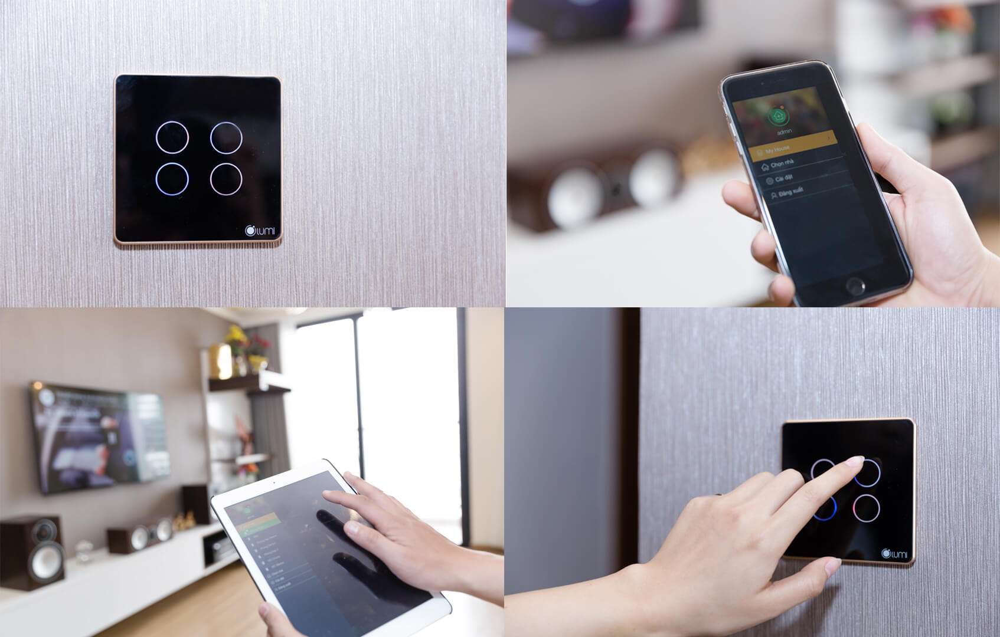

## Một chạm vạn tiện nghi

_Một chạm vạn tiện nghi_

Với nhà thông minh LUMI smarthome, tất cả đều trở nên dễ dàng hơn chỉ với một cái “chạm” nhẹ. Đơn cử như việc bạn có khách tới nhà chơi, chỉ chạm vào giao diện quản lý để điều khiển là điện được thắp sáng, điều hòa được điều chỉnh ở mức độ phù hợp, rèm cửa tự động được kéo lên…Điều này hoàn toàn khác với khi bình thường, bạn sẽ phải đi ra mở cửa cho khách, tiến tới công tắc bật đèn, kéo rèm cửa lên và điều chỉnh điều hòa ở mức phù hợp… rất nhanh chóng, tiện lợi và tiết kiệm thời gian.

Hay là mỗi khi đi ngủ, bạn chỉ cần thiết lập chế độ thì chỉ cần một cái chạm là đèn tự động tắt, rèm cửa tự động kéo xuống, vô cùng đơn giản và tiện lợi.

Trước đây, hệ thống đèn thông minh trong nhà bạn sẽ có rất nhiều công tắc, dàn trải từ phòng khách cho tới phòng bếp, phòng ngủ hay phòng vệ sinh. Tuy nhiên khi sử dụng giải pháp nhà thông minh smarthome thì tất cả các thiết bị điện trong nhà bạn giờ chỉ còn là một vài nút bấm ở trên màn hình cảm ứng.

_Dù ở bất kì đâu chúng ta vẫn tương tác với ngôi nhà _

## Có thể thực hiện điều khiển bằng giọng nói

Với sự phát triển của khoa học công nghệ, đặc biệt là công nghệ trợ lý ảo. Giờ đây một số ngôi nhà thông minh LUMI smarthome còn có thể thực hiện việc điều khiển bằng giọng nói. Đây được xem là một trải nghiệm hết sức tuyệt vời, khi sử dụng giọng nói để điều khiển thiết bị thông minh, tăng thêm tính thân thiện trong ngôi nhà.

## Mang đến sự khác biệt , hiện  đại

Nhiều người cho rằng, nhà thông minh LUMI smarthome chỉ có những người giàu có mới có thể sử dụng. Đây là một suy nghĩ sai lầm, bởi hiện nay cùng với sự phát triển mạnh mẽ của khoa học kỹ thuật, nhà thông minh đang trở nên phổ biến hơn, với mức giá hợp lý phù hợp với túi tiền của người tiêu dùng. Mô hình này được nhân rộng sẽ góp phần tạo ra một xã hội sự hiện đại và văn minh hơn.

Nhiều người dùng vẫn còn e dè với giải pháp mới này vì ngại quy trình lắp đặt phức tạp, nhiều chức năng rắc rối khó sử dụng. Hiểu được những điều này, các công ty cung cấp thiết bị nhà thông minh đã và đang nghiên cứu để tối ưu công tác thi công lắp đặt, cũng như xây dựng giao diện thân thiện với người dùng, giúp dễ dàng điều khiển và sử dụng ngay cả khi bạn không phải là một người rành công nghệ.

Trên đây là những điểm mạnh của nhà thông minh LUMI  smarthome. Nếu bạn cũng muốn sở hữu cho mình một ngôi nhà tiện nghi như thế này,  hãy liên hệ với CSIT thông qua website: https://giahangroup.vn  
