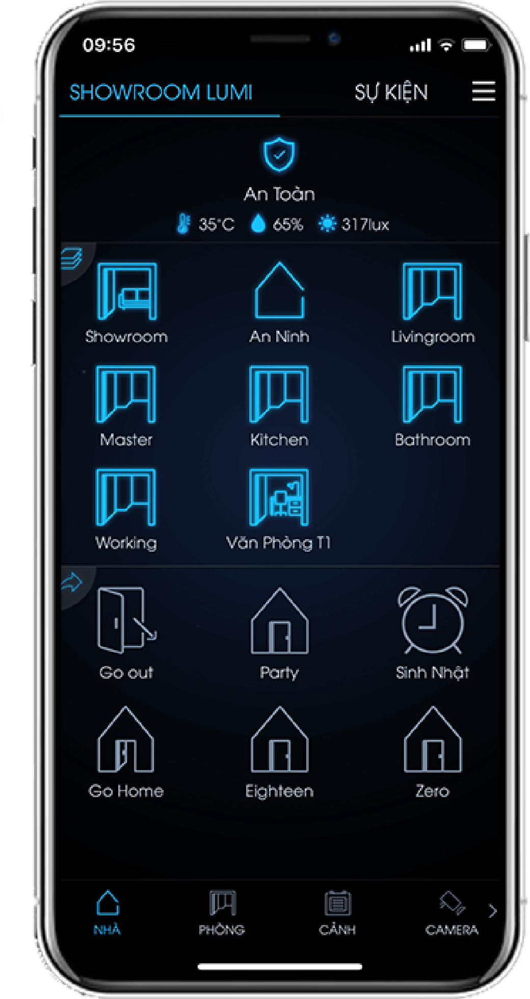
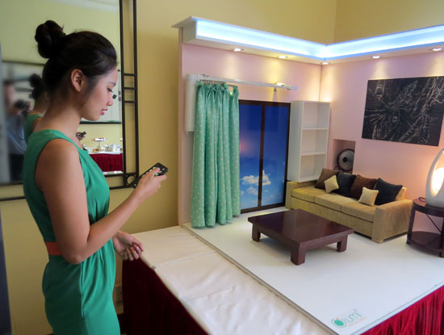
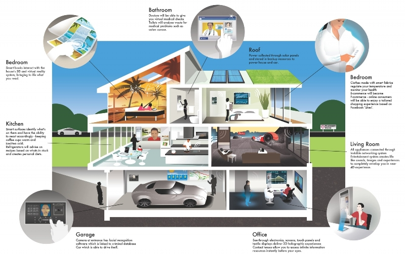
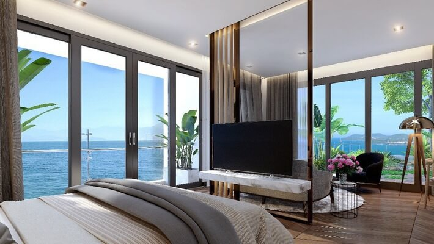
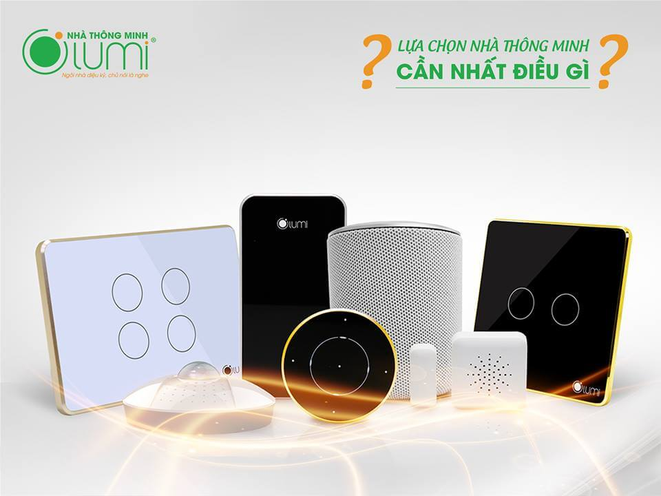
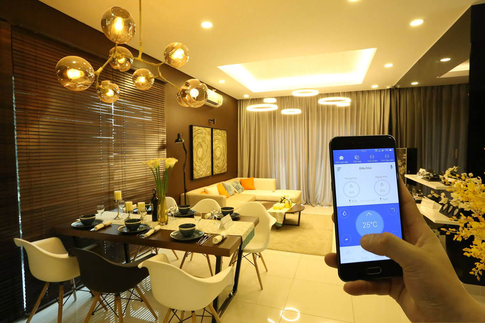

Cụm từ “nhà thông minh” (smarthome) có vẻ xa vời đối với phần đông mọi người và bạn nghĩ rằng đó là ngôi nhà rất cao siêu, có thể lắp ghép tự động hoặc di chuyển đến bất kỳ nơi đâu. Tuy nhiên, các tính năng đó có thể sẽ thành hiện thực trong tương lai, nhưng hiện tại con người vẫn chưa đạt đến trình độ cao để sở hữu những công nghệ trên.
 
Kinhtedothi - 3 từ “nhà thông minh” (smarthome) có vẻ xa vời đối với phần đông mọi người và bạn nghĩ rằng đó là ngôi nhà rất cao siêu, có thể lắp ghép tự động hoặc di chuyển đến bất kỳ nơi đâu. Tuy nhiên, các tính năng đó có thể sẽ thành hiện thực trong tương lai, nhưng hiện tại con người vẫn chưa đạt đến trình độ cao để sở hữu những công nghệ trên.

Theo khái niệm dễ hiểu, smarthome là ngôi nhà được lắp đặt các thiết bị điện, điện tử có khả năng bán tự động hoặc tự động hoàn toàn. Khi đó, con người có thể quản lý, giám sát và điều khiển tất cả các thiết bị điện từ xa vào bất kỳ thời gian nào trong ngày thông qua điện thoại, máy tính, máy tính bảng,… một cách đơn giản và dễ dàng.
Ngoài ra, con người cũng có thể thiết lập các thiết bị ở nhà hoạt động theo kịch bản đã cài đặt sẵn. Tất cả các ứng dụng nhà thông minh nhằm mục đích mang lại cho con người sự tiện nghi, an ninh và tiết kiệm điện năng.
Dưới đây, các kỹ sư của Lumi Việt Nam sẽ giới thiệu cho người dùng một số giải pháp tích hợp điều khiển một cách đồng bộ các thiết bị điện mà một ngôi nhà thông minh tại Việt Nam cần có.

## Điều khiển hệ thống ánh sáng

Hệ thống ánh sáng trong và ngoài ngôi nhà được chia thành nhều khu vực, chỉ những khu vực nào có người, đèn mới được bật sáng và tự động tắt khi không có người. Không những thế, hệ thống ánh sáng còn tự động điều chỉnh ở chế độ phù hợp theo sở thích của gia chủ như: Khi tiếp khách, ánh sáng ở chế độ rực rỡ, tất cả các đèn sáng lên, từ đèn trần, đèn hắt, đèn chùm, đèn tranh.

Mức độ sáng của các hệ đèn này còn được tự động thay đổi vào mỗi thời điểm khác nhau. Chẳng hạn vào ban ngày, ánh sáng sẽ bật tự động ở mức 50% độ sáng nhưng vào buổi tối hệ thông ánh sáng sẽ bật ở mức 100% để phù hợp với nhu cầu và sinh hoạt của gia chủ, đem tới sự tiện nghi và tiết kiệm năng lượng.

## Điều khiển hệ thống rèm tự động

Hệ thống rèm tại các cửa vào, cửa sổ của ngôi nhà sẽ được tích hợp trong giải pháp điều khiển hệ thống đèn tự động của Lumi. Gia chủ chỉ cần chạm nhẹ vào công tắc để điều khiển đóng/mở, đặt lịch, hẹn giờ, điều khiển từ xa hệ thống rèm hoặc dùng remote/smartphone ở bất kỳ nơi đâu. Nếu muốn, tất cả các rèm phòng ngủ sẽ tự động hạ xuống vào lúc 9 giờ tối và mở lên lúc 7 giờ sáng. Cũng có thể, 5h30 sáng, rèm tự động mở ra đánh thức bạn bằng ánh sáng thiên nhiên, một cảm giác ngày mới tràn đầy năng lượng. 12h00 rèm tự động đóng lại cho bạn một giấc nghỉ trưa thoải mái. Bạn có thể tùy chỉnh thời gian đặt lịch đóng, mở cho một hoặc nhiều rèm cùng lúc trên chính chiếc điện thoại đi động của mình.

Đó là hai trong rất nhiều kịch bản có thể xây dựng tùy theo nhu cầu thực tế của gia chủ. Với Lumi smartphone, hệ thống rèm mành ngoài việc điều khiển từ xa, chế độ đóng mở theo các kịch bản đặt trước, hệ thống còn cho phép điều khiển kết hợp với hệ thống ánh sáng, âm thanh, giải trí đa phương tiện… theo các kịch bản mong muốn, phù hợp trong các tình huống sử dụng trong thực tế như tiếp khách, xem phim, đi ngủ… để tự động điều chỉnh đóng mở cho phù hợp.

Với chiếc Smartphone có kết nối Internet, bạn có thể kiểm soát hệ thống rèm cửa nhà mình ở bất cứ lúc nào, trạng thái của từng bộ rèm đang đóng hay mở hoặc đóng bao nhiêu % đều được hiển thị trên điện thoại hay máy tính bảng của bạn. 

## Tạo cảnh phối hợp điều khiển nhiều thiết bị

Hệ thống nhà thông minh cho phép gia chủ tạo cảnh không giới hạn phối hợp điều khiển nhiều thiết bị trong gia đình. Ví dụ buổi sáng với chế độ cảnh: Chào buổi sáng, gia chủ chỉ cần 1 thao tác bấm trên điện thoại thì máy tập thể dục bật, rèm kéo lên, quạt thông gió hoạt động, nhạc nổi lên, bình nóng lạnh bật trong 30 phút, điều hòa tự động tắt….

## Cài lịch, hẹn giờ bật tắt các thiết bị ở bất kỳ nơi đâu

Bạn có thể kiểm soát ngôi nhà từ bất cứ đâu. Bạn đang ở văn phòng, hay đang trong kỳ nghỉ, hệ thống Nhà thông minh sẽ giúp bạn dễ dàng kiểm soát và điều khiển ngôi nhà từ thiết bị di động, máy tính bảng thông qua kết nối Interner (wifi, 3G).

## Kết nối không giới hạn, điều khiển qua smartphone/tablet

Các ứng dụng điều khiển nhà thông minh được các kỹ sư Lumi Việt Nam nghiên cứu và phát triển trên một giao diện thân thiện, dễ sử dụng giúp cho các gia chủ dễ dàng điều khiển toàn bộ các chức năng thông minh trong ngôi nhà từ chiếu sáng, rèm cửa và nhiệt độ cho đến hệ thống nghe-nhìn một cách vô cùng thuận tiện tại bất cứ đâu. Các kỹ sư sẽ thiết kế và cài đặt riêng cho mỗi gia chủ một giao diện điều khiển phù hợp nhất ngay trên Iphone và iPad của bạn.

Thông thường để điều khiển tất cả các thiết bị trong nhà, bạn cần tới hàng chục công tắc, thậm chí với căn nhà lớn hàng trăm công tắc. Với giải pháp nhà thông minh Lumi, bạn có thể điều khiển tất cả bằng một vài nút bấm trên màn hình cảm ứng của smartphone hay máy tính bảng.

## Cảm biến an ninh, chống trộm

Hệ thống được thiết kế đảm bảo an toàn, thông minh theo nhiều lớp. Khi kẻ đột nhập tới bên ngoài nhà, hệ thống an ninh sẽ được kích hoạt đồng bộ theo nhiều cấp độ khác nhau. Bạn có thể cài đặt cho hệ thống phát cảnh cáo theo các cấp độ an ninh khác nhau như: Bật đèn tại khu vực có đột nhập, báo động qua còi hú trong nhà, gửi tin nhắn hoặc gọi điện đến các số điện thoại của các thành viên trong gia đình hoặc các số điện thoại khẩn cấp khác mà bạn đã đăng ký. Hệ thống an ninh sẽ hỗ trợ bạn kích hoạt tự động đi cùng với các kịch bản trong ngôi nhà, giúp bạn hoàn toàn yên tâm khi ở nhà cũng như khi vắng nhà.

Cảm biến môi trường

Nhà thông minh Lumi được trang bị hệ thống kiểm soát môi trường với các cảm biến nhiệt độ, độ ẩm, ánh sáng đặt ở khắp các vị trí thích hợp trong ngôi nhà. Các thông số được chuyển về hệ thống trung tâm để tính toán, đưa ra lệnh điều khiển tới các thiết bị điều hòa nhiệt độ, máy hút ẩm, quạt thông gió giúp duy trì trạng thái môi trường trong lành nhất cho ngôi nhà.
Với mỗi gia đình chủ nhà có thể đặt tùy ý các thông số về môi trường cho phù hợp với gia đình của mình. Chẳng hạn, với kịch bản “Đi ngủ”, bình thường chế độ này được mặc định tự động đóng rèm, đèn trần, đèn hắt tắt, chỉ sáng đèn ngủ, điều hòa giảm xuống 25-26 độ C. Tuy nhiên, vào thời gian gần về sáng, người dùng thường có cảm giác bị lạnh và nếu họ thực hiện việc điều chỉnh điều hòa tăng lên 27-28 độ C thì hệ thống sẽ tự động điều chỉnh tăng theo mức cài đặt sẵn từ trước.
Cảm biến phát hiện chuyển động
Hệ thống cảm biến có khả năng cảm  nhận và chỉ hoạt động khi khu vực đó không đủ độ sáng cần thiết, đảm bảo việc tự động điều khiển bật đèn khi có người sử dụng và tắt đèn sau một khoảng thời gian định trước. Tại các khu vực như cầu thang, hành lang, ban công, nhà vệ sinh, các cảm biến sẽ làm sáng đèn khi có người sử dụng và sẽ để ở chế độ mặc định khoảng thời gian sau đó đèn tự động tắt. Hơn 50% năng lượng điện được tiết kiệm nhờ chức năng này, không những thế hệ thống dây điện trong nhà trở nên đơn giản và an toàn hơn rất nhiều.

## Cảm biến hồng ngoại

Cùng với thiết bị ngoại vi, hệ thống điều hòa nhiệt độ, tivi trong gia đình sẽ tạo ra các chế độ hoạt động tối ưu, phù hợp với từn hoàn cảnh sử dụng khác nhau. Với Lumi smarthome, gia chủ có thể tăng, giảm, điều chỉnh nhiệt độ của điều hòa hoặc thay đổi kênh sóng của tivi ngay từ phím bấm trên remote hay trên smartphone.