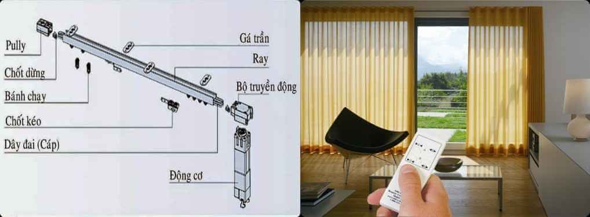
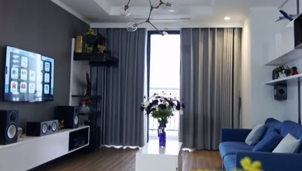

**Tiên phong trong lĩnh vực smarthome, nhà thông minh Lumi hướng đến phát triển tối đa các tiện ích phục vụ cuộc sống con người. Trong đó, giải pháp rèm cửa thông minh hỗ trợ bạn đóng mở rèm cửa một cách nhanh chóng và dễ dàng chỉ bằng smartphone hay giọng nói. Ngoài ra, chức năng tự động mở/đóng theo khung giờ bạn cài đặt giúp bạn tiết kiệm và tận dụng ánh sáng tự nhiên cho ngôi nhà.**

_Giải pháp rèm cửa thông minh_

## Điều khiển từ xa mọi lúc mọi nơi

Với giải pháp rèm cửa thông minh Lumi, bạn có thể dễ dàng điều khiển hệ thống rèm cửa chỉ bằng smartphone hoặc giọng nói.

Thay vì phải đến tận nơi và điều khiển bằng tay, chỉ cần một chiếc smartphone kết nối internet (3G/4G), bạn có thể dễ dàng đóng mở một hay nhiều rèm cửa trong nhà chỉ với một cú chạm. Mọi thông tin trạng thái đóng mở rèm cửa đều được hiển thị chi tiết trên màn hình điện thoại/máy tính bảng.

Ngoài ra, Lumi còn phát triển sản phẩm loa thông minh Milo giúp bạn điều khiển hệ thống rèm cửa chỉ bằng giọng nói. Giải pháp này cực hữu ích khi bạn không thể đến tận nơi hay khi không rảnh tay để mở smartphone.

## Hẹn giờ đóng mở rèm theo ý muốn

Không phải lúc nào bạn cũng ở nhà hoặc có đủ thời gian để quản lý ngôi nhà. Chính vì vậy, Lumi đã phát triển tính năng hẹn giờ để bạn thiết lập hoạt động/trạng thái cho hệ thống rèm cửa ngay trên nền tảng điện thoại. Bạn có thể tùy chỉnh cài đặt thời gian đóng mở cho một hoặc nhiều rèm cửa trong hệ thống theo ý muốn của mình. 
Ví dụ, bạn cài đặt thời gian đóng mở theo đồng hồ sinh học cá nhân. 6h sáng, rèm cửa sẽ tự động mở và đánh thức bạn dậy bằng ánh sáng tự nhiên. 12h trưa rèm tự động đóng lại để bạn nghỉ ngơi thư giãn và chiều đến khung cửa sổ lại rộng mở để bạn tận hưởng thời khắc hoàng hôn lãng mạn.

## Điều khiển linh hoạt đa phương tiện

Ngoài chức năng điều khiển và hẹn giờ từ xa, Lumi còn giúp bạn kết hợp nhiều tiện ích đa phương tiện. Hệ thống cho phép bạn điều khiển rèm cửa kết hợp với chiếu sáng thông minh, âm thanh, giải trí đa phương tiện…ngay trên chiếc điện thoại của mình.

Ứng dụng Lumi tích hợp các ngữ cảnh đã được lập trình sẵn như đi ngủ, xem phim, tiếp khách...để bạn lựa chọn trạng thái phù hợp với các tình huống trong thực tế. Ví dụ, nếu bạn đang trên đường về nhà, chỉ cần bấm chọn “về nhà”, hệ thống rèm cửa sẽ tự động mở cho không khí thoáng đãng và sẵn sàng chào đón bạn trở về. Nếu bạn đang chuẩn bị tiếp đón một vị khách quý, nút bấm “tiếp khách” sẽ mang âm nhạc vui tươi rộn rã khi mở rèm, khiến thượng khách cả bạn cảm thấy được tiếp đón một cách đặc biệt. 
Ngoài việc hẹn giờ theo ý muốn, giải pháp rèm cửa thông minh Lumi còn tự động theo dõi và ghi nhớ thói quen của người dùng, phân biệt được nhu cầu ánh sáng giữa các mùa/các thời điểm trong ngày để tự động điều chỉnh đóng mở cho phù hợp.

## Gia Hân - đơn vị cung cấp giải pháp rèm cửa thông minh Lumi hàng đầu Việt Nam

Là đơn vị duy nhất tại Việt Nam đạt chứng chỉ chất lượng CE và UL, Gia Hân mang đến cho bạn những tiện ích tuyệt vời và đồng bộ từ giải pháp rèm cửa thông minh, Milo - giọng nói Tiếng Việt, chiếu sáng thông minh, Led 16 triệu màu, bật tắt bình nóng lạnh, âm thanh đa vùng, kiểm soát môi trường...

Đặc biệt, Gia Hân mang đến cho bạn giải pháp rèm cửa thông minh và đồng bộ. Các sản phẩm đi kèm bao gồm: công tắc cảm ứng viền vàng, công tắc cảm ứng viền nhôm, bộ điều khiển trung tâm và loa Milo. Tất cả các sản phẩm đều đạt chuẩn CE tiêu chuẩn xuất khẩu châu Âu và UL – bo mạch phần cứng đạt chuẩn quốc tế được xuất khẩu rộng rãi trên 104 quốc gia trên thế giới.  

Đặc biệt, Gia Hân có đội ngũ kỹ thuật nhiều năm kinh nghiệm luôn sẵn sàng triển khai các hệ thống nhà thông minh, hệ thống thiết bị an ninh rộng khắp. Hệ thống đại lý trên toàn quốc và liên tục mở rộng hệ thống đại lý tới các tỉnh thành.

Hãy đến với Gia Hân ngay hôm nay để cập nhật những tiện ích tuyệt vời cho không gian sống ngôi nhà bạn cùng giải pháp rèm cửa thông minh Lumi.