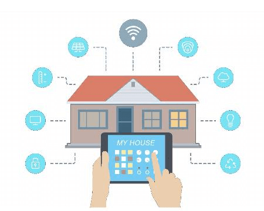
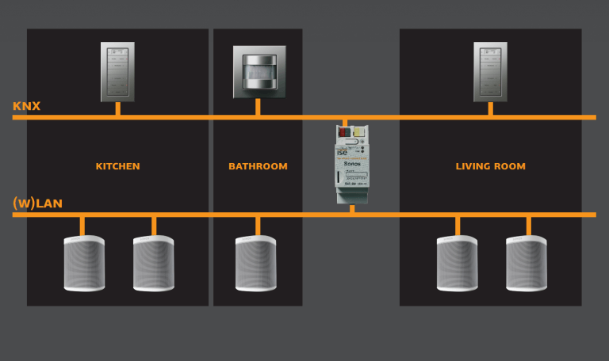

Hãy tưởng tượng, mỗi sáng thức dậy, bạn chỉ cần click chuột là toàn bộ hệ thống đèn sẽ bật sáng, tivi mở kênh mình yêu thích và rèm cửa được kéo lên để đón ánh bình minh. Hay nước nóng tự động bật lên, điều hòa auto điều chỉnh nhiệt độ ngay khi bạn đặt chân trở về nhà. Đó chính là hệ thống nhà thông minh không dây hiện đại nhất hiện nay giúp bạn kiểm soát ngôi nhà một cách linh hoạt nhất. Nhà thông minh không dây đang trở thành xu hướng phổ biến tại Việt Nam hiện nay. 

**Phân biệt nhà thông minh có dây và không dây**

Để so sánh những tiện ích vượt trội của nhà thông minh không dây, trước tiên cần làm rõ sự khác biệt giữa hai hình thức: nhà thông minh không dây và có dây.
Nhà thông minh có dây phù hợp với biệt thự, tòa nhà nhiều tầng với đầy đủ tính năng toàn diện. Hệ thống này có ưu điểm truyền tải dữ liệu nhanh, ổn định và đồng thời nhiều tín hiệu cùng một lúc. Nhờ vậy, bạn có thể quản lý được nhà có không gian lớn, tòa nhà nhiều tầng. Tuy nhiên, hình thức này lại cần nhiều công đoạn lắp đặt. Chi phí bỏ ra khá cao và cần phải lắp đặt khi công trình còn đang xây dựng phần thô. 

_Phân biệt nhà thông minh có dây và không dây_

Để so sánh những tiện ích vượt trội của nhà thông minh không dây, trước tiên cần làm rõ sự khác biệt giữa hai hình thức: nhà thông minh không dây và có dây.
Nhà thông minh có dây phù hợp với biệt thự, tòa nhà nhiều tầng với đầy đủ tính năng toàn diện. Hệ thống này có ưu điểm truyền tải dữ liệu nhanh, ổn định và đồng thời nhiều tín hiệu cùng một lúc. Nhờ vậy, bạn có thể quản lý được nhà có không gian lớn, tòa nhà nhiều tầng. Tuy nhiên, hình thức này lại cần nhiều công đoạn lắp đặt. Chi phí bỏ ra khá cao và cần phải lắp đặt khi công trình còn đang xây dựng phần thô. 

