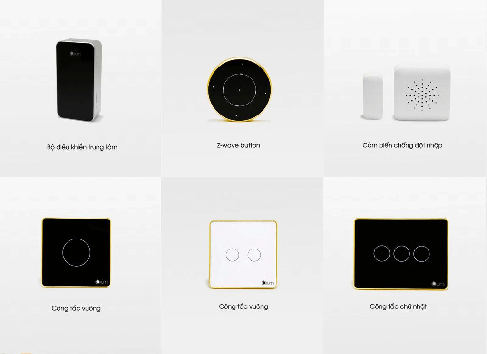

Thiết bị điện chính là chìa khóa vạn năng mang đến những tiện ích vượt trội cho giải pháp nhà thông minh. Gia Hân xin giới thiệu đến bạn những thiết bị điện dân dụng thông minh tiên tiến nhất hiện nay để bạn có thể ứng dụng vào ngôi nhà của mình.

**Thiết bị bật tắt đèn thông minh**

Giờ đây việc điều khiển hệ thống ánh sáng trong nhà không còn khiến bạn phải bận tâm nữa khi mọi hoạt động đều được lập trình nhanh gọn và tiết kiệm công sức. Các loại thiết bị bật tắt đèn phổ biến hiện nay bao gồm: 
* Thiết bị bật tắt đèn từ xa hoặc qua cảm ứng (hay còn gọi là công tắc thông minh) giúp bạn dễ dàng điều khiển hệ thống chiếu sáng trong và ngoài nhà. 
* Thiết bị bật tắt đèn dựa vào cảm biến ánh sáng: nguyên tắc hoạt động của loại thiết bị này là dựa vào cảm biến ánh sáng so với môi trường. Khi trời tối, đèn sẽ tự động bật sáng và ngược lại. Nhờ ưu điểm này mà bạn sẽ tiết kiệm được điện năng sử dụng cho hệ thống chiếu sáng, đặc biệt là đèn ở sân vườn, cổng hay ngoài đường. 
* Thiết bị cảm biến chuyển động: Dựa vào sự chuyển động hồng ngoại trong một phạm vi nhất định, đèn sẽ tự động bật hoặc tắt. Đây là thiết bị điện dân dụng thông minh phù hợp với không hành lang, cầu thang của biệt thự, nhà cao tầng. 

**Thiết bị điều khiển hồng ngoại thông minh**

Thiết bị điều khiển hồng ngoại hoạt động theo nguyên tắc cảm biến thụ động. Khi có sóng hồng ngoại đi vào khu vực cảm biến, tín hiệu sẽ được ghi nhận và gửi về trung tâm điều khiển. Các lệnh có sẵn sẽ được kích hoạt và điều khiển trạng thái bật tắt của thiết bị được sử dụng rất nhiều trong cuộc sống hiện nay. 

Thiết bị điều khiển hồng ngoại thông minh - tối giản việc sử dụng Remote
Những thiết bị điều khiển hồng ngoại thông minh được sử dụng rất nhiều trong cuộc sống hiện nay từ cảm biến hồng ngoại cho an ninh, chống trộm, cầu thang,...
Một số thiết bị điện dân dụng thông minh thông dụng hiện nay
Hiểu được tầm quan trọng của các thiết bị điện trong không gian nhà ở hiện nay, Lumi đã nghiên cứu và phát triển các thiết bị điện tích hợp mạng Zigbee được người sử dụng đánh giá rất cao về độ ổn định, đảm bảo kết nối liên tục trong quá trình sử dụng. Sau đây là các thiết bị điện dân dụng thông minh phổ biến trên thị trường hiện nay:
+ Công tắc thông minh: điều khiển bật/tắt các thiết bị như đèn điện, đèn chùm, quạt trần, bình nóng lạnh,...
+ Cảm biến hồng ngoại: thay thế tất cả các Remote để điều khiển bóng đèn, tivi, điều hòa...bằng tia hồng ngoại.
+ Cảm biến chuyển động:  thích hợp khi sử dụng cho bóng đèn cầu thang, ban công, WC,...
+ Cảm biến an ninh: Có khả năng báo trộm rất tốt, kích hoạt thông báo về điện thoại cho bạn biết khi có trộm đột nhập.

_Hình ảnh các thiết bị điện dân dụng thông minh cho gia đình_

Khảo sát ý kiến trên 100 khách hàng đang sử dụng thiết bị điện Lumi, 75% lựa chọn Lumi ngay từ đầu và 25% còn lại chuyển sang dùng Lumi sau khi sử dụng sản phẩm khác nhưng chất lượng và hiệu năng không đảm bảo. Một thiết bị điện dân dụng thông minh tốt cần đảm bảo các yếu tố sau: 
* Dễ lắp đặt, không cần phải đi dây hay đục khoét tường ảnh hưởng đến cấu trúc của ngôi nhà.
* Sở hữu tính năng tự ngắt khi xảy ra sự cố về điện. Tính năng này đảm bảo an toàn cho cả gia đình đặc biệt là khi bạn vắng nhà.
* Tích hợp công nghệ không dây Zigbee - loại sóng ổn định, độ phủ rộng hơn Wifi. Ngoài ra, sóng Wifi nếu chập chờn thì sẽ không thể điều khiển qua điện thoại và dễ bị xâm nhập bằng đường mạng, công nghệ không dây Zigbee khắc phục được nhược điểm này.

Để lựa chọn được thiết bị điện dân dụng thông minh chất lượng, hãy đến với Gia Hân. Chúng tôi chuyên cung cấp và thi công các thiết bị điện thông minh Lumi chất lượng cao và dễ dàng sử dụng (chỉ với 1 đến 2 ngày thi công bất kể công trình cũ hay mới, không cần đục đẽo). Các thiết bị điện Lumi được phân phối bởi Gia Hân đều nhận được chứng chỉ CE – tiêu chuẩn xuất khẩu sang các nước Châu  u và chứng chỉ UL – được xuất khẩu đến 104 quốc gia trên thế giới. Đặc biệt, mức giá chỉ bằng 1/3 so với các giải pháp tương tự trên thị trường.

Liên hệ Gia Hân ngay hôm nay để sở hữu cho mình những thiết bị điện dân dụng thông minh chất lượng cho ngôi nhà của bạn.

