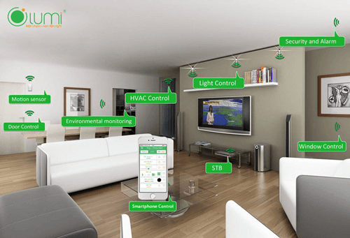
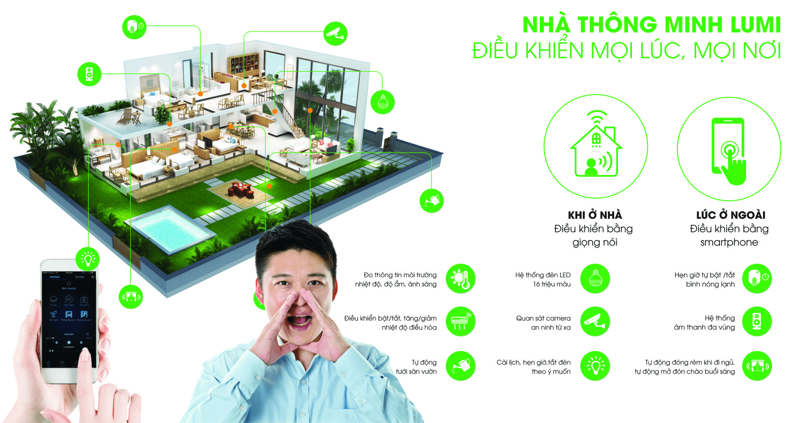

Ngôi nhà thông minh không còn là ước mơ của nhiều người với Lumi - thương hiệu smarthome được ưa chuộng nhất hiện nay. Chỉ với 16 triệu đồng, bạn đã có thể sở hữu ngay giải pháp nhà thông minh với nhiều tính năng tuyệt vời như điều khiển đóng mở rèm từ xa, bật tắt bình nóng lạnh hay lập trình sẵn các hoạt động của thiết bị điện trong nhà.

**Giải pháp nhà thông minh là gì?**
Nhà thông minh tích hợp hệ thống điều khiển không dây (Wifi, Zigbee, mạng LAN,..) để kết nối các thiết bị điện thông minh. Nhờ vậy, bạn có thể kiểm soát và điều khiển ngôi nhà theo ý muốn cũng như thiết lập các hoạt động cho thiết bị dựa theo kịch bản. 
Thử tưởng tượng xem, mỗi sáng thức dậy, đèn bật sáng, âm nhạc ngân lên du dương và rèm cửa tự động mở ra chào đón ánh nắng. Khi bạn ra ngoài và lỡ quên tắt đèn hay đóng cửa phòng, chỉ cần mở điện thoại ra và bật tắt mọi thiết bị tùy ý.

_Giải pháp nhà thông minh với nhiều tiện ích vượt trội_

Với những tiện ích vượt trội này, rất khó để có thể sở hữu một giải pháp nhà thông minh với mức giá bình dân. Các thương hiệu smarthome lớn như Siemens (Đức), Lagrand (Pháp), Comfort (Singapore),… thường có mức giá lên đến vài trăm triệu đồng. 
Hiểu được mong muốn sử dụng nhà thông minh và mức sống bình quân của các hộ gia đình Việt Nam, Lumi đã nghiên cứu và phát triển giải pháp nhà thông minh với mức giá chỉ bằng ⅓. Đặc biệt gói giải pháp nhà thông minh chỉ 16 triệu đồng với nhiều tiện ích vượt trội. 
Gói giải pháp nhà thông minh 16 triệu đồng
Chỉ với 16 triệu đồng, mức giá chỉ bằng ⅓ so với thị trường, bạn sẽ sở hữu nhiều tính năng tiện nghi cho cuộc sống gia đình: 
* Điều khiển bật/tắt bóng đèn từ xa bằng Smartphone
* Hẹn giờ tự động bật/tắt bóng đèn
* Thiết lập ngữ cảnh bật/tắt 1 hoặc nhiều bóng đèn cùng một lúc.
* Đèn WC tự động bật/tắt theo chuyển động.
* Điều khiển bật/tắt bình nóng lạnh từ xa bằng Smartphone
* Hẹn giờ tự động bật/tắt bình nóng lạnh.
* Không cần đi dây nhờ tính năng đảo chiều được thiết lập hoàn toàn trên phần mềm.

Gói giải pháp nhà thông minh bao gồm các thiết bị: bộ điều khiển trung tâm, 3 công tắc điều khiển từ xa công suất lớn, 4 mặt công tắc điều khiển từ xa 4 nút và chiết áp. Số lượng thiết bị này có thể thay đổi tùy thuộc vào nhu cầu sử dụng của từng gia đình. Lưu ý, chi phí trên chưa bao gồm công lắp đặt. 

**Gia Hân group - đơn vị cung cấp và thi công giải pháp nhà thông minh Lumi uy tín**

Để sở hữu giải pháp nhà thông minh chất lượng với mức giá hợp lý, hãy liên hệ với Gia Hân để được hỗ trợ tốt nhất.
Các sản phẩm Lumi được Gia Hân phân phối đều nhận được chứng chỉ CE – tiêu chuẩn xuất khẩu sang các nước Châu  u và chứng chỉ UL – được xuất khẩu đến 104 quốc gia trên thế giới. Các sản phẩm của Lumi đã xuất khẩu tới 6 nước trên thế giới: Ấn Độ, Australia, Thái Lan, Lào, Campuchia.

Khác với các thương hiệu smarthome khác, Lumi tập trung vào phân khúc thị trường trung và cao cấp nên các giải pháp nhà thông minh mang lại sự tiện ích vượt trội cho khách hàng với mức giá chỉ bằng ⅓. Quy trình lắp đặt cực đơn giản và dễ dàng chỉ với 1 đến 2 ngày thi công bất kể công trình cũ hay mới mà không cần đục đẽo.

Với hàng ngàn ngôi nhà đã hoàn thiện và nhiều công trình đang được ký kết triển khai. Gia Hân là đơn vị cung cấp và thi công được ưa chuộng nhất hiện nay. Sự tín nhiệm của các đối tác và hàng nghìn khách hàng đang sử dụng giải pháp nhà thông minh là minh chứng rõ ràng nhất về chất lượng phục vụ của chúng tôi.

Chỉ từ 16 triệu đồng, bạn đã có thể sở hữu giải pháp nhà thông minh với nhiều tiện nghi. Và chỉ từ 25 – 70 triệu/căn hộ hoặc 40 – 150 triệu/biệt thự liền kề, bạn đã sở hữu ngay ngôi nhà hiện đại, sang trọng đẳng cấp Châu  u. Mức giá này chỉ bằng 1/2 so với các giải pháp nhập khẩu tương tự trên thị trường.

Hãy liên hệ ngay với Gia Hân để trở thành người tiếp theo sở hữu giải pháp nhà thông minh hiện đại chỉ với 16 triệu đồng.

