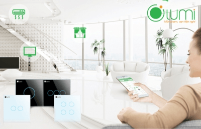
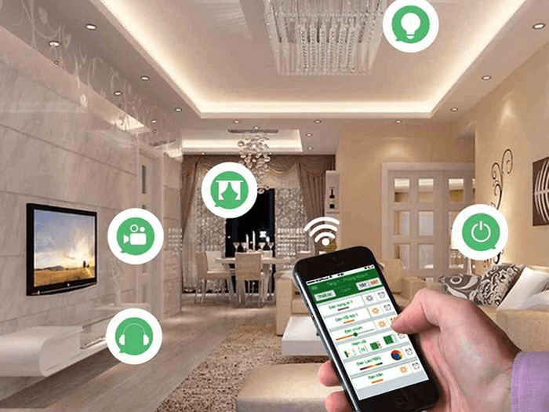
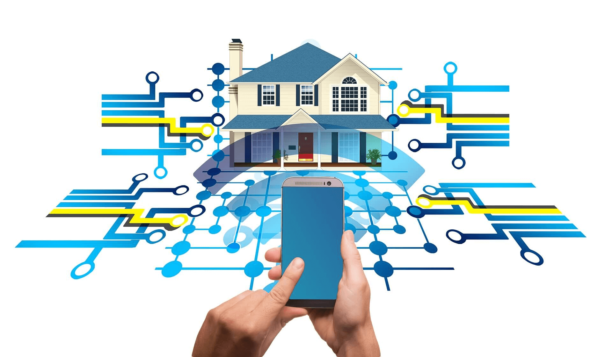

Ngày nay không ít trường hợp chập cháy điện nguy hiểm do quên tắt thiết bị điện khi ra ngoài, thiết bị điện kém chất lượng hay trộm cắp đột nhập khi đi vắng. Giờ đây, mọi vấn đề sẽ được giải quyết với hệ thống điều khiển nhà thông minh bằng điện thoại. 

**Ưu điểm của hệ thống điều khiển nhà thông minh bằng điện thoại**

Giải pháp nhà thông minh được trang bị các thiết bị điện sản xuất theo công nghệ IoT và được tích hợp mạng không dây tự động kết nối với nhau qua bộ điều khiển trung tâm. Nhờ vậy, bạn chỉ cần phần mềm nhà thông minh về điện thoại có kết nối Internet là có thể điều khiển các thiết bị này khi ở nhà hay bất cứ đâu. 

**Bật/tắt thiết bị điện dễ dàng **

Dù bạn đang đi làm hay đi công tác xa, bạn vẫn có thể điều khiển bật/tắt bình nóng lạnh, điều hòa hay hệ thống chiếu sáng trong nhà. Trên phần mềm cài đặt hiển thị mọi thông tin trạng thái của thiết bị điện, bạn chỉ cần chạm nhẹ vào nó là bạn có thể bật/tắt 1 hoặc tất cả thiết bị điện mà không cần di chuyển.

_Bật/tắt thiết bị điện dễ dàng bằng smartphone_

**An toàn tuyệt đối về điện:**
Việc điều khiển nhà thông minh bằng điện thoại đảm bảo sự an toàn vì không cần tiếp xúc trực tiếp với thiết bị điện. Ngay cả công tắc cảm ứng cũng được thiết kế với chất liệu cách điện cách nhiệt và tính năng tự ngắt điện khi quá tải an toàn tuyệt đối ngay cả khi tay ướt.

**Giải pháp chống trộm hoàn hảo:**
Chức năng chống trộm là một trong những ưu điểm vượt trội của hệ thống điều khiển nhà thông minh bằng điện thoại. Các thiết bị điện của giải pháp nhà thông minh có khả năng học hàng nghìn lệnh, trong đó có lệnh chống trộm. Khi có kẻ lạ đột nhập vào nhà, thiết bị sẽ tự động thông báo về điện thoại để bạn theo dõi và kịp thời xử lý.

_Điều khiển nhà thông minh bằng điện thoại một cách dễ dàng_

**Hiện nay trên thị trường đang có hơn 50 thương hiệu về nhà thông minh và thiết bị điện. Để lựa chọn được giải pháp chất lượng, bạn cần lưu ý: **

* Lựa chọn thiết bị điện thông minh dễ lắp đặt, không cần phải đục khoét tường để đi dây gây ảnh hưởng đến cấu trúc của ngôi nhà.
* Lựa chọn giải pháp nhà thông minh tích hợp công nghệ không dây Zigbee. Nếu như sóng Wifi bị hư hay chập chờn thì sẽ không thể điều khiển qua Smartphone thì công nghệ Zigbee lại ổn định và độ phủ rộng hơn so với Wifi. 
* Ưu tiên lựa cho các thiết bị Made in Việt Nam (đã đạt tiêu chuẩn xuất khẩu như Lumi) để đảm bảo chất lượng và chính sách bảo hành nhanh chóng, chu đáo.

**3 lý do nên chọn hệ thống điều khiển nhà thông minh bằng điện thoại tại Gia Hân**

_Hàng Việt Nam xuất khẩu_
Thiết bị điện Lumi sản xuất tại Việt Nam theo công nghệ IoT với 100% linh kiện được nhập khẩu từ các hãng điện tử hàng đầu thế giới. Các sản phẩm cung cấp đều đạt chứng chỉ CE – tiêu chuẩn xuất khẩu sang các nước Châu  u và chứng chỉ UL – được xuất khẩu đến 104 quốc gia trên thế giới. Hiện nay, giải pháp nhà thông minh Lumi đã xuất khẩu tới 6 nước trên thế giới: Ấn Độ, Thái Lan, Australia, Campuchia, Lào,…

_Chi phí hợp lý_
So với các thương hiệu smarthome khác, giải pháp nhà thông minh Lumi có mức giá vừa phải phù hợp với thu nhập của người Việt Nam. Chỉ với 16 triệu đồng, bạn đã có thể sở hữu gói giải pháp nhà thông minh với những tiện ích cơ bản. Mức giá này chỉ bằng ⅓ khi so sánh với các giải pháp tương tự trên thị trường.

_Bảo hành chuyên nghiệp_
Khác với các giải pháp nhà thông minh đến từ Đức, Pháp hay Singapore, Lumi Việt Nam cung cấp, phân phối và lắp đặt các thiết bị điện thông minh Lumi trên khắp thị trường cả nước với hệ thống đại lý rộng khắp. Gia Hân group là đơn vị trực thuộc hệ thống giải pháp nhà thông minh Lumi Chính vì vậy, chính sách bảo hành và thời gian bảo dưỡng tại Gia Hân rất nhanh chóng, chuyên nghiệp.
Hãy liên hệ với Gia Hân ngay hôm nay để ứng dụng hệ thống điều khiển nhà thông minh bằng điện thoại hiện đại tiện dụng cho ngôi nhà của mình.

