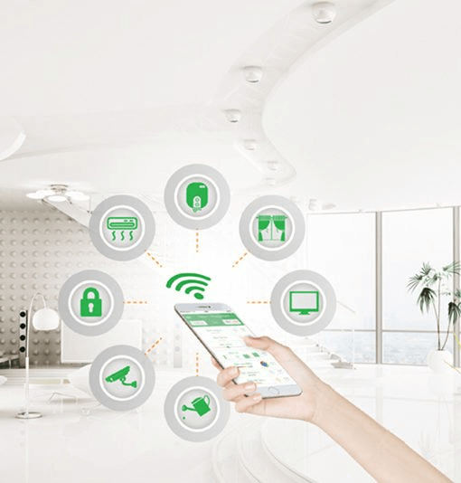
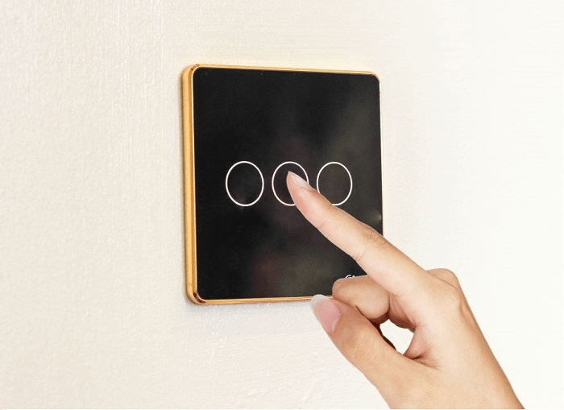
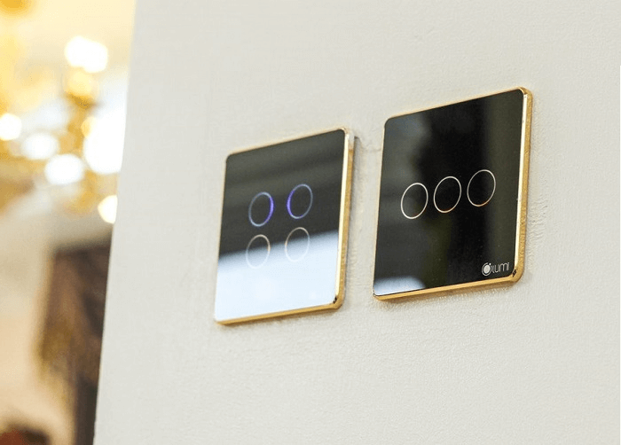

Bạn đã chán ngấy cái cảnh phải chạy lòng vòng từ tầng này sang phòng khác chỉ để đóng mở rèm? Bạn ngại ngần khi ra ngoài mà lỡ quên tắt đèn trong phòng? Tất cả những phiền toái này sẽ được giải quyết nhờ giải pháp điều khiển thiết bị điện từ xa thông qua công tắc cảm ứng Lumi.

**Công tắc cảm ứng Lumi - người đồng hành tin cậy**

**Hiểu bạn cần gì**
Cuộc sống hiện đại đem lại tiện ích vượt trội cho cuộc sống con người. Công tắc cảm ứng chính là thiết bị mang đến sự tiện nghi ấy. Hãy tưởng tượng, ngay khi bạn đặt chân về nhà, đèn bật sáng, điều hòa đã mát lạnh, bình nóng lạnh đã sẵn sàng phục vụ. Chỉ cần cài đặt ứng dụng SmartHome của Lumi vào điện thoại, bạn sẽ dễ dàng điều khiển mọi hoạt động của tất cả thiết bị điện trong nhà chỉ với một nút chạm. Hệ thống công tắc cảm ứng kết nối với ứng dụng smarthome sẽ ngay lập tức nhận lệnh và hoạt động theo ý muốn của bạn. 

_Công tắc cảm ứng Lumi - một chạm vạn tiện ích_

**Khẳng định đẳng cấp ngôi nhà**
Công tắc cảm ứng Lumi là dòng thiết bị điện thông minh ghi điểm cả về chất lượng lẫn thiết kế. Kiểu dáng siêu mỏng với lớp kính cường lực và vòng tròn đèn LED sang trọng sẽ mang đến vẻ đẹp tinh tế cho ngôi nhà bạn. Hãy xem công tắc cảm ứng như món đồ trang trí xinh đẹp cho khoảng tường nhà bạn thêm sinh động. 

_Công tắc điện Lumi với thiết kế tinh tế như món đồ trang trí trong nhà_

**An tâm mỗi khi vắng nhà**

Bề mặt công tắc cảm ứng được bảo vệ bởi lớp kính cường lực cách điện, cách nhiệt an toàn cả khi tay ướt nên rất phù hợp với gia đình có người lớn tuổi và trẻ nhỏ.
Khác với các loại công tắc thường, công tắc cảm ứng tích hợp điều khiển từ xa. Nếu bạn ra ngoài mà lỡ quên bật/tắt đèn hay bất cứ thiết bị nào trong nhà, bạn chỉ cần mở ứng dụng smarthome trên điện thoại và thao tác là xong. Đặc biệt cơ chế tự động ngắt khi dòng điện quá tải hay xuất hiện tình trạng cháy nổ sẽ đảm bảo an toàn cho cả gia đình bạn.

**Sở hữu công tắc điện cảm ứng Lumi chỉ với 10 triệu đồng**

Với những tính năng và ưu điểm vượt trội, công tắc cảm ứng đã trở thành một bộ phận không thể thiếu cho giải pháp nhà thông minh hiện nay. Hiểu được vai trò đó, Lumi Việt Nam đã nghiên cứu và phát triển các thiết bị điện thông minh chất lượng và phù hợp với túi tiền của người Việt. Với Lumi, việc sở hữu các thiết bị điện thông minh như công tắc cảm ứng không còn là ước mơ. Chỉ cần bỏ ra một khoản chi phí 10 triệu đồng, bạn đã có thể sử dụng gói các thiết bị bao gồm:

* 1 Bộ điều khiển trung tâm Lumi.
* Công tắc cảm ứng
* 2 mặt Công tắc đèn cảm ứng Lumi 4 nút
* 3 mặt Công tắc điện cảm ứng Lumi 2 nút
* 
Gói công tắc cảm ứng Lumi chỉ 10 triệu đồng nhưng mang đến cho bạn vô vàn tiện ích vượt trội như: điều khiển bật/tắt bóng đèn từ xa bằng Smartphone, hẹn giờ bật/tắt bóng đèn, thiết lập ngữ cảnh bật/tắt 1 hoặc nhiều bóng đèn cùng một lúc. Bạn cũng có thể bật/tắt bình nóng lạnh từ xa bằng điện thoại hoặc hẹn giờ để bình hoạt động vào bất cứ lúc nào. Ngoài ra tính năng đảo chiều được thiết lập hoàn toàn trên phần mềm nên bạn không cần phải đi dây như công tắc đảo chiều thông thường.

Trên thị trường hiện nay có khá nhiều thương hiệu công tắc cảm ứng thông minh nhưng không phải sản phẩm nào cũng đảm bảo. Nhiều công tắc kém chất lượng khi sử dụng có thể xảy ra hiện tượng chập chờn, nhiễu sóng khi điều khiển từ xa hay bị đơ phần cảm ứng. Chưa kể đến tuổi thọ của các loại công tắc này khá thấp, thậm chí còn dễ bị cháy nổ khi dòng điện quá tải. Để tránh mua phải những sản phẩm này, bạn cần lựa chọn kỹ đơn vị cung cấp uy tín. 
Theo khảo sát thực tế trên 100 khách hàng đang sử dụng công tắc cảm ứng Lumi do Gia Hân cung cấp thì có đến 53% khách hàng phản hồi tích cực. Trong đó, các ưu điểm được đánh giá cao có thể kể đến như độ ổn định của mạng, không bị đơ khi sử dụng và thiết kế sang trọng, bắt mắt. 
Hãy liên hệ với Gia Hân để sở hữu trọn bộ công tắc cảm ứng Lumi chất lượng cao cho ngôi nhà của bạn.
