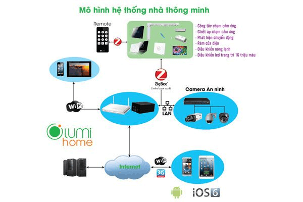
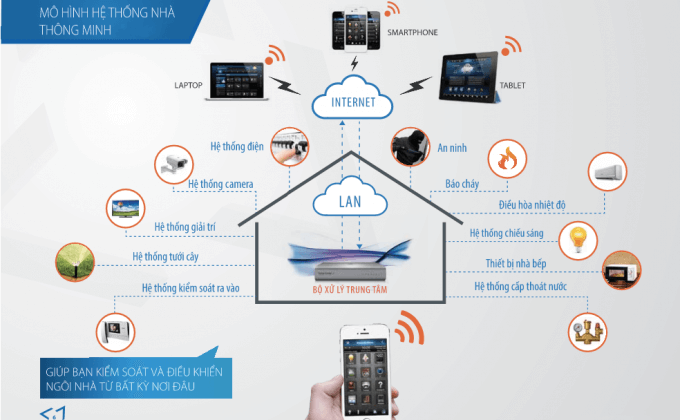
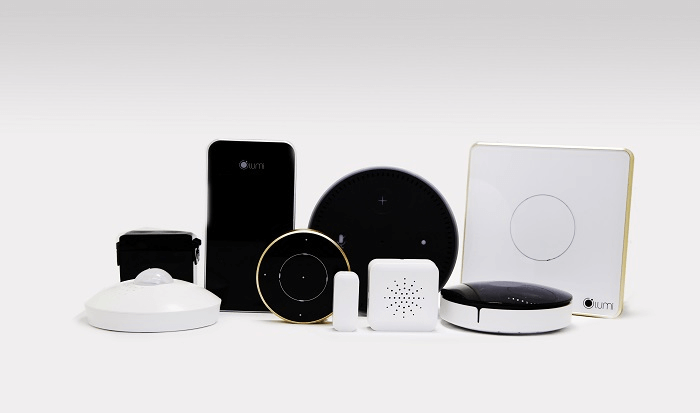

Giải pháp nhà thông minh là mạng lưới kết hợp giữa hệ thống điện và thiết bị nhằm tạo ra môi trường sống an toàn và tiện nghi. Tuy nhiên để có thể kết nối tất cả các hệ thống điện với nhau không phải là một điều dễ dàng. Hãy cùng Gia Hân tìm hiểu cách thức để kết nối và quản lý hệ thống điện nhà thông minh bạn nhé!

**Cách quản lý hệ thống điện nhà thông minh**

Để quản lý tốt hoạt động của nhà thông minh, bạn cần nắm bắt các bộ phận cơ bản cấu hình nên giải pháp này. Một hệ thống điện thông minh thường bao gồm các thiết bị: 
- Một bộ điều khiển trung tâm có nhiệm vụ kết nối và điều khiển toàn bộ hệ thống điện. Đây được xem như bộ não của ngôi nhà. 
- Thiết bị điện thông minh như ổ cắm, công tắc cảm ứng, công tắc cảm biến (chuyển động, nhiệt độ, báo cháy…) 
- Thiết bị vận hành như đèn, điều hòa, quạt trần, bình nóng lạnh, mô-tơ điều khiển đóng mở cửa/rèm, hệ thống an ninh....

_Mô hình hệ thống điện nhà thông minh Lumi_

Về quản lý, việc ứng dụng các thiết bị thông minh giờ đây không còn gặp nhiều rào cản. Hệ thống điện nhà thông minh thường được quản lý và điều khiển thông qua sóng truyền thông (Zigbee, Wifi…) nhờ kết nối với bộ điều khiển trung tâm. Nhờ vậy, mạng lưới thiết bị điện thông minh có thể dễ dàng hiểu ngôn ngữ của nhau thông qua những tiêu chuẩn chung. Bạn chỉ cần cài đặt các app điều khiển trên smartphone hoặc máy tính bảng để giám sát, quản lí hoạt động của các thiết bị điện tử, điện gia dụng trong nhà chỉ với một cú chạm tay. Tính năng này cực kỳ hữu ích khi bạn làm việc bên ngoài hay đi du lịch xa.

Ngoài việc tích hợp sóng không dây, bạn còn có thể điều khiển ngôi nhà thông qua giọng nói của chính mình nhờ công nghệ nhận dạng Alexa của Amazon. Với người bạn trợ lý ảo Alexa, bạn có thể giao tiếp và điều khiển đơn giản với các thiết bị điện trong nhà.

_Chọn mua thiết bị điện chất lượng từ thương hiệu uy tín_

Để việc quản lý hệ thống điện nhà thông minh đảm bảo an toàn, bạn cần cẩn trọng ngay trong khâu mua thiết bị. Chỉ nên mua các thiết bị điện dễ lắp đặt, không cần phải đi dây lại hay đục khoét tường để tránh ảnh hưởng đến cấu trúc ngôi nhà. Nên chọn mua các thiết bị tích hợp công nghệ không dây Zigbee để đảm bảo sóng ổn định và độ phủ rộng. Đặc biệt, các thiết bị điện giá rẻ thường hoạt động không tốt nên hãy chọn các sản phẩm xuất xứ uy tín với mức giá hợp lý. Đừng ham rẻ mà lựa chọn các sản phẩm kém chất lượng tránh tình trạng xảy ra hiện tượng chập chờn, đơ hay thậm chí là cháy nổ. 

**Gia Hân group - đơn vị thi công lắp đặt hệ thống điện nhà thông minh uy tín**

Hiện nay trên thị trường, có khoảng hơn 50 thương hiệu smarthome tuy nhiễn không phải sản phẩm nào cũng đảm bảo đủ 3 yếu tố cần và đủ bao gồm chất lượng tốt, dễ dàng lắp đặt và an toàn khi sử dụng. Theo khảo sát từ hơn 1000 khách hàng, Lumi đang là thương hiệu nhà thông minh đáp ứng tốt nhất các tiêu chí đó. 

Ngoài ra, mức giá vừa phải cùng chi phí hợp lý với túi tiền người Việt cũng là điểm cộng khiến giải pháp nhà thông minh Lumi được lựa chọn rộng rãi. Để sở hữu một hệ thống điện nhà thông minh với đầy đủ các tiện ích cho một căn hộ chung cư hoặc biệt thự liền kề, bạn chỉ cần bỏ ra một khoản chi phí từ 50 đến 70 triệu đồng. Mức giá này chỉ bằng ⅓ so với các giải pháp tương tự trên thị trường. 

Tập trung vào phân khúc thị trường trung và cao cấp, giải pháp của Lumi do Gia Gân cung cấp mang lại sự tiện ích vượt trội cho khách hàng bởi sự đơn giản và dễ dàng sử dụng. Thời gian thi công nhanh chóng chỉ mất  1 đến 2 ngày bất kể công trình cũ hay mới. 

Các sản phẩm của chúng tôi đều đạt chứng chỉ chứng chỉ UL – được xuất khẩu đến 104 quốc gia trên thế giới và CE – tiêu chuẩn xuất khẩu sang các nước Châu  u. Hàng ngàn công trình Việt được thiết kế, thi công bởi Gia Hân trên khắp cả nước chính là bằng chứng thuyết phục nhất về uy tín và chất lượng phục vụ của chúng tôi. 

Hãy liên hệ ngay với Gia Hân để trở thành “gia chủ thông thái” trong việc điều khiển và quản lý hệ thống điện nhà thông minh.

