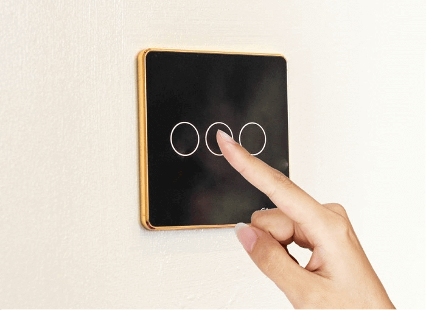

“Một chạm, vạn tiện nghi”, đó là slogan thể hiện rõ tính năng tuyệt vời của sản phẩm công tắc cảm ứng thông minh đến từ thương hiệu Lumi. Với cảm ứng chạm và điều khiển từ xa qua thiết bị điện thông minh, Lumi mang đến cho bạn một giải pháp tổng thể cho ngôi nhà thông minh của mình. Dưới đây là những loại công tắc cảm ứng thông minh Lumi hiện đang được ưa chuộng trên thị trường thiết bị điện hiện nay. 

## Công tắc cảm ứng thông minh là gì?

Công tắc cảm ứng thông minh Lumi là loại công tắc điện được trang bị các thiết bị hiện đại và có những tính năng tiện ích thông minh giúp bạn tận hưởng cuộc sống tiện nghi và sang trọng.

Khác với công tắc cơ thông thường, bạn phải bật tắt thường xuyên và phải tới gần vị trí công tắc để thực hiện thao tác. Tuy nhiên, với công tắc thông minh, bạn có thể tắt bật từ xa thông qua điện thoại di động, ipad. Điều này có nghĩa là dù bạn ở đâu, xa cỡ nào bạn hoàn toàn có thể điều khiển thiết bị điện trong nhà theo ý muốn của mình một cách dễ dàng. Chỉ cần 1 hành động nhỏ là chạm nhẹ vào màn hình điện thoại di động có kết nối internet thôi. Nhờ vậy, bạn luôn cảm thấy an tâm mỗi khi vắng nhà với tính năng điều khiển từ xa trên phần mềm hệ thống của nhà thông minh Lumi – Smarthome được cài đặt trên các thiết bị di động.

_Một chạm - vạn tiện nghi cùng công tắc cảm ứng thông minh Lumi_

Công tắc cảm ứng thông minh Lumi còn đưa ra những lựa chọn bật tắt theo ngữ cảnh và theo yêu cầu của người sử dụng. Chẳng hạn như khi gia chủ có khách đến chơi nhà, người dùng chỉ cần lấy điện thoại ra, truy cập vào ứng dụng và chạm vào ngữ cảnh “Tiếp khách” lập tức bóng đèn phòng khách bật lên và sáng ở mức đã được thiết lập, rèm cửa tự động mở ra đón ánh sáng tự nhiên, điều hòa nếu chưa được bật cũng sẽ tự động bật lên,… tất cả tạo nên một không gian hoàn hảo để tiếp những vị khách quý của gia chủ.

Ngoài ra, bạn có thể thay thế công tắc cơ truyền thống tại Việt Nam mà không cần đi lại bất kỳ đường dây điện nào trong nhà. Vì thế, loại công tắc tự động Lumi thích hợp với cả công trình cải tạo hoặc xây mới từ đầu do không có yêu cầu đặc biệt nào trong thi công.

## Các loại công tắc cảm ứng thông minh Lumi được ưa chuộng hiện nay

(hình minh họa - đang chờ bổ sung)
Công tắc cảm ứng viền vàng 1,2,3,4 nút

(hình minh họa - đang chờ bổ sung)
Công tắc cảm ứng viền nhôm 1,2,3,4 nút

Với thiết kế siêu mỏng chỉ bằng với độ dày của một chiếc iPhone 7 giúp ngôi nhà của bạn cảm giác rộng hơn khi lắp đặt các công tắc thường có độ dày gần như gấp 2, 3 lần. Bề mặt công tắc đều được thiết kế với kính cường lực, chống xước, chống va đập,.. Viền bo trò thường sử dụng nhôm nguyên khối hoặc mạ vàng để tạo sự tinh tế, sang trọng cho sản phẩm. Thiết kế sản phẩm với vòng tròn đèn led tinh tế. Đèn led màu đỏ thể hiện cho thiết bị đang được bật sử dụng. Khi đèn Led chuyển sang màu xanh thể hiện cho thiết bị đã được tắt. Vòng Led xanh đỏ càng khiến ngôi nhà của bạn trở nên “sang chảnh”, thời thượng hơn.
Thay vì việc treo những bức tranh để làm ngôi nhà nổi bật thì giờ đây chỉ cần lắp những chiếc công tắc Lumi đẹp lung linh cũng đủ khiến những bức tường tĩnh như có sức sống.

Chính tay bạn sẽ lắp từng chiếc công tắc điện cho ngôi nhà của chính mình. Tại sao không? Việc lắp đặt những chiếc công tắc điện Lumi vô cùng dễ dàng, thậm chí bạn là phụ nữ hay không biết gì về điện cũng không là vấn đề.

Sản phẩm công tắc thông minh đang được phân phối tại Gia Hân với mức giá ưu đãi nhất và chính sách bảo hành tốt nhất. 

Hãy liên hệ ngay với Gia Hân qua hotline 0968.333.268 - 0935.333.268 để sở hữu các thiết bị công tắc cảm ứng thông minh Lumi tiên tiến hàng đầu. 

