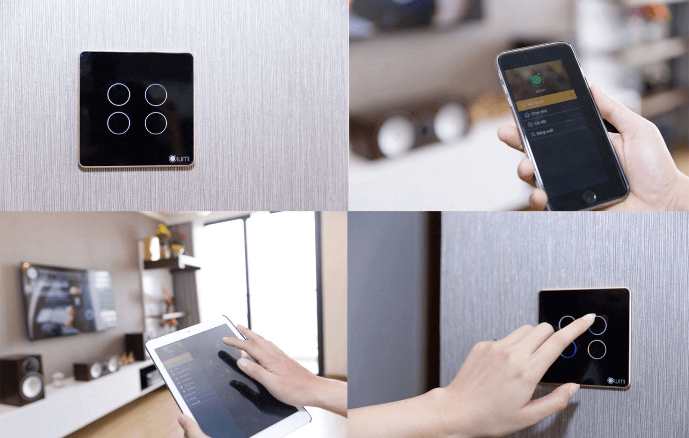
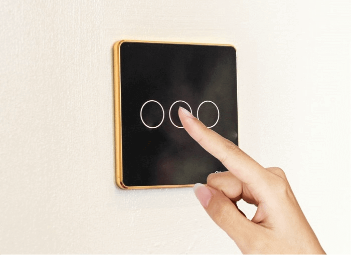
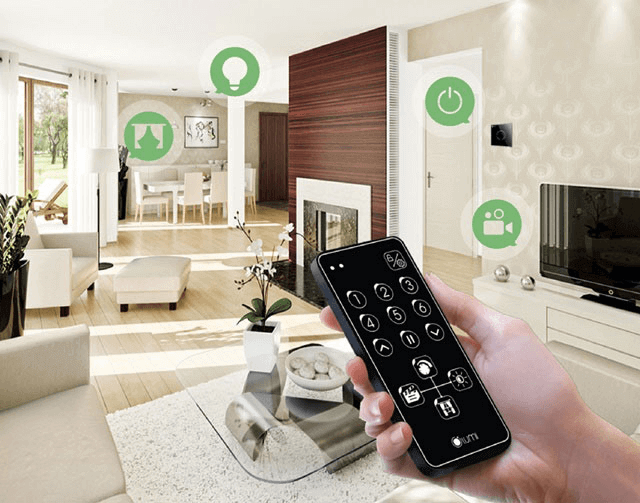
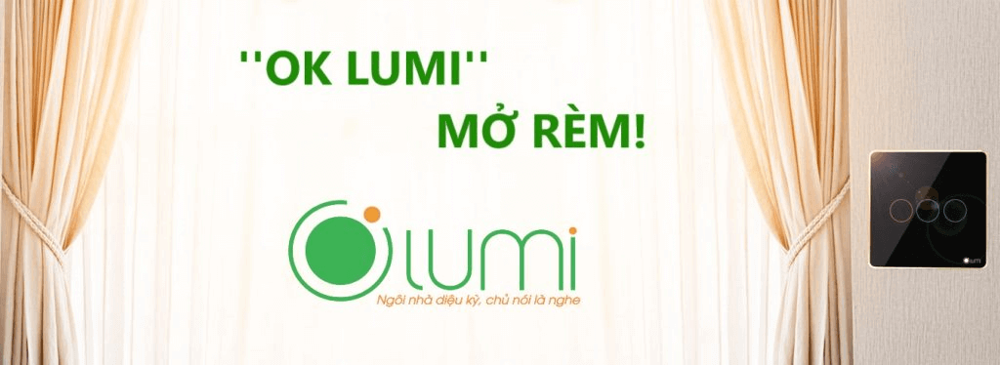

Siêu phẩm “công tắc cảm ứng Lumi” với những ưu điểm vượt trội đang trở thành xu hướng mua sắm mới ở Việt Nam năm 2018. Nhưng liệu bạn đã biết cách sử dụng thiết bị điện thông minh này chưa? Bài viết này sẽ hướng dẫn bạn cách dùng công tắc cảm ứng Lumi theo 3 kiểu “đẳng cấp” nhất.

_3 cách sử dụng công tắc cảm ứng Lumi _

**Chạm vào công tắc cảm ứng Lumi**

Thiết bị điện thông minh này được tích hợp công nghệ cảm ứng điện dung “vô cùng nhạy” vì vậy khi muốn sử dụng trực tiếp, người dùng chỉ cần lấy ngón tay chạm nhẹ vào vòng tròn đèn LED (khu vực cảm ứng), ngay lập tức đèn sẽ sáng lên hoặc tắt đi theo ý muốn của người dùng.

_Chạm vào công tắc cảm ứng Lumi_

Đặc biệt, độ nhạy của công tắc cảm ứng Lumi còn khiến người dùng phải ngạc nhiên bởi ngay cả khi tay ướt, người dùng vẫn có thể điều khiển được mà chẳng phải lo điện giật hay cháy nổ.
Thay vì điều khiển bật/tắt bằng cách dùng lực như những chiếc công tắc bình thường, với công tắc điện cảm ứng Lumi việc điều khiển thiết bị sẽ trở nên vô cùng nhẹ nhàng.

**Điều khiển từ xa qua App Lumi**

Điều khiển từ xa qua App Lumi chính là tính năng khiến nhiều khách hàng tò mò và thích thú nhất. Chỉ cần cài đặt ứng dụng nhà thông minh vào điện thoại hoặc máy tính bảng có kết nối Internet hoặc 3G là người dùng hoàn toàn có thể điều khiển tất cả các thiết bị điện trong nhà dù đang đi du lịch ở nước ngoài.
Công tắc cảm ứng ánh sáng Lumi còn được tích hợp công nghệ không dây Zigbee cho phép người dùng bật/tắt hay điều chỉnh đèn điện và một số thiết bị điện khác trong nhà bằng Smartphone hoặc Ipad.  

_Điều khiển từ xa qua App Lumi_

Bên cạnh các biểu tượng bật/tắt hay điều chỉnh độ sáng cho từng thiết bị trong nhà, trên ứng dụng nhà thông minh Lumi. Người dùng còn có thể tự thiết lập các “Ngữ cảnh” cho một hoặc nhiều thiết bị cùng một lúc bật hoặc tắt để phù hợp với không gian mà người dùng cần. Bạn có thể sử dụng công tắc cảm ứng đèn cầu thang, công tắc cảm ứng chạm tay để điều khiển mọi thiết bị trong nhà. Chẳng hạn như khi gia chủ có khách đến chơi nhà, người dùng chỉ cần lấy điện thoại ra, truy cập vào ứng dụng và chạm vào ngữ cảnh “Tiếp khách” lập tức bóng đèn phòng khách bật lên và sáng ở mức đã được thiết lập, rèm cửa tự động mở ra đón ánh sáng tự nhiên, điều hòa nếu chưa được bật cũng sẽ tự động bật lên,… tất cả tạo nên một không gian hoàn hảo để tiếp những vị khách quý của gia chủ.

Việc cài đặt ứng dụng nhà thông minh Lumi vô cùng đơn giản như cách bạn vẫn cài đặt các ứng dụng nghe nhạc, game hay tin tức ở trên điện thoại hay máy tính bảng. Cài đặt xong, người dùng có thể trải nghiệm được ngay tính năng tuyệt vời này rồi.

**Điều khiển bằng giọng nói Tiếng Việt**

Mới đây Lumi đã tích hợp thành công công tắc cảm ứng Lumi với loa thông minh Amazon Echo Dot và cho ra đời giải pháp nhà thông minh điều khiển bằng giọng nói.

_Điều khiển bằng giọng nói Tiếng Việt_

Bạn có thể giao tiếp với tất cả các thiết bị điện trong nhà mà không cần phải dùng tay hay Smartphone nữa. Chỉ với một câu lệnh ngắn gọn, đơn giản như: “Lumi, bật đèn”, ngay lập tức đèn sẽ sáng lên. Hoặc khi bạn đang vướng tay vào việc bếp núc, muốn tắt tivi nhưng lại không muốn làm bẩn điện thoại hay tivi, ngay lúc đó chỉ cần nói: “Lumi, tắt tivi” là mọi chuyện sẽ được giải quyết trong một nốt nhạc. Tính năng này đặc biệt có ích với những người không có khả năng hoặc khó khăn trong việc di chuyển, những người có thị lực kém, đặc biệt là người cao tuổi. 

Hãy tự làm cho cuộc sống của bạn trở nên đơn giản, nhẹ nhàng và an toàn hơn với 3 cách điều khiển công tắc cảm ứng Lumi trên nhé! Liên hệ Gia Hân để sở hữu trọn bộ công tắc cảm ứng Lumi mới nhất!
