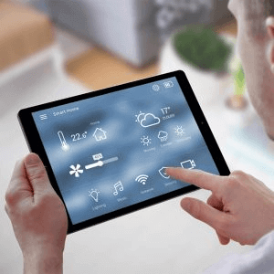
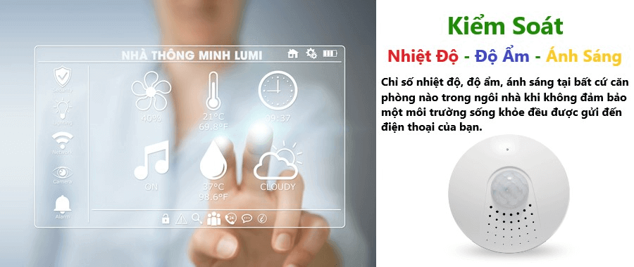
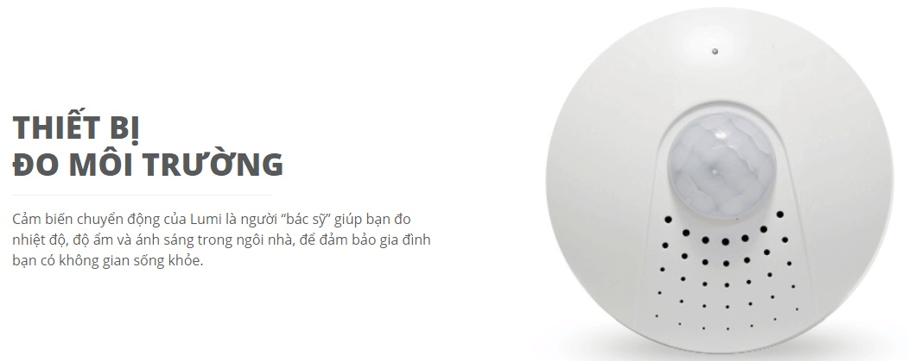

Môi trường đang là vấn đề nóng trên toàn cầu. Vì thế, bảo vệ môi trường không phải là chuyện của riêng ai, mà tất cả mỗi chúng ta đều phải có trách nhiệm trong việc bảo vệ môi trường. Giải pháp nhà thông minh Lumi, giúp bảo vệ môi trường một cách tối ưu nhất, thông qua việc tiết kiệm điện cũng như tăng cường sử dụng những nguồn năng lượng sẵn có từ thiên nhiên. 

_Giải pháp nhà thông minh Lumi bảo vệ môi trường_

## Tiết kiệm năng lượng

Giải pháp nhà thông minh Lumi giúp quý khách hàng có thể tiết kiệm năng lượng một cách tối ưu nhất. Cụ thể như sau:

Lượng điện năng từ điều hòa, hệ thống chiếu sáng, hệ thống  điện sử dụng trong phòng bếp sẽ được lập trình sẵn theo nhu cầu của người dùng. Đến thời điểm đã được lập trình trước, những thiết bị này sẽ tự động hoạt động và tự động tắt khi đến thời điểm được lập trình dừng. Chính vì thế, quý khách hàng sẽ tiết kiệm được nguồn năng lượng từ các thiết bị đó một cách đáng kể.

Hơn thế nữa, trong việc sử dụng điều hòa, nếu nhiệt độ trong căn phòng đã quá thấp thì hệ thống sẽ tự động nâng nhiệt độ của căn phòng lên, điều này không chỉ giúp bảo vệ sức khỏe của các thành viên trong gia đình mà còn giúp tiết kiệm lượng khí thải từ điều hòa thải ra môi trường.

Trong trường hợp nếu không may ra khỏi nhà nhưng bạn quên tắt các thiết bị điện đang hoạt động thì bạn có thể kiểm soát và tắt nó dù đang ở bất kỳ nơi đâu. Chính vì thế, lượng điện năng tiêu thụ trong ngôi nhà không bao giờ bị lãng phí và được sử dụng một cách tối ưu nhất.

## Sử dụng những nguồn năng lượng sạch từ thiên nhiên

Bên cạnh việc tiết kiệm điện năng tiêu thụ và hạn chế xả chất độc hại ra môi trường thì giải pháp nhà thông minh Lumi còn giúp quý khách hàng sử dụng những nguồn năng lượng sạch từ thiên nhiên, bảo vệ môi trường một cách tối ưu nhất.

_Sử dụng những nguồn năng lượng sạch từ thiên nhiên_

Khi nhận thấy ánh sáng ngoài trời phù hợp với những người trong căn phòng thì hệ thống rèm sẽ tự động mở và hệ thống đèn chiếu sáng cũng sẽ tự động tắt.
Điều này sẽ giúp tiết kiệm điện năng tiêu thụ trong nhà bạn cũng như tận dụng tối đa lượng ánh sáng của thiên nhiên, giúp tiết kiệm năng lượng và bảo vệ môi trường tối ưu nhất.
Như vậy với những thông tin mà chúng tôi đã chia sẻ trên đây thì các bạn đã thấy được những ưu điểm vượt trội của nhà thông minh rồi đúng không nào.

**Những tiện ích khác của giải pháp nhà thông minh Lumi **

Bên cạnh bảo vệ môi trường một cách tốt nhất, giải pháp nhà thông minh Lumi còn mang đến nhiều tiện ích khác như:
* Bảo vệ an toàn cho gia đình bạn: Hệ thống cảm biến thông minh sẽ phát hiện sự xâm nhập bất thường và cảnh báo đến bạn. Bên cạnh đó, hệ thống cảm biến cũng sẽ phát ra những tín hiệu cảnh báo khác như sáng đèn, kéo rèm và còi hú.
* Bảo vệ sức khỏe của gia đình bạn: Hệ thống cảm biến môi trường thông minh sẽ giúp điều chỉnh nhiệt độ, độ ẩm, ánh sáng, bảo vệ sức khỏe của bạn một cách tốt nhất.

_Kiểm soát các yếu tố môi trường trong không gian nhà bạn_

* Giúp bạn có thể chăm sóc những đứa trẻ của mình tốt hơn: Cho dù ở bất kỳ nơi đâu thì bạn vẫn có thể quan sát những đứa trẻ của mình. Bạn có thể kiểm soát được rằng bé có đi ngủ đúng giờ hay không, hay bé có đang xem tivi hay không. Điều này sẽ giúp bạn có thể chăm sóc bé một cách tốt nhất.
* Hơn thế nữa, bạn có thể lập trình được nhiều chương trình khác nhau cho gia đình mình. Mỗi buổi sáng bạn và các thành viên trong gia đình sẽ được đánh thức bằng một bản nhạc sôi động, thưởng thức bữa sáng đã được chuẩn bị sẵn. Đến lúc về thì hệ thống nước nóng của gia đình đã được bật sẵn để bạn thư giãn và nghỉ ngơi.

Không gia gia đình sẽ có thêm nhiều tiện ích cũng như vẻ đẹp sang trọng, hiện đại khi bạn sử dụng thiết bị nhà thông minh Lumi
Nếu quý khách hàng đang có nhu cầu tìm hiểu cũng như lắp đặt giải pháp nhà thông minh Lumi, vui lòng liên hệ Gia Hân qua hotline 0968.333.268 - 0935.333.268 để được hỗ trợ tốt nhất.
