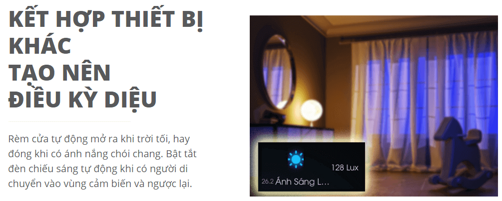
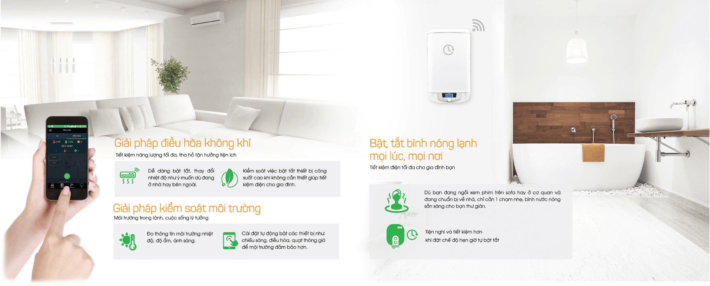

Trong gia đình, người phụ nữ luôn bận rộn với nhiều công việc khác nhau như làm việc công ty, quan tâm việc xã hội và chăm lo cho gia đình. Với nhiều công việc như vậy thì thường các chị em phụ nữ sẽ không có thời gian chăm lo cho bản thân mình.
Nhưng giải pháp nhà thông minh Lumi đã hoàn toàn xóa tan điều đó. Với Lumi, các chị em vừa có thể chăm sóc vẹn toàn cho gia đình lại vừa có thể chăm lo cho bản thân mình.

_Nhà thông minh Lumi- người bạn thân thiết của các chị em phụ nữ _

## Giải pháp nhà thông minh Lumi giúp bảo vệ sức khỏe của các chị em phụ nữ

Hệ thống cảm biến nhiệt, cảm biến môi trường trong giải pháp nhà thông minh Lumi sẽ giúp các chị em phụ nữ bảo vệ được sức khỏe của mình một cách tốt nhất.
Khi nhiệt độ trong căn phòng tăng quá cao hay xuống quá thấp thì nhiệt độ trong căn phòng sẽ tự động điều chỉnh phù hợp với cơ thể của chị em. Hơn thế nữa, độ ẩm trong căn phòng cũng sẽ được tự động điều chỉnh, để cân bằng độ độ ẩm trong ngôi nhà, đảm bảo các chị em không bao giờ gặp phải những vấn đề về sức khỏe khi sống trong nhà thông minh.

Lượng ánh sáng trong căn phòng cũng sẽ được điều chỉnh để phù hợp với căn phòng đó nhất. Khi căn phòng quá sáng thì hệ thống rèm sẽ tự động kéo lại, còn nếu lượng ánh sáng quá yếu thì hệ thống đèn sẽ tự động mở, đảm bảo lượng ánh sáng cung cấp đến người dùng trong căn phòng luôn là vừa đủ nhất.

_Tự động điều chỉnh ánh sáng phù hợp với nhu cầu sử dụng_

## Giải pháp nhà thông minh Lumi giúp bảo vệ làn da của các chị em phụ nữ

Làn da luôn được các chị em phụ nữ chăm sóc cẩn thận, tỉ mỉ nhất. Những vấn đề xuất hiện trên làn da như đen sạm, khô rám luôn khiến các chị em phụ nữ đau đầu.
Tuy nhiên, giải pháp nhà thông minh Lumi luôn kiểm soát được những điều đó và mang đến cho các chị em phụ nữ làn da sáng, mịn và rạng rỡ nhất.
Nhiệt độ và độ ẩm trong căn phòng sẽ luôn được kiểm soát một cách tối ưu nhất, để giúp làn da các chị em phụ nữ được phục hồi cũng như được chăm sóc một cách tốt nhất.
Lượng ánh sáng cung cấp đến ngôi nhà cũng là vừa đủ để giúp cung cấp năng lượng vừa đủ và không làm hư hại, hư tổn đến làn da của các chị em phụ nữ .

## Các chị em phụ nữ sẽ không còn nhiều nỗi lo lắng nữa

Một trong những điều khiến các chị em luôn băn khoăn và không có thời gian để chăm sóc cho gia đình mình chính là những nỗi lo rằng bé nhà mình đã dậy hay chưa, bé nhà mình ở nhà mình một mình có an toàn hay không, ấm điện ở nhà đã tắt hay chưa.
Chính những nỗi lo này luôn khiến các chị em phụ nữ mất quá nhiều thời gian và không có thời gian để chăm lo cho bản thân mình Nhưng với giải pháp nhà thông minh Lumi thì hoàn toàn khác. 

_Nhà thông minh Lumi - giúp bạn kiểm soát mọi hoạt động trong nhà_

Bạn sẽ không phải lục đục dậy sớm để đánh thức bé và chuẩn bị bữa sáng nữa. Vì đã có hệ thống báo thức tự động bằng hệ thống âm thanh, bữa sáng của bạn cũng sẽ được lập trình chuẩn bị sẵn. Bạn chỉ cần dậy và thưởng thức cùng cả gia đình thân yêu mà không phải dậy sớm chuẩn bị nữa

Nếu bạn ra khỏi nhà mà không may quên khóa cửa hay tắt thiết bị điện trong nhà thì cũng không phải lo lắng hay vội vàng chạy về làm gì . Vì bạn chỉ cần điều khiển bằng một vài thao tác đơn giản trên điện thoại thông minh là cửa sẽ được khóa và các thiết bị điện sẽ được tắt hoàn toàn

Bạn cũng sẽ kiểm soát được những hoạt động của những đứa trẻ thông qua hệ thống camera giám sát, Sự an toàn của trẻ cũng sẽ được đảm bảo bằng hệ thống cảm biến thông minh, tự động cảnh báo khi có người lạ xâm phạm.

Như vậy, giải pháp nhà thông minh Lumi ra đời sẽ giúp các chị em phụ nữ nhàn hơn và có thêm nhiều thời gian chăm sóc bản thân mình. 
