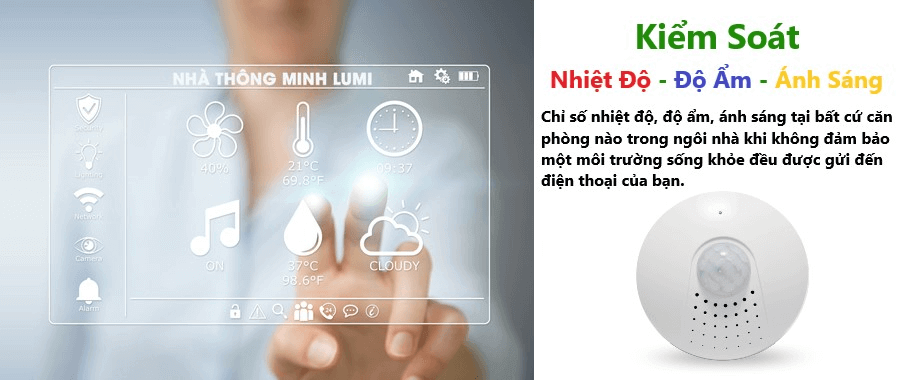

Mang đến một môi trường sống tốt đẹp với những tiện ích tối ưu để bảo vệ sức khỏe cũng như giúp bé phát triển toàn diện là điều mà tất cả những ông bố bà mẹ đều mong muốn. Tuy nhiên, cuộc sống bộn bề với những lo toan trong cuộc sống, nhiều bố mẹ đã bỏ lỡ mất những điều này. Và họ luôn phải trong vòng xoáy lo lắng công việc, lo lắng việc xã hội và chăm lo cho những đứa con của mình. Hiểu được điều đó, Lumi đã cung cấp ra thị trường giải pháp nhà thông minh Lumi, giúp chăm sóc và bảo vệ bé yêu của bạn một cách toàn diện nhất.

_Nhà thông minh Lumi- giải pháp bảo vệ bé yêu của bạn_

**Kiểm soát yếu tố môi trường trong phòng bé**

Những yếu tố môi trường trong căn phòng bé như nhiệt độ, độ ẩm, ánh sáng ảnh hưởng rất nhiều đến sức khỏe cũng như sự phát triển toàn diện về thể chất cũng như tinh thần của bé.
Vì thế, các ông bố bà mẹ luôn cần phải chú ý đến những yếu tố này trong căn phòng bé. Giải pháp môi trường mà Lumi cung cấp sẽ luôn kiểm soát được những yếu tố về môi trường trong căn phòng bé cũng như trong toàn ngôi nhà.

Khi nhiệt độ hay độ ẩm trong căn phòng tăng lên thì hệ thống sẽ tự động giảm nhiệt độ trong căn phòng xuống để phù hợp với cơ thể bé. Nếu ánh sáng trong căn phòng quá lớn thì hệ thống rèm cũng sẽ tự động được kéo lại để đảm bảo luồng ánh sáng đó không gây hại đến bé.

_Kiểm soát yếu tố môi trường trong phòng bé_

Đặc biệt, các ông bố bà mẹ còn có thể kiểm tra thông tin về những chỉ số môi trường trong căn phòng đó thông qua smartphone. Vì thế, bạn sẽ luôn kiểm soát được những yếu tố môi trường trong phòng bé và trong toàn ngôi nhà dù ở bất kỳ đâu.

**Kiểm soát được những yếu tố gây nguy hại cho bé**

Nếu khi bạn ra khỏi nhà mà  quên tắt ấm nước điện đang đun sôi, lò vi sóng hay lò nướng thì điều đó sẽ cực kỳ nguy hiểm, đặc biệt là trong những gia đình mà trẻ chỉ ở nhà một mình.
Tuy nhiên, với giải pháp nhà thông minh Lumi thì những thiết bị điện đang được sử dụng trong nhà sẽ kiểm soát tối đa. Bạn có thể điều khiển tắt bật những thiết bị đó dù đang ở rất xa ngôi nhà của mình.
Đặc biệt, bạn còn có thể hẹn giờ tắt cho những thiết bị điện trong nhà của mình. Vì thế, bạn sẽ không bao giờ phải lo lắng về tình trạng cháy nổ, chập điện có thể xảy ra trong nhà gây nguy hiểm cho bé nữa. Chính vì thế, với giải pháp nhà thông minh Lumi, sự an toàn của bé sẽ luôn được bảo vệ tối ưu.

**Kiểm soát an ninh trong ngôi nhà, đảm bảo an toàn cho bé**

Giải pháp nhà thông minh Lumi còn cung cấp đến  quý khách hàng hệ thống camera an ninh cùng cảm biến an ninh chống trộm tiên tiến nhất. Hệ thống cảm biến chống trộm sẽ giúp bảo vệ an toàn của bé một cách tối ưu.

_Kiểm soát an ninh trong ngôi nhà, đảm bảo an toàn cho bé_

Khi có người lại xâm nhập, hệ thống cảm biến chống trộm sẽ hoạt động. Đồng thời, hệ thống đèn điện, còi hú, rèm cũng sẽ hoạt động, giúp cảnh báo cũng như gây sự sự sợ hãi, sợ sệt cho tên trộm đó.
Hệ thống đèn điện cũng có thể tự động bật sáng nhằm đánh lạc hướng của tên trộm. Vì thế, sự an toàn của bé sẽ luôn được bảo vệ một cách tốt nhất, đặc biệt là khi bé ở nhà một mình.
Với hệ thống camera an ninh trong nhà, bạn cũng có thể kiểm soát được tất cả mọi hoạt động của trẻ, rằng bé có ngủ đúng giờ hay không, bé có đang xem tivi hay không… Điều này sẽ giúp bố mẹ có thể kiểm soát và bảo vệ bé một cách tốt nhất.

Cuộc sống bộn bề khiến bố mẹ không có nhiều thời gian ở bên cạnh để chăm con. Tuy nhiên, giải pháp nhà thông minh ra đời đã giúp quý khách hàng chăm sóc, quan tâm trẻ một cách tận tình nhất, dù không ở cạnh bên.

Với giải pháp này, những đứa trẻ sẽ luôn được bảo vệ và có một môi trường sống tốt nhất để phát triển toàn diện.

Nếu quý khách hàng đang có nhu cầu tìm hiểu cũng như lắp đặt  giải pháp nhà thông minh Lumi, vui lòng liên hệ Gia Hân qua hotline 0968.333.268 - 0935.333.268 để được hỗ trợ tốt nhất . 

