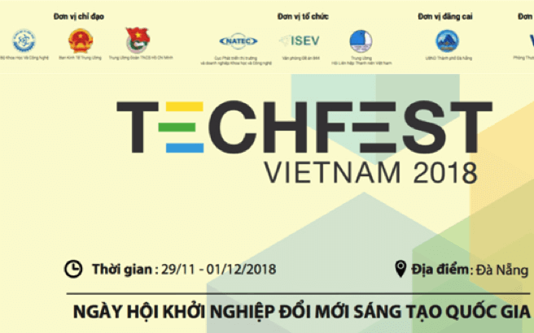
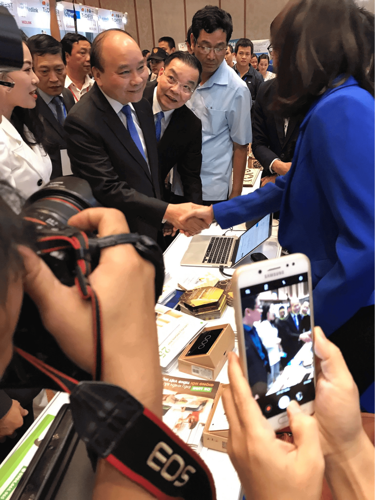
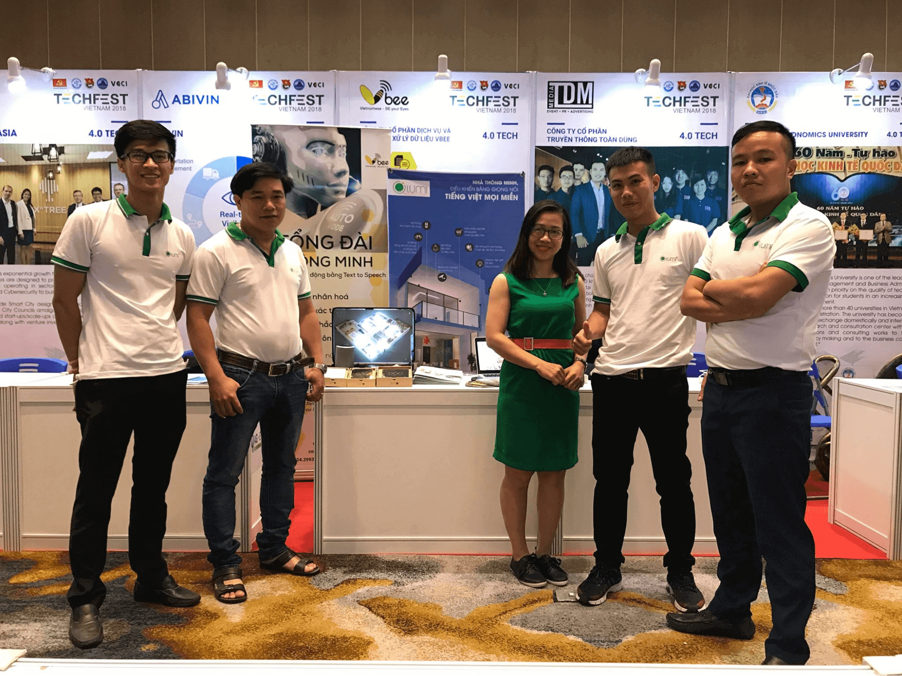
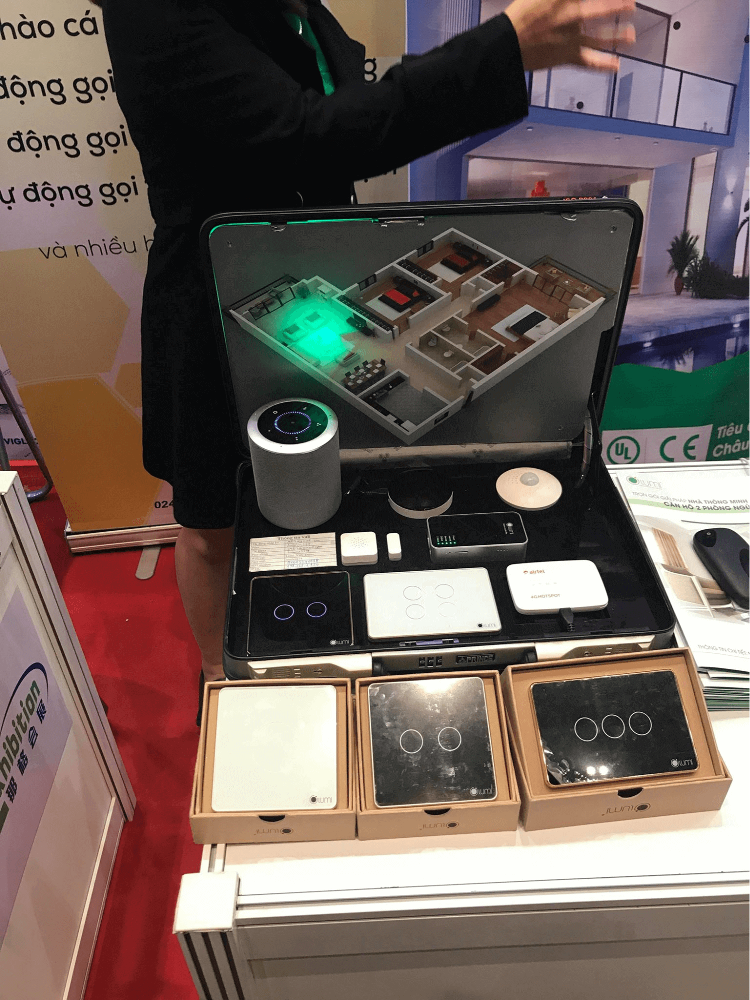
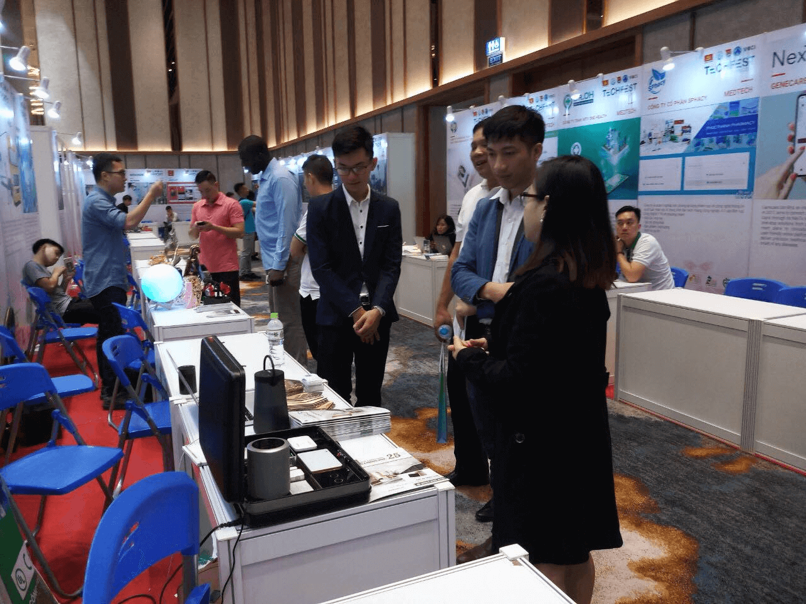

Từ ngày 29-1/12/2018, ngày hội Techfest Vienam 2018 - "Khởi nghiệp sáng tạo - Kết nối toàn cầu" diễn ra với sự tham gia của gần 100 nhà đầu tư trong và ngoài nước và 200 doanh nghiệp khởi nghiệp. Gia Hân Group đại diện cho chi nhánh nhà thông minh Lumi miền Trung tham gia triển lãm lần này.

_Techfest Vienam 2018_

**Techfest Vienam 2018 - nơi hội tụ công nghệ thông minh hàng đầu**

Ngày hội khởi nghiệp đổi mới sáng tạo Quốc gia Techfest Vienam là sự kiện thường niên do Bộ Khoa học và Công nghệ chủ trì, phối hợp với các Bộ ngành, các tổ chức chính trị - xã hội với định hướng chủ đạo "Khởi nghiệp sáng tạo - Kết nối toàn cầu". 

Điểm nổi bật của sự kiện năm nay là sự tham gia của gần 100 nhà đầu tư trong và ngoài nước và 200 startups. Ngoài ra, sự hiện diện của lãnh đạo Chính phủ, các Bộ ngành, cùng các đối tác trong khu vực và trên thế giới như Singapore, Malaysia, Hàn Quốc… sẽ tạo ra nhiều kết nối hơn thông qua hoạt động kết nối đầu tư và không gian thân mật của buổi tiệc giao lưu.

_Thủ tướng Nguyễn Xuân Phúc, CEO Lumi Việt nam, Hiệu trưởng trường ĐH Bách Khoa và nhà sáng lập Vbee ghé thăm gian hàng Lumi_

Đặc biệt, nhiều đối tác uy tín trong lĩnh vực công nghệ điện thông minh và năng lượng sạch cũng tham gia giới thiệu sản phẩm tại triển lãm. Sự kiện diễn ra với 3 mục tiêu chính:
Thông tin: Techfest cung cấp thông tin về xu hướng công nghệ nổi bật như trí thông minh nhân tạo, công nghệ chuỗi khối,… Ngoài ra, Techfest với sự tham gia của đại diện Nhà nước, đại diện các Bộ, Ban, ngành, hứa hẹn sẽ mang đến những thông tin tham vấn chính sách hữu ích. 
Kết nối: Với sự hiện diện của lãnh đạo Chính phủ, các Bộ ngành, cùng 100 nhà đầu tư trong và ngoài nước và 200 doanh nghiệp khởi nghiệp, Techfest sẽ tạo ra nhiều cơ hội phát triển thông qua hoạt động kết nối đầu tư và không gian thân mật của buổi tiệc giao lưu.
Đầu tư: Các doanh nghiệp khởi nghiệp và nhà đầu tư được nâng cao năng lực trước sự kiện thông qua các hoạt động bên lề và chương trình đào tạo thuộc các Làng khởi nghiệp.
Gia Hân mang giải pháp Nhà thông minh Lumi đến ngày hội Techfest Vienam 2018 
Gia Hân group đại diện chi nhánh Lumi khu vực miền trung tham gia triển lãm với vai trò đơn vị khởi nghiệp sáng tạo. Tham gia Techfest Vienam 2018, Gia Hân mang đến trọn bộ giải pháp nhà nhà thông minh Lumi điều khiển bằng giọng nói tiếng Việt đang được ưa chuộng nhất hiện nay. Với đầy đủ các giải pháp thông minh được bài trí từ phòng khách, phòng ăn cho tới phòng ngủ. Chắc chắn “ngôi nhà diệu kỳ” này sẽ mê hoặc bất cứ khách tham quan nào.

_Gia Hân group, đại diện chi nhánh Lumi miền Trung tham gia Techfest Vienam 2018_

Trong khuôn khổ triển lãm, Gia Hân giới thiệu đến quý khách hàng một ngôi nhà diệu kỳ với những tính năng mới nhất của công nghệ 4.0 áp dụng trong nhà ở. Một công nghệ thông minh mới, hiện đại giúp tất cả thiết bị điện trong nhà từ: hệ thống đèn chiếu sáng,  rèm cửa, điều hòa, bình nóng lạnh, van tưới, âm thanh đa vùng, camera an ninh ... được kết nối internet, giao tiếp hai chiều thông qua thiết bị xử lý trung tâm. Cho phép cư dân có thể kiểm soát, điều khiển các thiết bị điện trong gia đình từ bất kỳ đâu trên tablet hoặc smartphone hoặc bằng chính giọng nói “quyền năng của mình”. 

_Trọn bộ giải pháp nhà thông Lumi do Gia Hân cung cấp tại triển lãm_

Tại đây, khách tham quan cũng sẽ được tìm hiểu, trải nghiệm nhiều thông tin bổ ích về công nghệ nhà thông minh cũng như những tiện ích cũng như cách lắp đặt, sử dụng giải pháp nhà thông minh. Lần đầu tiên, tinh hoa của giải pháp nhà thông minh sẽ được Lumi thổi hồn một cách trọn vẹn với đầy đủ cung bậc cảm xúc. 

_Khách hàng tham quan và trải nghiệm các sản phẩm giải pháp Lumi tại gian hàng Gia Hân_

Ngày hội Techfest Vienam 2018 đang thu hút nhiều khách hàng đăng ký tham quan và mua sản phẩm công nghệ để trang hoàng cho ngôi nhà của mình nhân dịp cuối năm. Đây sẽ là triển lãm mang đến những thông tin về xu hướng công nghệ nổi bật như trí thông minh nhân tạo, công nghệ chuỗi khối và công nghệ nhà thông minh.

Bạn đang có nhu cầu trang hoàng cho ngôi nhà của mình trở nên hiện đại, thông minh, đặc biệt là được sống trong không gian sống tiện nghi, hiện đại. Hãy liên hệ 0968.333.268 - 0935.333.268 để được tư vấn những gói giải pháp phù hợp cho ngôi nhà của bạn.

