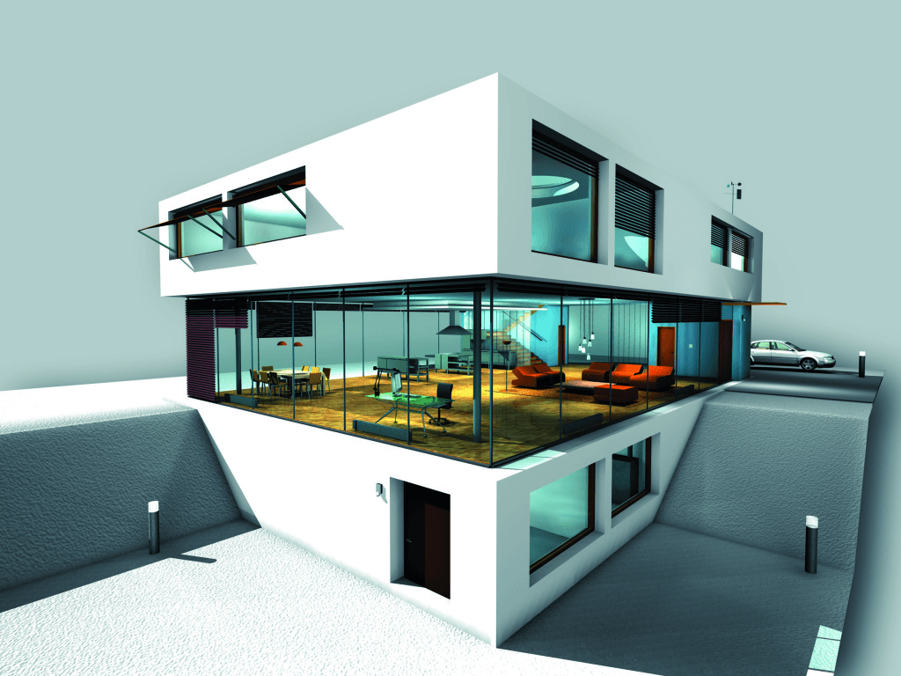
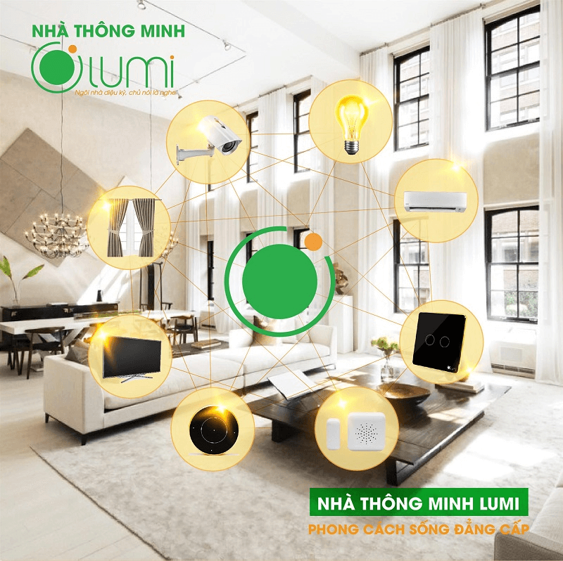

Nhà thông minh ở Việt Nam là một khái niệm không còn xa lạ với nhiều người. Đặc biệt là ở các thành phố lớn như Hà Nội, Hồ Chí Minh, Đà Nẵng, Hải Phòng… Những cư dân thành thị tân tiến đã ngay lập tức tiếp cận và ứng dụng công nghệ mới này vào ngôi nhà của mình. Và sẽ thật lạc hậu nếu bạn không nắm bắt ngay những xu hướng phát triển của nhà thông minh để trở thành một “gia chủ thông thái”.

**Xu hướng nhà thông minh ở Việt Nam hiện nay**

Trên mặt trận công nghệ, cuộc cách mạng 4.0 và công nghệ IoT đang là ngọn cờ dẫn đầu. Trong đó, nhà thông minh là ứng dụng công nghệ IoT một cách toàn diện nhất vào cuộc sống, là tiêu chuẩn của nhà ở hiện đại.

Khi sống trong ngôi nhà được trang bị các thiết bị điện thông minh, bạn có thể điều khiển và quản lý toàn bộ hệ thống điện trong nhà. Được sản xuất theo công nghệ IoT nên các thiết bị điện thông minh có khả năng học hàng nghìn lệnh điều khiển khác nhau. Bạn có thể bật/tắt bóng đèn, bình nóng lạnh, điều hòa,… từ xa hay hẹn giờ tự động bật/tắt bằng Smartphone.

_Nhà thông minh ngày càng trở thành xu hướng phổ biến_

Theo thống kê của công ty nghiên cứu thị trường Statista, giá trị thị trường của Smarthome dự báo đạt 43 tỉ USD vào năm 2020, tăng gấp 3 lần so với năm 2014. Với tiềm năng phát triển đó, ngày càng nhiều thương hiệu smarthome xâm nhập thị trường nhà thông minh ở Việt Nam, trong đó phải kể đến các ông lớn như Lumi, Bkav,… Tuy chỉ mới phát triển từ 3 -5 năm nay, nhưng các đơn vị này đã nắm được thị phần phân phối nhà thông minh khá lớn tại Việt Nam. Đặc biệt là Lumi với khoảng 85 đại lí trên khắp toàn quốc, từ Hà Nội, Đà Nẵng, và Hồ Chí Minh cho đến các thành phố trực thuộc tỉnh đểu có các đại lý/showroom Lumi. 
Nhà thông minh Lumi - niềm tự hào mang tên “made in Vietnam”.

Chỉ mới xuất hiện ở Việt Nam không lâu, nhưng bằng chất lượng, uy tín và tâm huyết của mình, Lumi đã trở thành thương hiệu nhà thông minh xứng danh Made in Việt Nam. 

Với mục tiêu mang đến sự tiện lợi cho người tiêu dùng Việt, Lumi cung cấp bộ 8 giải pháp tổng thể cho ngôi nhà thông minh bao gồm:
* Milo - giọng nói tiếng Việt. 
* Chiếu sáng thông minh
* Điều khiển rèm cửa tự động
* Hệ thống điều hòa - tivi
* Bật tắt bình nóng lạnh
* An ninh chống trộm
* Âm thanh đa vùng
* Kiểm soát môi trường
* Đèn Led 16 triệu màu

So với các giải pháp nhà thông minh ở Việt Nam hiện nay, Lumi tập trung vào phân khúc trung và cao cấp nhưng với mức giá chỉ bằng ⅓. Nếu như để sở hữu trọn bộ nhà thông minh từ thương hiệu ngoại nhập, bạn phải bỏ ra một khoản chi phí từ vài trăm triệu tới vài tỉ đồng thì với Lumi, bạn chỉ cần mất chi phí từ 30 -50 triệu cho căn hộ chung cư và từ 70 -100 triệu động cho biệt thự liền kề.

_Nhà thông minh Lumi - phong cách sống đẳng cấp_

Là thành viên của nhà thông minh Lumi, Gia Hân group là đơn vị cung cấp đầy đủ [trọn gói các sản phẩm dịch vụ](/san-pham) từ thiết kế thi công đến xây mới, cải tạo các giải pháp, thiết bị điện thông minh. Thời gian thi công nhanh chóng chỉ từ 2 -3 ngày mà không đập phá hay phải đi dây lại hệ thống điện. Đặc biệt tất cả các sản phẩm đều được sản xuất tại Việt Nam với quy trình sản xuất đạt tiêu chuẩn Châu  u. Hàng trăm công trình thiết kế thi công chất lượng chính là minh chứng rõ ràng về uy tín và chất lượng phục vụ của Gia Hân group.
Hãy lắp đặt nhà thông minh Lumi tại Gia Hân ngay hôm nay vừa để tận hưởng những trải nghiệm tuyệt vời và góp phần đưa công nghệ Việt đến với người tiêu dùng trên khắp thế giới.