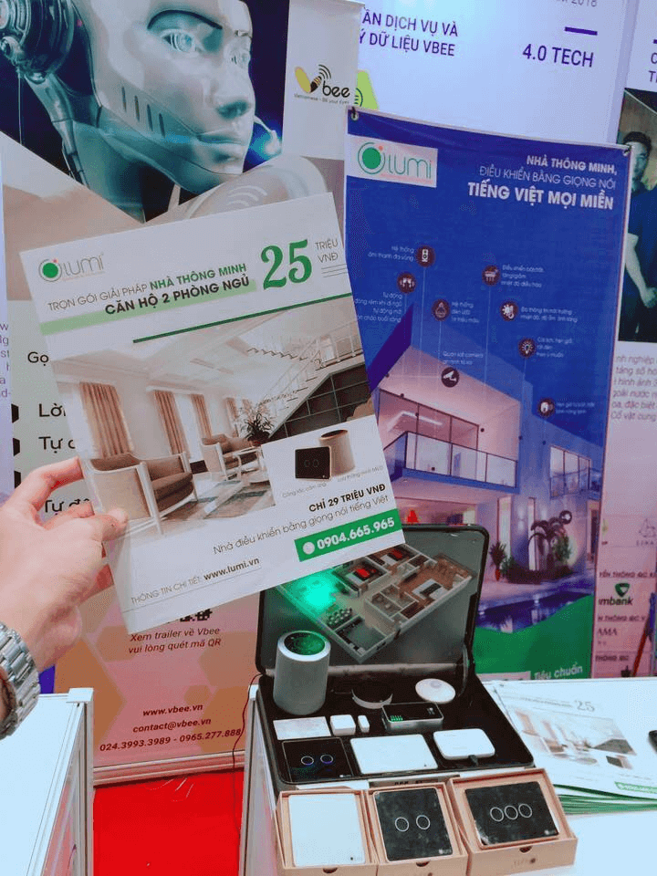
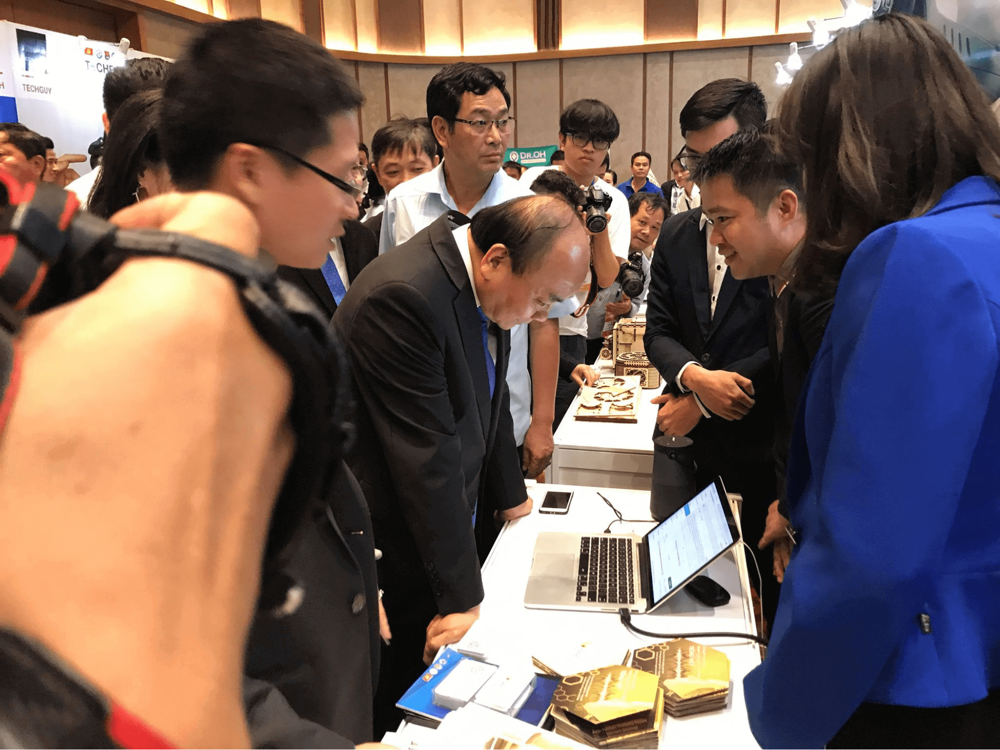
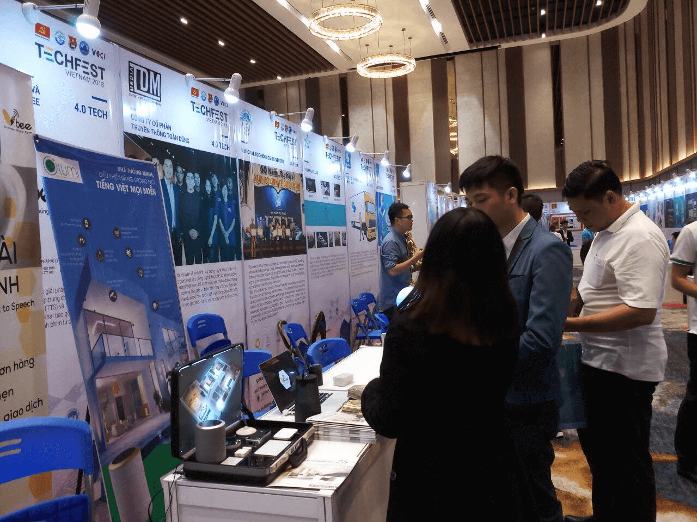
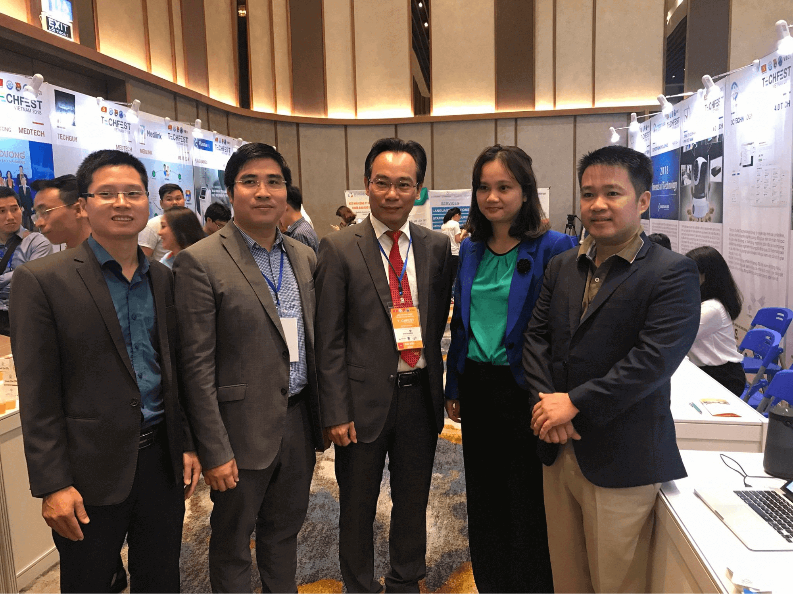

Lần đầu tiên, giải pháp ngôi nhà với các thiết bị thông minh hoàn toàn điều khiển bằng giọng nói xuất hiện tại triển lãm Techfest Vienam 2018. Với sự tinh tế, sang trọng và đẳng cấp được thổi hồn một cách trọn vẹn với đầy đủ cung bậc cảm xúc, ngôi nhà đã khiến đối tác vô cùng ngạc nhiên và mê hoặc bất cứ khách tham quan nào.

**Choáng ngợp với giải pháp nhà thông minh Lumi điều khiển bằng giọng nói tiếng Việt**.

Sự bùng nổ của mạng lưới vạn vật kết nối Internet – IoT và trí tuệ nhân tạo – AI, việc dùng giọng nói, smartphone, tablet điều các thiết bị điện trong ngôi nhà đã trở thành hiện thực. Nắm bắt được xu hướng đó, Bộ Khoa học và Công nghệ đã tổ chức Techfest Vienam 2018 với sự tham gia của gần 100 nhà đầu tư trong và ngoài nước và 200 startups. Với định hướng chủ đạo "Khởi nghiệp sáng tạo - Kết nối toàn cầu", sự kiện cung cấp thông tin về xu hướng công nghệ nổi bật như trí thông minh nhân tạo, công nghệ chuỗi khối,…
Đến với Techfest Vienam 2018 lần này, Gian Hân mang đến trọn bộ giải pháp nhà thông minh Lumi đỉnh cao, đang là xu hướng nhà mới nhất, hiện đại nhất của tương lai bao gồm:
* Giải pháp chiếu sáng thông minh
* Giải pháp rèm cửa tự động
* Giải pháp điều khiển nhà thông minh bằng giọng nói
* Giải pháp điều khiển bình nóng lạnh và tưới nước ban công từ xa
* Giải pháp điều hòa không khí
* Giải pháp kiểm soát môi trường
* Giải pháp giám sát an ninh, chống đột nhập
* Giải pháp âm thanh đa vùng.

Hãy hình dung về một không gian sống mà bạn hoàn toàn điều khiển được mọi thiết bị điện trong ngôi nhà, từ: hệ thống chiếu sáng, điều hòa, rèm cửa, bình nóng lạnh, tưới nước cho cây… Giải pháp tích hợp bộ điều khiển thông qua smartphone, tablet hoặc giọng nói tiếng Việt mọi miền. Thiết kế tinh tế, chuẩn phong cách châu  u với mặt kính cường lực cảm ứng, viền nhôm nguyên khối mạ vàng sẽ làm cho ngôi nhà càng trở nên sang trọng. Được ứng dụng công nghệ IoT và AI, nhà thông minh Lumi – giải pháp mang đến cuộc sống thông minh, vạn tiện nghi cho mọi gia đình Việt.

_Trọn bộ giải pháp nhà thông minh Lumi do Gia Hân cung cấp_

Ngoài việc mang đến giải pháp nhà thông minh, Gia Hân còn chia sẻ những tiện ích cũng như cách lắp đặt, sử dụng ngôi nhà thông minh. Đặc biệt, khách hàng được trải nghiệm các giải pháp nhà thông minh như: giải pháp chiếu sáng thông minh, điều khiển bình nóng lạnh, điều hòa , rèm cửa từ xa, an ninh thông minh... 

_Thủ tướng Nguyễn Xuân Phúc ghé thăm gian hàng Lumi _

_Khách hàng tham quan và trải nghiệm sản phẩm Lumi_

Hiện nay, nhà thông minh Lumi đang là giải pháp có số lượng người dùng nhiều nhất tại Việt Nam với hơn 25.000 công trình đã lắp đặt và hàng nghìn dự án lớn trên cả nước đang triển khai. Sản phẩm đã đạt chứng chỉ CE – tiêu chuẩn xuất khẩu sang các nước châu  u và chứng chỉ UL – bo mạch phần cứng đạt chuẩn quốc tế được phép xuất khẩu tới 104 quốc gia trên thế giới. Chỉ với chi phí từ 25 -50 triệu cho một căn hộ thông minh và từ 50 -80 triệu/ căn biệt thự là bạn có thể sở hữu trọn bộ giải pháp nhà thông minh Lumi đẳng cấp hàng đầu.

**Gia Hân group - đơn vị cung cấp và phân phối giải pháp nhà thông minh Lumi hàng đầu**

Được biết, Gia Hân group đại diện chi nhánh Lumi khu vực miền trung tham gia triển lãm với vai trò đơn vị khởi nghiệp sáng tạo. Không gian hiện đại, cộng với sự tỉ mỉ trong thiết kế từ đội ngũ trong và ngoài nước, Lumi đã mang tới ngôi nhà trọn vẹn nhất dành tặng cho khách tham quạn.

_CEO Lumi Việt nam, Hiệu trưởng trường ĐH Bách Khoa và nhà sáng lập Vbee ghé thăm gian hàng Gia Hân_

Đại diện đơn vị Gia Hân group, ông Nguyên Dũng chia sẻ: “Hiện nay phần lớn người dân khi xây nhà, mua căn hộ mới khi nhắc đến nhà thông minh đều cho rằng đó là một khoản đầu tư quá xa xỉ và tốn kém. Nhưng với Gia Hân, chúng tôi mang tới một giải pháp Lumi  toàn diện cho các loại căn hộ từ biệt thự cao cấp cho tới căn hộ chung cư với chi phí chỉ từ 15 đến 80 triệu đồng. Tất cả các linh kiện cấu thành nên sản phẩm của Lumi đều được nhập từ các thương hiệu nổi tiếng trên thế giới như Texas Instrument, Freescale, NXP, Silicon Labs,… để đảm bảo tính ổn định, chất lượng tốt nhất cho từng sản phẩm đến tay khách hàng.

Gia Hân mang đến cho bạn giải pháp nhà thông minh “Made in Vietnam” tổng thể với các giải pháp đồng bộ nhằm đem lại sự tiện nghi tối đa cho khách hàng chỉ trong 1 nút chạm. Ưu điểm lớn nhất khi sử dụng các thiết bị thông minh Lumi chính là sự đơn giản trong thi công lắp đặt, tiện lợi dễ dàng cho người sử dụng mang tới cho khách hàng cảm giác thoải mái, tiện nghi và hiện đại.  Quy trình lắp đặt cực đơn giản và dễ dàng chỉ với 1 đến 2 ngày thi công bất kể công trình cũ hay mới mà không cần đục đẽo.

Liên hệ Gia Hân ngay hôm nay để sở hữu giải pháp nhà thông minh hàng đầu hiện nay. 

