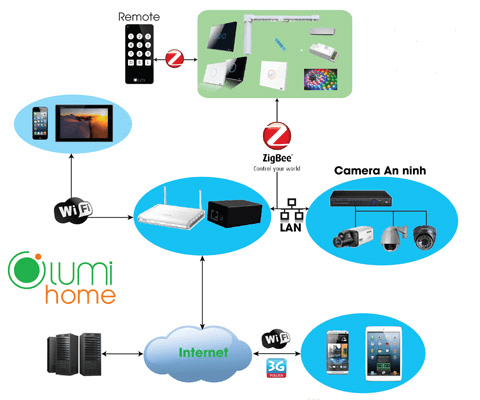
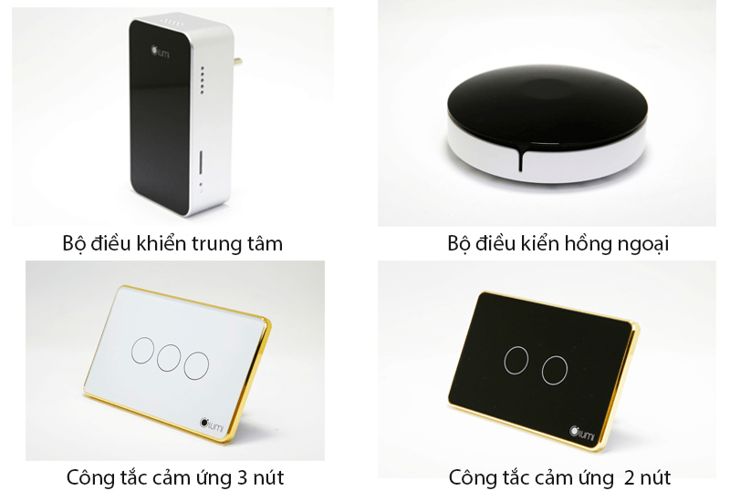
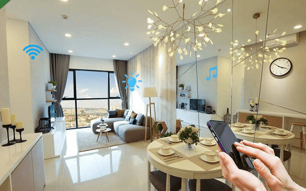

Một ngôi nhà thông minh là khi nó có thể thấu hiểu và hoạt động theo ý muốn của chủ nhà. Hiểu được điều đó, Lumi ứng dụng công nghệ IOT hàng đầu để tạo ra nhiều tiện ích phục vụ mọi nhu cầu của con người. Hãy cùng tìm hiểu 4 ưu điểm vượt trội của giải pháp nhà thông minh Lumi - đơn vị tiên phong trong lĩnh vực Smarthome hiện nay.

_Giải pháp nhà thông minh Lumi_

**Tiện nghi**

Nhà thông minh Lumi được trang bị những thiết bị điện, điện tử có khả năng tương tác linh hoạt với con người. Bạn có thể làm chủ và điều khiển mọi hoạt động, trạng thái ngôi nhà bằng các thiết bị điều khiển, smartphone hay thậm chí là bằng chính giọng nói của mình. 
Lumi mang đến những giải pháp thông minh như hệ thống chiếu sáng, điều khiển rèm tự động, hệ thống điều hòa tivi, bật tắt bình nóng lạnh, an ninh chống trộm, kiểm soát môi trường, an ninh đa vùng, đèn Led 16 triệu màu, loa Milo điều khiến tiếng Việt… Những công nghệ mới này sẽ giúp bạn tiết kiệm thời gian và công sức vào những vấn đề nhỏ nhặt hằng ngày. Chỉ với một thao tác, một cú chạm nhẹ hay giọng nói quyền năng của bạn, ngôi nhà sẽ hoạt động trơn tru theo ý muốn. Tiện nghi là một trong những ưu điểm tuyệt vời mà giải pháp nhà thông minh Lumi mang đến cho cuộc sống của bạn.

**Đẳng cấp**

Không gì tuyệt vời hơn khi ngôi nhà của mình khiến thượng khách đến chơi phải trầm trồ thán phục vì sự đẳng cấp riêng biệt. Ngay khi bước chân vào cửa, hệ thống đèn tự động bật lên, rèm cửa mở đón ánh sáng bên ngoài, điều hòa auto điều chỉnh nhiệt độ và âm nhạc thì cất lên những giai điệu du dương. Đó chính là đẳng cấp và sự khác biệt từ giải pháp nhà thông minh Lumi.

_ Một số sản phẩm đi kèm bộ giải pháp_

Để vận hành được những tiện ích đó tưởng chừng như phải cần rất nhiều các thiết bị điện tử phức tạp. Nhưng ngược lại, các thiết bị thông minh Lumi được thiết kế vô cùng tinh gọn, đơn giản mà vẫn toát lên vẻ đẹp sang trọng đẳng cấp. Các công tắc viền mạ vàng với mặt kính phản chiếu ánh đèn lung linh, loa Milo nhỏ xinh thiết kế hiện đại như những món đồ nội thất trang điểm cho tổng thể ngôi nhà.

**Tiết kiệm**

Không chỉ mang đến tiện ích và đẳng cấp vượt trội, giải pháp nhà thông minh Lumi còn giúp bạn tiết kiệm chi phí của các hoạt động sử dụng sinh hoạt của gia chủ. Điều hòa có thể tự động tùy chỉnh nhiệt độ theo thời tiết hay tự động tắt khi bạn ra khỏi nhà. Bạn có thể điều khiển hoạt động trạng thái của các thiết bị bằng smartphone mọi lúc mọi nơi. Nếu đi ra ngoài và quên tắt bất cứ một thiết bị nào đó thì bạn không cần phải lo lắng. Smartphone sẽ trở thành một công tắc di động để bạn điều khiển mọi hoạt động của thiết bị chiếu sáng, tivi, điều hòa… Bạn hoàn toàn kiểm soát thiết bị nào bật, thiết bị nào tắt, rèm đang đóng hay mở và chỉ cần một thao tác, mọi thứ sẽ hoạt động theo kịch bản. Ví dụ bạn đang trên đường đi làm và nhớ ra mình quên chưa tắt các thiết bị, chỉ cần một chạm kích hoạt chế độ "đi vắng" trên ứng dụng Lumi, các thiết bị sẽ tắt và kích hoạt chế độ an ninh. Tất cả các thông tin về hoạt động trạng thái ngôi nhà đều được hiển thị trên màn hình điện thoại. Tính di động và tự động này sẽ rất hữu ích trong việc cắt giảm chi phí hóa đơn tiền điện hàng tháng.

**An toàn**

Sự an toàn là điều cơ bản không thể thiếu khi xây dựng giải pháp nhà thông minh Lumi. Với hệ an ninh hoạt động 24/7, bạn sẽ dễ dàng kiểm soát mọi hoạt động, trạng thái ngôi nhà mọi lúc mọi nơi. Nếu có bất cứ sự xâm nhập nào, các thiết bị thông minh sẽ ngay lập tức cảnh báo tới điện thoại của bạn. Không những thế, khi kích hoạt chế độ an ninh, hệ thống sẽ tự động ghi lại hình ảnh và cảnh báo khi có phát hiện chuyển động bất thường. Với giải pháp nhà thông minh Lumi, bạn có thể thảnh thơi đi du lịch dài ngày mà không cần phải lo lắng gì về mái ấm của mình.

_Kiểm soát mọi hoạt động, bảo vệ bạn an toàn_

**Giahangroup  - địa chỉ tư vấn và thi công lắp đặt giải pháp nhà thông minh Lumi uy tín**

Là đơn vị hướng dẫn tư vấn và thi công lắp đặt chuyên nghiệp, Gia Hân mang đến cho bạn giải pháp nhà thông minh Lumi hiện đại nhất với mức giá tiết kiệm nhất. Chỉ từ 25 – 70 triệu/căn hộ (hoặc 40 – 150 triệu/biệt thự liền kề) là bạn đã sở hữu ngay một không gian sống tiện nghi, hiện đại và sang trọng với chi phí bỏ ra chỉ bằng ½ giải pháp nhập khẩu trên thị trường. 
Mang đến những sản phẩm/giải pháp chất lượng nhất tới quý khách hàng là tôn chỉ hàng đầu tại Lumi, chính vì vậy bạn có thể yên tâm mua sắm trên hệ thống đại lý chính thức của Lumi trên toàn quốc. Với gần 25.000 ngôi nhà đã hoàn thiện và hàng chục dự án đang được triển khai, Lumi tự hào trở thành thương hiệu Việt được ưa chuộng nhất trong lĩnh vực smarthome tại Việt Nam hiện tại.

Hãy liên hệ với Gia Hân để sở hữu giải pháp nhà thông minh Lumi và tận hưởng trọn vẹn cuộc sống tiện nghi đẳng cấp ngay hôm nay.

 Địa chỉ: Số 304 Nguyễn Đình Tựu, Q.Thanh Khê, TP. Đà Nẵng
 Hotline: 0968.333.268 - 0935.333.268
 Email: GiahanGroup2018@gmail.com