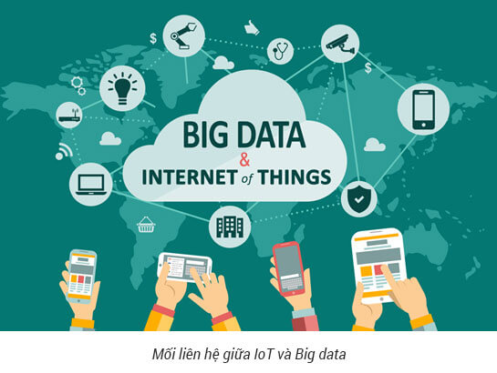
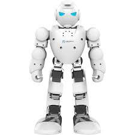
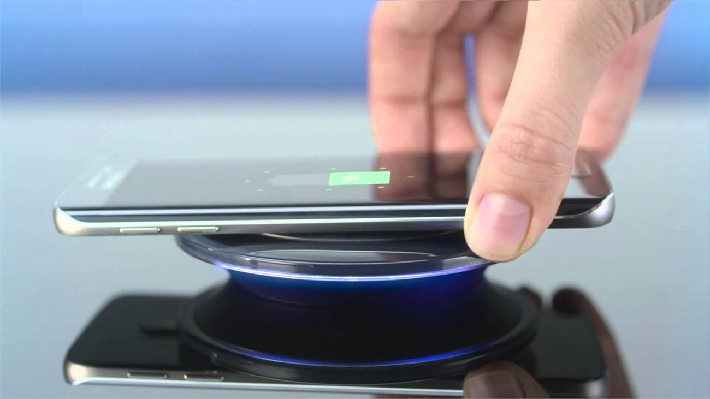
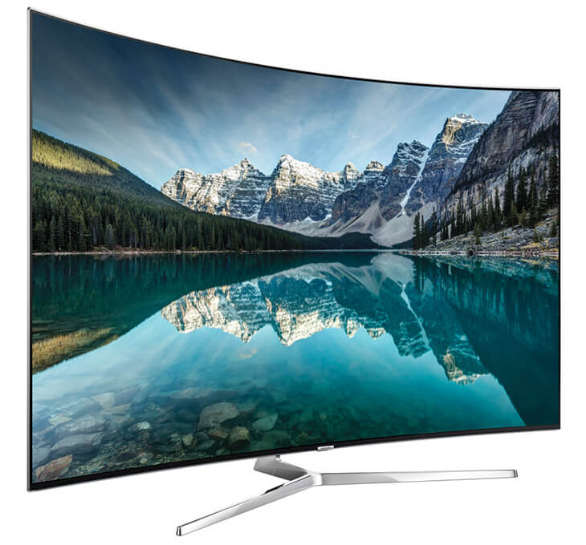

**1. Dữ liệu lớn**

Định nghĩa dữ liệu lớn không còn xa lạ với nhiều người nhưng, nhưng nó sẽ là xu hướng của hiện tại lẫn tương lai. Năm 2010, Chủ tịch điều hành Google, ông Eric Schmidt cho rằng, thế giới tạo ra 5 exabyte dữ liệu mỗi 2 ngày, và bây giờ có thể đã tăng gấp đôi.

**2. Trí tuệ nhân tạo**'

Dữ liệu lớn được thu thập lại sẽ hoàn toàn vô nghĩa nếu người ta không tạo ra một cỗ máy thông minh khai thác lượng dữ liệu trên. Trang Mashable dẫn chứng trong quá khứ là Microsoft đã tạo ra hệ thống biên dịch đoạn hội thoại hai chiều với Skype. Mặc dù công nghệ của Microsoft hoạt động chưa thật sự hoàn hảo nhưng tương lai chắc chắn sẽ tốt hơn.

_Trí tuệ nhân tạo_

**3. Robot**

Đã có nhiều dòng robot được tạo ra và tham gia các hoạt động sản xuất cùng với con người. Tuy nhiên, giữa robot và con người vẫn còn một khoảng cách nhất định. Trước thực trạng này, Giáo sư Julie A. Shah, người dẫn đầu nhóm Robotics, đang làm việc tại Phòng thí nghiệm Trí tuệ nhân tạovà Khoa học máy tính của MIT và cho biết: "Trong năm 2015, chúng ta sẽ thấy điều này có nhiều ảnh hưởng đến sản xuất". Bà tự tin ngày sẽ càng có nhiều robot làm việc cùng với con người.

_Robot_

**4. Công nghệ pin và sạc không dây**

Cách để tăng thời lượng sử dụng cho hầu hết các thiết bị cầm tay hiện nay là sạc dự phòng. Chắc chắn Intel, Qualcomm, Nvidia, AMD và Texas Instruments đang xây dựng các CPU di động ngày càng hiệu quả hơn, nhưng lượng điện năng tiêu thụ cũng sẽ hút cạn viên pin.

_Công nghệ pin và sạc không dây_

**5. Màn hình cong**

Năm 2014 chỉ mới ghi nhận được một số sản phẩm màn hình cong như HDTV của LG hay Fit của Samsung. Và người ta đang mong chờ các sản phẩm có màn hình không chỉ cong mà còn linh hoạt nữa. Đặc biệt, công nghệ kính cường lực Gorilla Glass cũng sẽ linh hoạt hơn để áp dụng trên các sản phẩm màn hình cong.

_Màn hình cong_