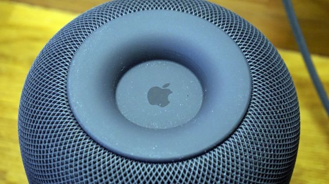
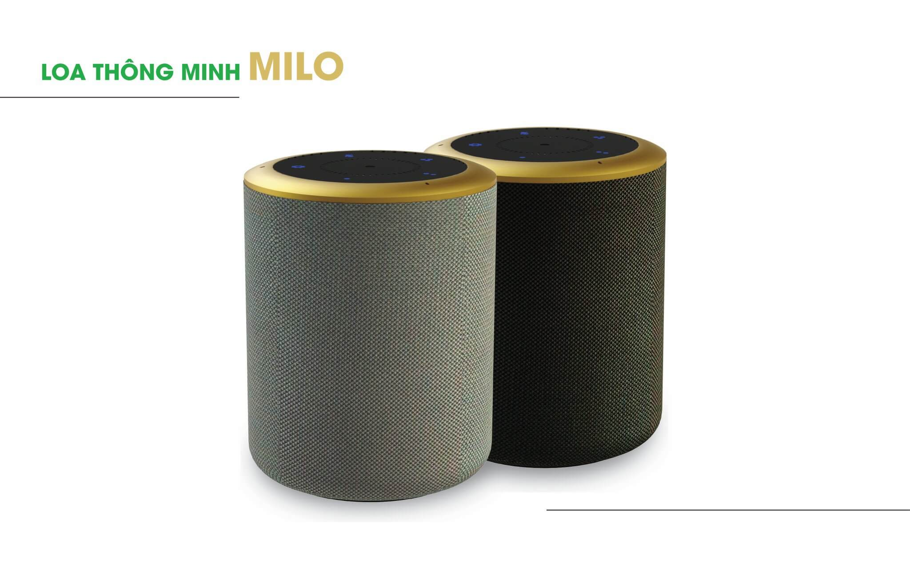

Sau đây chúng ta cùng điểm qua các trợ lí ảo đang làm mưa làm gió tại thị trường trong nước.liệu có thực sự mê hoặc được cán tín đồ công nghệ.Thị trường nhà thông minh Việt Nam đang phát triển đến mức chóng mặt và hứa hẹn sẽ bùng nổ con số 45 triệu đô này sẽ sớm tăng lên **gấp 10 lần chỉ trong vài năm nữa**. Hầu như tất cả các hãng nhà thông minh hàng đầu thế giới đều đã xuất hiện tại Việt Nam với những sản phẩm tiên phong của mình, ví dụ như Apple với loa thông minh **Homepod, Google với Home Mini**..., các hãng lớn mạnh này gây sức ép không nhỏ đến các thương hiệu Việt. **Bkav Smarthome và Lumi Việt Nam** - những đơn vị đi đầu  trong lĩnh vực nhà thông minh được đánh giá là mạnh mẽ nhất thị trường quốc nội buộc phải có những bước đi tương tự để khẳng định vị thế.

**1. Apple Homepod - Trợ lý ảo Siri: thương hiệu Apple đã quá gần gũi và không xa lạ với bất kì ai ở việt nam, kể từ các đời IPhone 4 trở lên đều trang bị hệ thống trợ lí áo Siri**

**Điểm mạnh**: Chất lượng âm thanh tốt nhất, thiết kế tinh tế, nhận diện giọng nói cực nhạy.

**Điểm yếu**: Giá thành cao hơn khá nhiều so với các đối thủ, không có Bluetooth Streaming, thị trường bị bó hẹp cùng với các dòng sản phẩm Apple.

Ngoài việc thực thi các mệnh lệnh căn bản bằng giọng nói để điều khiển thiết bị trong nhà thông minh thì điều đầu tiên cần phải chú ý khi nhắc đến Apple Homepod là chất lượng âm thanh vô cùng tuyệt hảo. Dù là một chiếc loa di động nhỏ gọn nhưng Homepod thể hiện đẳng cấp khi có thể chơi tốt các loại nhạc khác nhau. Thậm chí Homepod có thể thể hiện tốt các dải âm siêu trầm, thách thức cả những chiếc loa nghe nhạc thực thụ của các hãng danh tiếng về loa trên thế giới.

_Các trợ lí ảo đang hỗ trợ nhà thông minh tại Việt Nam_

Được công bố vào tháng 6 năm ngoái, và ra mắt vào tháng 2/2018, Homepod hoàn toàn làm ngạc nhiên tất cả các tín đồ công nghệ nhờ chất lượng âm thanh. Có lẽ đây là điểm sáng duy nhất giúp Homepod gỡ gạc lại sự yếu kém của Siri, trợ lý ảo này còn thiếu nhiều chức năng và có ít số lượng câu lệnh hơn các đối thủ như Google Assistant hay Alexa của Amazon. Một giới hạn khác có lẽ sẽ khiến Homepod mất thị phần so với đối thủ là nó cũng bị giới hạn thị trường cùng với các dòng sản phẩm Apple khác, sẽ chỉ có những iFan lâu năm mới sắm chiếc loa này cho bộ sưu tập quả táo của mình mà thôi.

Hiện tại, Homepod đang được các doanh nghiệp tư nhân nhập khẩu và bán ở thị trường Việt Nam với giá khoảng 8 đến hơn 9 triệu đồng tùy phiên bản màu trắng hay màu đen.

**2. Google Home Mini - Trợ lý ảo Google Assistant:**

**Điểm mạnh**: Mức giá rẻ hấp dẫn nhất thị trường nhưng tính năng vẫn đa dạng phong phú.

**Điểm yếu**: Chất âm chưa được hay, mức độ hoàn thiện sản phẩm chưa bằng các đối thủ.

Với cái giá cực ''sốc" tại thị trường Việt Nam chỉ với khoảng 1 triệu 500 nghìn đồng, Home Mini trở thành sản phẩm loa thông minh có chỉ số p/p ( price/performance - tỉ suất đánh giá hiệu năng trên giá thành ) cao nhất thị trường hiện nay. Thiết kế đơn giản nhỏ gọn, dễ thương, nhiều màu sắc bắt mắt...Google Home Mini mang đến ngôi nhà thông minh của bạn một điểm nhấn vô cùng đáng giá với kích thước chỉ bằng một cái bánh donut, nặng vỏn vẹn 173 gram gói gọn trong lòng bàn tay.

_Google Home Mini, nhỏ gọn tiện dụng, giá thành hấp dẫn_

Khi tung ra sản phẩm Home Mini có lẽ Google đã muốn bao trọn cả thị trường, tương tự với những sản phẩm đang dùng hệ điều hành Android hiện tại. Trợ lý ảo Google Assistant mạnh mẽ cũng là linh hồn của Home Mini giúp cho chiếc loa nhỏ xinh này có thể dễ dàng kết nối với tất cả các thiết bị khác một cách vô cùng dễ dàng, bạn chỉ cần kết nối với điện thoại thông qua ứng dụng Google Home và chúng sẽ tự đồng bộ. Ngoài ra tính năng phát qua Bluetooth cũng giúp Home Mini vượt mặt Apple Homepod về tính phong phú đa dạng.

Hơn thế nữa, Google Home Mini cũng có thể kết hợp với Chromecast để phát phim ảnh qua TV, hay hỗ trợ kích hoạt các dịch vụ như Netflix. Với cái giá hấp dẫn và tính năng tuyệt vời như thế này thì các tín đồ Android đông đảo trên thế giới sẽ không ngần ngại trang bị ngay một chú Google Home Mini để trải nghiệm công nghệ.

**3. Echo Dot - Trợ lý ảo Alexa:Thiết bị này cũng được ứng dụng tích hợp vào nền tảng trợ lí ảo của lumi khi loa MILO chưa được đi vào hoạt động**

**Điểm mạnh**: Trợ lý ảo Alexa thông minh, nhiều kỹ năng phong phú đa dạng nhất thị trường.

**Điểm yếu**: Không có ngõ ra âm thanh Digital, các chỉ số khác chỉ ở mức trung bình so với đối thủ.
 
Với hơn 5000 nhân sự được Amazon cắt cử để nghiên cứu và làm việc nhằm cải thiện Alexa - cô nàng trợ lý ảo ẩn mình trong loa Echo Dot chính là trí tuệ nhân tạo mạnh mẽ nhất thị trường nhà thông minh hiện nay. Thật vậy, kỹ năng của Alexa đang được cải thiện từng ngày với tiềm năng phát triển vô cùng hứa hẹn. Dòng loa thông minh Echo và Echo Dot của Amazon dù ra mắt khá sớm và vướng phải nhiều khó khăn trong quá trình hoàn thiện tuy nhiên vẫn giữ được thị phần và dẫn đầu thị trường nhà thông minh tại Mỹ.

_ Echo Dot, tính năng phong phú, dẫn đầu thị trường_

Tính đến tháng 1 năm 2018, có đến hơn 31 triệu thiết bị Echo được Amazon bán ra bao gồm Echo Dot, và 18% người Mỹ trên 18 tuổi sở hữu thiết bị này. Hơn thế nữa, Amazon Echo Dot là thiết bị loa thông minh đầu tiên được một doanh nghiệp Việt là Lumi Việt Nam hợp tác triển khai thành công trong hệ thống nhà thông minh của họ.

Hiện tại, Echo Dot thế hệ 2 có giá chỉ tầm 1 triệu 2 trăm nghìn tại thị trường Việt Nam. Một cái giá quá hời để người dùng Việt được trải nghiệm nhà thông minh đẳng cấp quốc tế.

**4. Lumi Milo - Trợ lý ảo Google Assistant:**

**Điểm mạnh**: Phá vỡ rào cản ngôn ngữ, tương tác tiếng Việt hoàn toàn với mức độ hoàn thiện sản phẩm cao sản phẩm đầu tay do người Việt chế tạo trợ lí ảo.

**Điểm yếu**: Vẫn trong thời gian phát triển tính năng, chịu sự cạnh tranh mạnh mẽ của thương hiệu nước ngoài, chưa nhận diện hết tất cả các giọng vùng miền( đặc thù ngôn ngữ Việt Nam rất đa dạng và phong phú)

Vâng một cái tên có lẽ rất lạ, vì đây là sản phẩm loa thông minh đầu tiên được một doanh nghiệp Việt phát triển phù hợp với thị trường quốc nội. Tỏa sáng tại triển lãm CES 2018 - Las Vegas ( Mỹ ), Milo được Lumi Việt Nam tích hợp trợ lý ảo Google Assistant, sử dụng công nghệ sóng Zigbee độc đáo tiêu thụ điện năng chỉ bằng 10% so với các thiết bị dùng sóng Wifi truyền thống.

_Lumi Milo, thương hiệu Việt, phá vỡ rào cản ngôn ngữ tích hợp ngôn ngữ 3 vùng miền việt nam (Bắc ,Trung, Nam)_

Với sự hợp tác giữa Lumi Việt Nam và Hogar Controls Ấn Độ, chắc chắn trong thời gian sắp tới loa thông minh Milo sẽ đánh dấu cột mốc quan trọng của nhà thông minh thương hiệu Việt. Trên hết, sản phẩm này sẽ phá vỡ mọi rào cản ngôn ngữ giúp cho người dùng phổ thông Việt Nam có thể thỏa sức trải nghiệm công nghệ và mang đến những giá trị sử dụng thiết thực nhất trong cuộc sống. Cho đến thời điểm này, Lumi Milo đã hoàn toàn có thể thực thi tất cả các mệnh lệnh căn bản như bật tắt thiết bị điện chiếu sáng, TV, điều hòa, rèm cửa, kiểm soát hệ thống an ninh...bằng tiếng Việt.

Được biết, sản phẩm này sẽ sớm được Lumi Việt Nam ra mắt rầm rộ vào 27-6 tại sài gòn nơi mà sản phẩm nhà thông minh LUMi được tin dùng nhiều nhất với giá  chính thức cũng rất vừa túi tiền của các tín đồ công nghệ. 4520000 VND

Kết lại, chúng ta có thể dự đoán được một tương lai vô cùng sôi động của thị trường nhà thông minh Việt Nam với các sản phẩm đa dạng về nguồn gốc xuất xứ lẫn ngoại hình, tính năng, phân khúc giá thành. Chắc chắn người dùng Việt dù có điều kiện tài chính như thế nào, thị hiếu ra sao, cũng sẽ tìm được giải pháp hợp lý và hiệu quả để hòa mình vào thế giới công nghệ đầy tiện ích mà nhà thông minh mang lại.