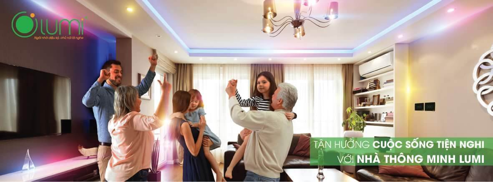

Các thương hiệu nhà thông minh xuất hiện ở Việt Nam cũng dc tầm 6 đến 10 năm trở lại đây. Nhưng những giải pháp nhà thông minh chỉ thực sự được quan tâm và bùng nổ thực sự kể từ thời điểm 2015 cùng với cuộc cách mạng công nghiệp 4.0 ( CMCN 4.0 ). Không thể phủ nhận những cố gắng của các đơn vị đi đầu trong lĩnh vực này đặc biệt là các thương hiệu Việt Nam như Lumi hay Bkav, thế nhưng thực tế cuộc chạy đua của nhà thông minh Việt Nam để bắt kịp với thế giới là cả một quá trình dài hơi.

Định nghĩa nhà thông minh cần sự rõ ràng và thồng nhất để chúng ta đừng lầm tưởng giữa nhà thông minh và các thiết bị tự động hay thiết bị thông minh.

Như thế nào là nhà thông minh? hầu hết chúng ta  vẫn chưa thực sự phân biệt được rõ ràng  khái niệm của các thiết bị thông minh và các thiết bị tự động. Một công tắc báo trộm, báo khói, báo rò gas độc lập vốn là một thiết bị tự động chứ không phải là thiết bị thông minh, những thiết bị này đã xuất hiện trên thị trường từ rất lâu và được sử dụng rộng rãi như một giải pháp mặc định căn bản nhất cho các biệt thự, căn hộ chung cư... Thế nhưng với sự phát triển và đi lên  của nhà thông minh thì các sản phẩm lỗi thời trên cũng được các nhà sản xuất ''lột xác'' trở thành ''thông minh'' với giá thành cực rẻ khiến cho người dùng rối trí vì sự chênh lệch giá giữa những tên gọi hoa mỹ như "cảm biến chuyển động, chuông báo khách, đèn cảm ứng, công tắc cảm ứng''... Theo định nghĩa của các chuyên gia thì nhà thông minh là ngôi nhà có các thiết bị điện gia dụng có thể được gia chủ điều khiển từ xa thông qua mạng truyền thông, ngoài ra còn có thể được lập trình để thích hợp với các ngữ cảnh khác nhau, học hỏi hành vi người dùng và tương tác qua phần mềm trực quan sinh động trên Smartphone hay Tablet. Thế nên những thiết bị tự động giá rẻ tràn ngập thị trường không thể xem là thông minh. Việc đánh đồng và trộn lẫn những thiết bị cũ mới khác nhau thế này có thể giúp một số nhà phân phối thiết bị thông minh bán được nhiều loại hàng trong thời gian ngắn, nhưng nó vô tình gây hại cho sản phẩm chính của họ trong tương lai.

Ở Việt Nam không chỉ có các ông lớn trong ngành công nghệ giá cũng khác nhau chưa kể đến các thiết bị rẻ tiền gây lộn xộn về giá cả cũng như chất lượng của sản phẩm, ảnh hưởng rất lớn đó chính là người khác hàng sẽ trực tiếp sử dụng các sản phẩm đó, vì vậy hãy tin tưởng các sản phẩm chính hãng có tuổi đời và sự tín nhiệm cao.

Trong khi các gói sản phẩm chất lượng có tiêu chuẩn và xuất xứ rõ ràng như Lumi Việt Nam và Bkav có giá thành khá cao so với người có thu nhập trung bình thì các sản phẩm ''giá rẻ'' trôi nổi có nguồn gốc không rõ ràng cũng đang cố chiếm lấy thị phần. Lợi thế về giá của các sản phẩm được cho là xuất xứ từ Trung Quốc này vốn không thể chối cãi, tuy nhiên giá trị sử dụng lâu dài và độ tin cậy vẫn là một dấu hỏi to tướng. Chỉ cần làm một khảo sát đơn giản giữa các linh phụ kiện chính hãng Lumi hay Bkav với ''hàng Trung Quốc'' thì bạn có thể nhận ra ngay sự khác biệt về chất liệu và chất lượng gia công hoàn thiện sản phẩm, khoan nói đến những chứng chỉ, giấy phép chứng nhận đạt chuẩn quốc của linh kiện bên trong thiết bị. Đơn cử như Bkav có dùng linh kiện nhập khẩu của STMicroelectronics hay SiliconLabs, Lumi sử dụng tụ điện của Panasonic và linh kiện tiếp điểm mạ vàng của Vishay USA có thể hoạt động lâu bền và chịu tải công suất cao, ngược lại các nhãn hàng từ Trung Quốc hoàn toàn dùng linh kiện ''no-name''. Một giải pháp ''Made in China'' có thể sẽ hút mắt người dùng với cái giá chỉ bằng 1/4 so với chính hãng nhưng sẽ sớm hư hỏng hoặc hoạt động không chính xác, khiến người dùng khó chịu và mất thiện cảm với cái gọi là ''nhà thông minh''. Sự lớn mạnh của một thị trường, một dòng sản phẩm ngoài việc có chất lượng hiển nhiên thì còn phụ thuộc rất nhiều vào thái độ và quan điểm của người dùng đầu cuối, nếu họ đã có định kiến và e dè khi tiếp cận thì quả là một khó khăn không nhỏ với các nhà phân phối.

## Thương hiệu Việt cần bước đi đúng đắn để sớm khẳng định mình trong và nhà nước

Việt Nam trong thời buổi hội nhập là thị trường màu mỡ của tất cả các ông lớn trên thế giới, nhất là trong lĩnh vực liên quan đến công nghệ và dịch vụ. Các con số thống kê đều cho thấy người Việt thích ứng nhanh và tiếp thu công nghệ cao rất tốt với một sự tò mò đam mê khám phá. Các thương hiệu nhà thông minh Việt Nam nên nắm bắt yếu tố này vì sẽ sớm thôi một cuộc chiến tranh giành thị phần cam go sẽ xảy ra khi các thương hiệu ngoại quốc từ Mỹ và Châu Âu cũng muốn lao vào tranh tiên sính cường. Đơn cử có thể kể đến Schneider của Pháp, Smartg4 hay Creston của Mỹ... Những đơn vị này vốn đã có quá trình phát triển lâu dài, chuyên nghiệp trong quy trình mặc dù sản phẩm của họ chưa chắc đã hơn được thương hiệu quốc nội về tính năng, họ sẽ phải vượt qua rào cản về giá cũng như tất cả những thói quen và văn hóa tiêu dùng của người Việt khi đặt chân đến Việt Nam, trên hết vẫn là sự tự hào của người Việt với sản phẩm trong nước.

**Có thể kết luận, người dùng Việt với nhận thức đúng đắn chính là yếu tố quan trọng nhất ảnh hưởng đến “sức khoẻ’’ của một thương hiệu, sự trong sạch của một thị trường mang tính đặc thù như nhà thông minh. Sắp tới đây các thương hiệu trong nước như Bkav sẽ phải thay đổi chiến lược truyền thông một cách trung thực hơn để tránh khủng hoảng, ngược lại Lumi cần đẩy mạnh các kênh quảng bá truyền thống để tránh bị chìm trước quá nhiều đối thủ.**