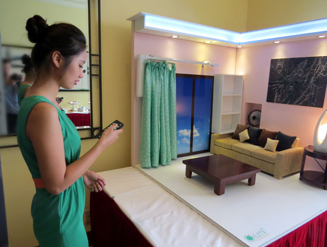
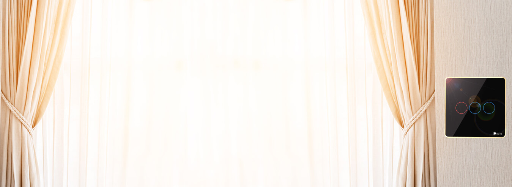
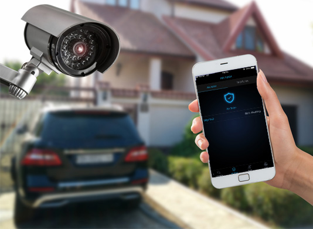

**Lumi  là nhà sản xuất và cung cấp giải pháp nhà thông minh trong nước cũng như nước ngoài được khách hàng lựa chọn nhiều nhất trong phân khúc hệ thống nhà thông minh với phân khúc trung và cao cấp bởi tính tiện ích, đơn giản và dễ dàng trong sử dụng mang đậm chất Việt.**

Giải pháp nhà thông minh của Lumi Việt Nam là giải pháp thiết kế cho phép bạn điều khiển, giám sát, đặt lịch hẹn giờ hoặc vận hành hệ thống điện tử thông minh, với nhiều thiết bị điện trong ngôi nhà cùng lúc theo cách đơn giản trên điện thoại di động hoặc máy tính bảng.

## Hệ thống chiếu sáng

**Một chạm – vạn tiện nghi **: Thông thường để điều khiển chiếu sáng trong nhà, bạn phải di chuyển và bật tắt rất nhiều công tắc cảm ứng, tuy nhiên với nhà thông minh của Lumi, các kịch bản chiếu sáng được thiết lập sẵn cho từng hoạt cảnh cụ thể, chỉ một chạm là bạn có thể điều khiển hệ thống chiếu sáng theo ý muốn. Ví dụ khi có khách đến nhà, nhấn vào chế độ “tiếp khách”  một loạt các bóng đèn sẽ cùng bật sáng lên,  hoặc khi ra ngoài, chỉ cần ấn nút “ đi vắng” toàn bộ hệ thống đèn trong nhà sẽ tắt đồng loạt.  Bạn hoàn toàn có thể biết được bóng nào đang bật, bóng nào đang sáng, cường độ sáng là bao nhiêu % được hiển thị trên điệnthoại di động hoặc máy tính bảng và bạn hoàn toàn bật hoặc tắt thiết bị đó ngay trên điện thoại khi không cần thiết.

### Tự động chiếu sáng và hẹn giờ chiếu sáng cho ngôi nhà của bạn

 Thiết bị chiếu sáng sẽ tự động bật lên khi phát hiện có chuyển động. Nếu ánh sáng tự nhiên không đủ cường độ sáng, đèn sẽ tự động bật khi phát hiện có người di chuyển và tự động tắt sau 1 khoảng thời gian cài đặt kể từ khi không phát hiện có người di chuyển.

## Hệ thống rèm cửa tự động

Đối với giải pháp nhà thông minh của Lumi Việt Nam, Bộ rèm trở nên tiện nghi và linh hoạt hơn rất nhiều.

**Điều khiển nhiều rèm cửa cùng 1 lúc**: Ngoài việc điều khiển rèm tại chỗ như thông thường, bạn có thể điều khiển nhiều rèm cùng một lúc chỉ với 1 chạm.

**Rèm tự động**: 5h30h sáng, rèm tự động mở ra đánh thức bạn bằng ánh sáng thiên nhiên, một cảm giác ngày mới tràn đầy năng lượng. 11h45 rèm tự động đóng lại cho bạn một giấc nghỉ trưa thoải mái. Bạn có thể tùy chỉnh thời gian đặt lịch đóng, mở cho một hoặc nhiều rèm cùng lúc trên chính chiếc điện thoại đi động của mình.

**Điều khiển ở bất cứ nơi đâu**: Với chiếc Smartphone có kết nối Internet, bạn có thể kiểm soát hệ thống rèm cửa nhà mình ở bất cứ lúc nào, trạng thái của từng bộ rèm đang đóng hay mở hoặc đóng bao nhiêu % đều được hiển thị trên điện thoại hay máy tính bảng của bạn.

## Điều hòa không khí và nóng lạnh 

Tiết kiệm năng lượng: Điều hòa không khí là thiết bị hoạt động dài hạn và có công suất tiêu thụ lớn nhất trong gia đình bạn. Với giải pháp của Lumi bạn không những điều khiển tiện lợi mà còn tiết kiệm chi phí hơn rất nhiều. Chỉ với 1 chạm trên điện thoại để đảm bảo rằng toàn bộ điều hòa trong nhà đã được tắt khi bạn đi ra ngoài hoặc bật khi bạn gần về đến nhà.Điều khiển nhiệt độ: Bạn có thể điều chỉnh nhiệt độ của một hay nhiều điều hòa ở bất cứ khi nào có điện thoại hay máy tính bảng trên tay. Kiểm tra nhiệt độ hiện tại của phòng lũ trẻ để điều chỉnh hợp lý hơn.
Âm thanh đa vùng
Bạn muốn thư giãn với âm nhạc tại bất cứ nơi nào trong phòng ?

Với giải pháp âm li không dây tích hợp công suất 35W*2, bạn có thể chơi nhạc trực tiếp từ điện thoại, máy tính bảng qua giao tiếp Airplay (IOS), DLNA (Android). Thư viện âm nhạc dùng trực tiếp từ thiết bị, hoặc trên phần mềm nghe nhạc hay các trang web hay kênh video bạn đang xem. Ngoài ra, để tăng khả năng chơi nhạc, tính sôi động bạn có thể kết hợp các phòng cùng chơi một bài hát cùng lúc theo ý muốn.

Tiết kiệm năng lượng: Điều hòa không khí là thiết bị hoạt động dài hạn và có công suất tiêu thụ lớn nhất trong gia đình bạn. Với giải pháp của Lumi bạn không những điều khiển tiện lợi mà còn tiết kiệm chi phí hơn rất nhiều. Chỉ với 1 chạm trên điện thoại để đảm bảo rằng toàn bộ điều hòa trong nhà đã được tắt khi bạn đi ra ngoài hoặc bật khi bạn gần về đến nhà.Điều khiển nhiệt độ: Bạn có thể điều chỉnh nhiệt độ của một hay nhiều điều hòa ở bất cứ khi nào có điện thoại hay máy tính bảng trên tay. Kiểm tra nhiệt độ hiện tại của phòng lũ trẻ để điều chỉnh hợp lý hơn.

## Âm thanh đa vùng

Bạn muốn thư giãn với âm nhạc tại bất cứ nơi nào trong phòng ?

Với giải pháp âm li không dây tích hợp công suất 35W*2, bạn có thể chơi nhạc trực tiếp từ điện thoại, máy tính bảng qua giao tiếp Airplay (IOS), DLNA (Android). Thư viện âm nhạc dùng trực tiếp từ thiết bị, hoặc trên phần mềm nghe nhạc hay các trang web hay kênh video bạn đang xem. Ngoài ra, để tăng khả năng chơi nhạc, tính sôi động bạn có thể kết hợp các phòng cùng chơi một bài hát cùng lúc theo ý muốn.

## Hệ thống an ninh giám sát: Giúp bạn yên tâm hơn khi đi ra ngoài cũng như khi đi ngủ.

**An Ninh giám sát**: Hệ thống an ninh giám sát cho ngôi nhà được đặt quan trọng ưu tiên hàng đầu bảo vệ an toàn cho gia đình bạn. Hệ thống Camera được lắp đặt tại các khu vực cần được giám sát và hoạt động liên tục suốt ngày đêm ghi lại toàn bộ các hoạt động diễn ra hàng ngày.

**Chống đột nhập**: Giải pháp an ninh, chống đột nhập ở mức độ cao nhất là đề tài thường xuyên được cải tiến của đội ngũ kỹ sư Lumi hàng năm, luôn đặt ra câu hỏi ? có cách nào tốt hơn nữa không ? có cách nào tốt hơn nữa không ? đây chính là lời giải: Tất cả các thiết bị trong nhà chính là người bảo vệ đắc lực và có mặt ngay lập tức, bao nhiêu thiết bị tham gia vào quá trình chống trộm đều do bạn cài đặt. Ví dụ bạn và gia đình đi vắng và đặt chế độ chống đột nhập cho cảm biến đặt ở tầng thượng: Khi cửa mở, ngay lập tức, còi hú vang lên, đèn xoáy quay sáng, hệ thống chiếu sáng bật lên, toàn bộ rèm cửa mở ra… tất cả các thiết bị đều tham gia “chống trộm” ngay khi có sự đột nhập trái phép. Tất cả sẽ có trong giải pháp nhà thông minh của Lumi Việt Nam. Điều thú vị nhất ở đây là bạn có thể “ giao nhiệm vụ” cho từng thiết bị hoạt động thế nào trong từng tình huống cụ thể.

## Kiểm soát môi trường: chính là bảo vệ sức khỏe của bạn.

Bảo vệ sức khỏe: Môi trường có ảnh hướng rất lớn đến sức khỏe con người, để đảm bảo được điều này Lumi đưa ra thiết kế cho phép kiểm soát nhiệt độ, độ ẩm, ánh sáng. Cảm biến môi trường sẽ được đặt ở vị trí thích hợp trong nhà để đo thông số môi trường và gửi về bộ điều khiển trung tâm đồng thời hiện thị trên điện thoại di động.

Môi  trường sống lý tưởng:  Dựa vào tham số gửi về, bộ điều khiển trung tâm sẽ cảnh báo lên điện thoại hoặc ra lệnh đóng mở các thiết bị điều hòa nhiệt độ, máy hút ẩm, quạt thông gió hoặc bật tắt thiết bị chiếu sáng để đảm bảo môi trường sống hợp lý nhất.

Cám ơn quý khách hàng đã tin tưởng sản phẩm LUMI cũng như Cty Giahansamrthome chịu trách nhiệm thi công và phân phối thiết bị điện thông minh tại thị trường Đà Nẵng mọi thông tin xin liên hệ về địa chỉ sau

 ĐIỆN THOẠI : 0968.333.268 / 0935.333.268

 Website: http://giahangroup.vn/
 
 ĐỊA CHỈ: Số 304, Nguyễn Đình Tựu, Thanh Khê, Đà Nẵng
