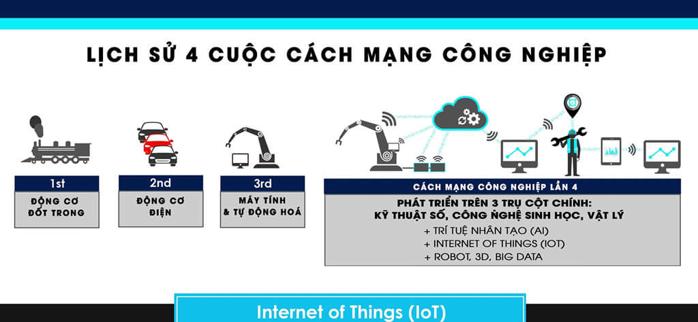
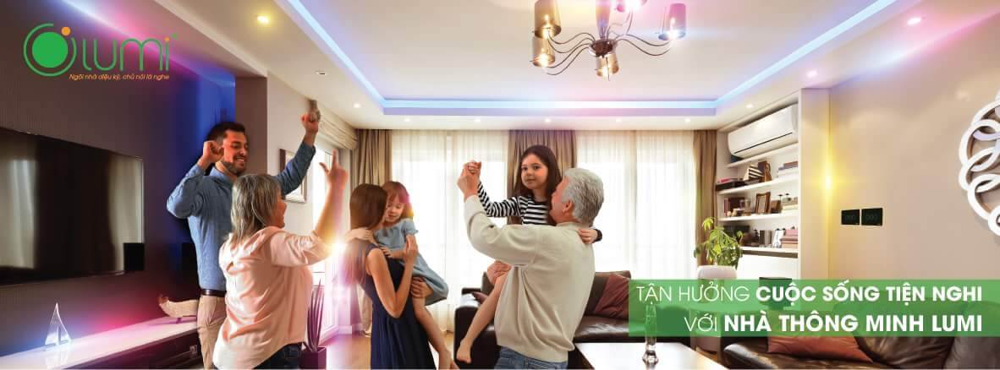

## Định nghĩa về Cách mạng Công nghiệp 4.0

Lịch sử của chúng ta đã trải qua 4 lần về cải cách công nghiệp "Cách mạng công nghiệp đầu tiên sử dụng năng lượng nước và hơi nước để cơ giới hóa sản xuất. Cuộc cách mạng lần 2 diễn ra nhờ ứng dụng điện năng để sản xuất hàng loạt. Cuộc cách mạng lần 3 sử dụng điện tử và công nghệ thông tin để tự động hóa sản xuất. Bây giờ, cuộc Cách mạng Công nghiệp Thứ tư đang nảy nở từ cuộc cách mạng lần ba, nó kết hợp các công nghệ lại với nhau, làm mờ ranh giới giữa vật lý, kỹ thuật số và sinh học".

## Cách mạng Công nghiệp 4.0 sẽ đi tiếp như thế nào?

Cách mạng Công nghiệp 4.0 sẽ diễn ra trên 3 lĩnh vực chính gồm Công nghệ sinh học, Kỹ thuật số và Vật lý.

Trên lĩnh vực công nghệ sinh học, Cách mạng Công nghiệp 4.0 tập trung vào nghiên cứu để tạo ra những bước nhảy vọt trong Nông nghiệp, Thủy sản, Y dược, chế biến thực phẩm, bảo vệ môi trường, năng lượng tái tạo, hóa học và vật liệu.

Cuối cùng là lĩnh vực Vật lý với robot thế hệ mới, máy in 3D, xe tự lái, các vật liệu mới (graphene, skyrmions…) và công nghệ nano.

## 4.0 ỨNG DỤNG VÀO NHÀ THÔNG MINH

“Cách đây vài năm, nói đến nhà thông minh, mọi người thường nghĩ nó là thứ xa xỉ, khó tiếp cận. Những năm 90, Bill Gates sở hữu nhà thông minh trị giá hơn 100 triệu USD. Tuy nhiên, thực tế hiện nay, với xu hướng phát triển của CMCN 4.0, các chi phí sản xuất thiết bị cho giải pháp nhà thông minh đã giảm xuống, vì thế hệ thống nhà thông minh như Bill Gates trước đây - hiện đã được các doanh nghiệp như Bkav có thể triển khai được với mức giá thấp hơn rất nhiều và nhiều người có thể tiếp cận với nó được. Thậm chí, với LUMI SmartHome thế hệ đi đầu trong lĩnh vực nhà thông minh tại Việt Nam, người dùng chỉ cần phải bỏ ra khoảng 30 triệu đồng đã có một hệ thống nhà thông minh tương đối cơ bản để dùng hàng ngày. Con số này chỉ chiếm khoảng 3 - 5% trong tổng chi phí xây dựng, sửa chữa một ngôi nhà tại Việt Nam hiện nay”, ông Nguyễn Đức Tài CEO LUMi Việt Nam cho hay.

Còn theo LUMI Việt Nam - doanh nghiệp cũng đã có 6 năm cung cấp giải pháp nhà thông minh, những năm trở lại đây, trong xu hướng CMCN 4.0, các giải pháp công nghệ IoT phát triển mạnh mẽ, khi các công ty công nghệ Việt đã bắt tay nghiên cứu và cho ra đời giải pháp nhà thông minh “Made in Vietnam” phù hợp hơn với nhu cầu và túi tiền của người Việt, thị trường nhà thông minh tại Việt Nam đã sôi động hơn.

Còn với Lumi Việt Nam, doanh nghiệp cung cấp giải pháp nhà thông minh “Made in Vietnam” do 3 kỹ sư từ lò đào tạo Bách khoa Hà Nội sáng lập đến nay cũng đã phát triển qua hàng chục phiên bản khác nhau để đáp ứng được nhu cầu thị trường. Hồi tháng 8 năm ngoái, Lumi Vietnam đã nghiên cứu tích hợp thành công công nghệ nhận dạng giọng nói của Amazon - trợ lý ảo Amazon Alexa vào giải pháp nhà thông minh Lumi, cho phép chủ nhân các ngôi nhà có thể điều khiển các chiếu sáng, đóng mở rèm, điều chỉnh chiết áp, thay đổi màu sắc đèn led… bằng giọng nói. Só liệu của Lumi Việt Nam cho hay, đến nay đơn vị này đã cung cấp giải pháp nhà thông minh cho nhiều dự án lớn như: khu đô thị An Khánh, Mandarin, Spendora, Time City, Royal City, Water Mark, ThangLong Number 01, Ecopark…, với khoảng 40.000 ngôi nhà đã hoàn thiện.

Dù đã có nhiều người quan tâm hơn đến nhà thông minh nhưng với phần lớn người dân Việt Nam vẫn chưa quen với khái niệm mới này, còn có tâm lý e ngại khi sử dụng các thiết bị, giải pháp IoT, hệ thống nhà thông minh LUMI… Để thay đổi nhận thức của người dùng vẫn cần có thời gian nhất định. Chúng tôi đang có kế hoạch để làm sao thời gian tới tiếp cận được nhiều hơn các khách hàng sử dụng động bộ cho cả nhà phố biệt thự hay cả chung cư.”