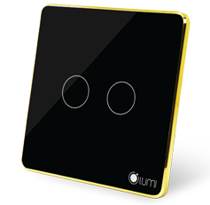
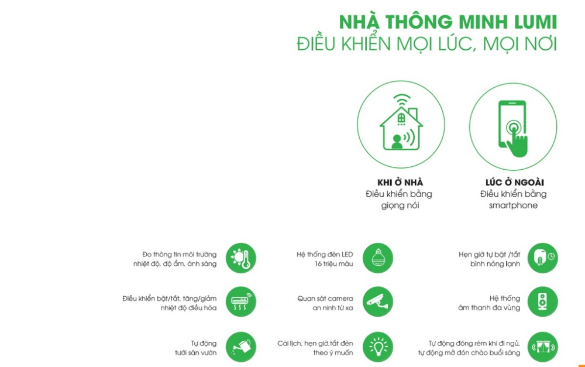
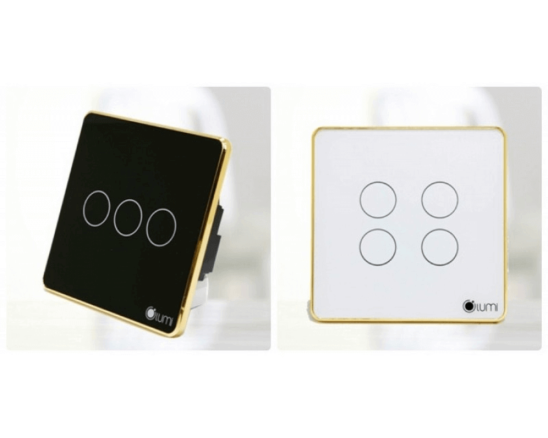

Vẻ ngoài sang trọng, lấp lánh, tiện tích sử dụng đa dạng, chi phí đầu tư hợp lý...Có quá nhiều lý do để công tắc cảm ứng Lumi trở thành thiết bị điện thông minh được ưa chuộng hiện nay trong gia đình Việt.

## Công tắc cảm ứng Lumi - hiểu những gì bạn muốn

Dù bạn đang ở nơi đâu, trong hay ngoài nhà, bạn hoàn toàn có thể điều khiển thiết bị điện theo ý muốn. Chỉ cần một chạm nhẹ vào màn hình điện thoại có kết nối internet, các thiết bị điện sẽ bật tắt một cách dễ dàng nhờ phần mềm SmartHome. Ngoài ra, giải pháp nhà thông minh Lumi còn phát triển một số tiện ích tự động hẹn giờ hay tạo ngữ cảnh để bóng đèn hay cách thiết bị khác như: điều hòa tự tăng nhiệt độ khi lạnh, đèn tự bật khi bạn đi làm về, bình nóng lạnh bật nước nóng có sẵn hay rèm cửa tự mở đón ánh nắng ban mai… Mọi thứ đều tự động và chỉn chu để sẵn sàng phục vụ mọi lúc bạn cần.

_Nhiều chức năng tiện nghi tích hợp trong công tắc cảm ứng Lumi_

Công tắc cảm ứng Lumi sẽ khiến bạn luôn cảm thấy an tâm mỗi khi vắng nhà với tính năng điều khiển từ xa trên phần mềm SmartHome. Với cơ chế tự động ngắt khi xuất hiện tình trạng dòng điện quá tải hay cháy nổ, đảm bảo an toàn cho cả gia đình bạn. Không những thế, công tắc cảm ứng Lumi còn giúp giảm thiểu điện năng với tính năng tự động bật tắt khi không có người ở, giúp tiết kiệm hóa đơn tiền điện mỗi tháng.

Đặc biệt, bề mặt công tắc cảm ứng Lumi được bảo vệ bởi lớp kính cường lực cách điện, cách nhiệt an toàn với gia đình có trẻ nhỏ và người lớn tuổi. Tích hợp công nghệ cảm ứng siêu nhạy dễ dàng điều khiển bật/tắt thiết bị ngay cả khi tay ướt.

## Công tắc cảm ứng Lumi - nâng tầm vẻ đẹp ngôi nhà bạn

Sẽ thế nào nếu những bức tường ngôi nhà bạn gắn lên những chiếc công tắc cảm ứng sang trọng của Lumi.  Thay vì những bức tranh thông thường, chỉ cần bố trí các công tắc điện Lumi cùng đủ để khiến những bức tường tĩnh như có sức sống.

Các dòng công tắc cảm ứng Lumi hiện nay có thiết kế rất sang trọng, tinh tế với kiểu dáng thiết kế siêu mỏng, bề mặt kính cường lực cùng vòng tròn đèn LED tinh tế. Độ dày mỏng hơn đến 2-3 lần so với công tắc thường giúp ngôi nhà của bạn cảm giác rộng rãi hơn.

 
_ Thiết kế tinh tế sang trọng của công tắc cảm ứng Lumi_
 
Công tắc cảm ứng Lumi gồm 2 sản phẩm cơ bản: công tắc cảm ứng viền nhôm và công tắc cảm ứng viền vàng. Trong đó, công tắc cảm ứng viền vàng là dòng sản phẩm được thiết kế sang trọng với viền bo phủ mạ vàng 24K xung quanh. Thiết kế kiểu dáng hình chữ nhật và hình vuông tương thích với mọi loại đế âm tường. Các góc của công tắc bo tròn và tạo cảm giác mềm mại khi sờ tay. Ngược lại, công tắc cảm ứng viền nhôm có mức giá vừa phải hơn nhưng sản phẩm vẫn giữ được những nét hiện đại sang trọng không kém. Bề mặt kính cường lực 4mm giúp sản phẩm sang trọng và không bị trầy xước trong quá trình sử dụng.

## Công tắc cảm ứng Lumi - ngân sách nhỏ, tiện nghi lớn

Khi nhắc đến thiết bị điện thông minh, người ta nghĩ ngay đến một mức giá đắt đỏ để sở hữu và vận hành nó. Tuy nhiên trên thực tế, các thiết bị này lại có mức giá hợp lý đến bất ngờ. Nếu bạn chỉ lắp công tắc cảm ứng Lumi thôi thì chi phí bỏ ra chỉ khoảng từ 10 triệu thôi nhé! Giá của mỗi chiếc công tắc cảm ứng dao động từ 1,5 – 2 triệu tùy loại 1,2,3 và 4 nút.

Ngoài ra, công tắc cảm ứng Lumi còn ghi điểm bởi sự tiện lợi và dễ dàng sử dụng. Chính tay bạn cũng có thể lắp đặt chiếc công tắc điện cho ngôi nhà của mình. Việc lắp đặt những chiếc công tắc cảm ứng Lumi vô cùng dễ dàng ngay cả với những người không biết gì về điện.

Với thái độ phục vụ chuyên nghiệp cùng đội ngũ kỹ thuật giàu kinh nghiệm tại Gia Hân group, bạn sẽ được giải đáp bất kỳ thắc mắc nào với thái độ thân thiện nhất. Tất cả sản phẩm của Lumi đều được bảo hành chu đáo. Trong quá trình sử dụng nếu có bất cứ vấn đề, nhân viên kỹ thuật sẽ có mặt ngay lập tức để hỗ trợ bạn.

Vẫn còn vô vàn những lợi ích mà công tắc cảm ứng Lumi có thể mang lại. Đừng bỏ lỡ một thiết bị điện thông minh tuyệt vời như Lumi để trở thành “Khách hàng là Thượng Đế” theo đúng nghĩa! Liên hệ ngay với chúng tôi để tư vấn, thi công, lắp đặt và khám phá tất tần tận về giải pháp nhà thông minh ngay hôm nay.
 